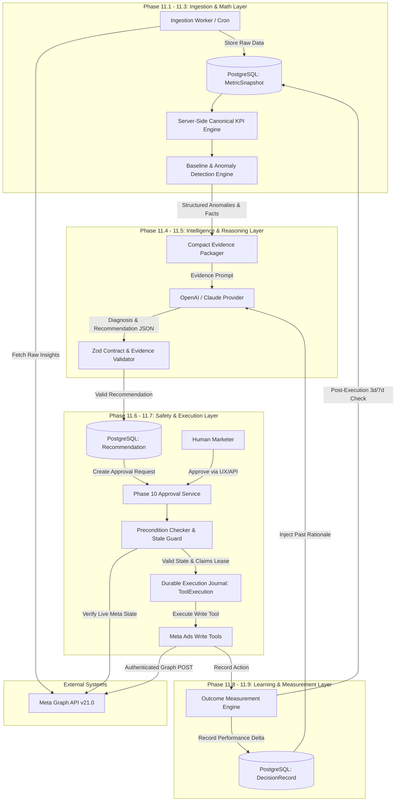

# PHASE 11 — MARKETING INTELLIGENCE & PERFORMANCE OPTIMIZATION ARCHITECTURE

**System:** JARVIS AI — Marketing Intelligence Subsystem  
**Phase:** 11.1 Architectural Design & Capability Audit  
**Status:** ARCHITECTURE AUDIT ONLY (No Production Code Changes, No Live Meta Writes)  

---

## 1. Executive Summary

### 1.1 Vision & Paradigm Shift
The objective of Phase 11 is to elevate JARVIS from an **"AI that can safely execute marketing actions"** (Phase 10) to an **"AI that can analyze marketing performance, diagnose problems, generate evidence-backed recommendations, obtain human approval, execute changes safely, and measure the result."**

```
+---------------------------------------------------------------------------------------+
|                                Phase 10 vs Phase 11                                   |
+---------------------------------------------------------------------------------------+
| Phase 10: SAFE EXECUTION FOUNDATION                                                   |
| User Intent -> Human Approval -> Single-Flight Lock -> Execution Journal -> Meta Write|
+---------------------------------------------------------------------------------------+
| Phase 11: MARKETING INTELLIGENCE & OPTIMIZATION LOOP                                 |
| Meta Insights -> Ingestion & Aggregation -> Canonical Math -> Anomaly Engine ->      |
| Compact Evidence -> AI Diagnosis & Recommendation -> Human Approval -> Safe Execution |
| -> Outcome Measurement & Closed Learning Loop                                         |
+---------------------------------------------------------------------------------------+
```

### 1.2 Core Architectural Principles
1. **Deterministic Server-Side Math**: Critical KPIs (CTR, CPC, CPM, CPA, ROAS, CVR, Frequency) and baseline anomaly thresholds are computed **100% deterministically on the server**. The LLM is never allowed to calculate rates, deltas, or percentages.
2. **Evidence-Backed Recommendations**: Every AI recommendation must reference concrete, server-validated `Fact` IDs and metric snapshots. No evidence = no recommendation.
3. **Strict Fact vs. Inference Separation**: The system enforces a hard boundary between observed data (`FACT`), diagnostic hypothesis (`INFERENCE`), and proposed change (`RECOMMENDATION`).
4. **Stale State & Precondition Verification**: Prior to executing any approved action, the system re-fetches live state from Meta to verify that baseline preconditions (e.g. current budget) have not shifted.
5. **Phase 10 Safety Wire-up**: All execution actions route through Phase 10 approval APIs, `paramsHash` binding, atomic single-flight concurrency, durable execution journal (`ToolExecution`), and server-side budget guardrails.

---

## 2. Existing Capability Audit

A comprehensive inspection of the existing codebase (`packages/meta-graph`, `packages/tools`, `packages/core`, and `packages/db`) reveals the exact current state of marketing analytics and execution capabilities.

### 2.1 Codebase Capabilities Matrix

| Capability Category | File Location | Code Entity / Function | Status | Capabilities & Limitations |
| :--- | :--- | :--- | :--- | :--- |
| **Ad Account Discovery** | `packages/meta-graph/src/provider.ts` | `getAdAccounts` | **Supported** | Fetches account list, currency, timezone, spend cap, amount spent. |
| **Campaign Listing** | `packages/meta-graph/src/provider.ts` | `getCampaigns` | **Supported** | Fetches name, status, objective, budget, start/end time. |
| **Ad Set Listing** | `packages/meta-graph/src/provider.ts` | `getAdSets` | **Supported** | Fetches campaignId, status, targeting, budget, optimization goal. |
| **Ad Listing** | `packages/meta-graph/src/provider.ts` | `getAds` | **Supported** | Fetches adSetId, campaignId, name, status, creative specs. |
| **Meta Insights Read** | `packages/tools/src/tools/meta-ads-tools.ts` | `MetaGetInsightsTool` (`meta.insights`) | **Partial** | Supports account, campaign, adset, ad levels. Date range (start/end) and breakdowns supported. |
| **Insights Parsing** | `packages/meta-graph/src/response-validator.ts` | `parseInsights` | **DEFECT FOUND** | **CRITICAL GAP**: `parseInsights` drops `conversions`, `costPerConversion`, `results`, `costPerResult`, `roas`, `actions`, `actionValues`, and `frequency` even though defined in `MetaInsightsSchema`! |
| **Budget Guardrails** | `packages/tools/src/tools/meta-ads-budget-guardrails.ts` | `validateBudgetTransition` | **Supported** | Enforces max increase (25%), max decrease (50%), max budget ($10,000). |
| **Write Tooling** | `packages/tools/src/tools/meta-ads-write-tools.ts` | Pause/Resume, Budget Update, Campaign Creation | **Supported** | Requires approval, paramsHash verification, durable journal, idempotency key. |
| **Durable Execution** | `packages/db/prisma/schema.prisma` | `ToolExecution` model | **Supported** | DB-backed idempotency, single-flight leases, UNKNOWN state handling. |
| **Performance Database** | `packages/db/prisma/schema.prisma` | N/A | **MISSING** | No DB tables exist for performance snapshots, recommendations, or outcome tracking. |
| **Baseline & Anomalies**| N/A | N/A | **MISSING** | No moving average, standard deviation, or anomaly detection logic exists. |
| **Comparison Windows** | N/A | N/A | **MISSING** | No WoW, MoM, or prior-period relative window logic exists. |

### 2.2 Uncovered Code Gaps
1. **Response Validator Dropping Conversion Metrics**: In [`packages/meta-graph/src/response-validator.ts`](file:///d:/dreamprojectjarvis/dreamprojectjarvis/packages/meta-graph/src/response-validator.ts#L107-L121), `parseInsights` maps only `impressions`, `clicks`, `spend`, `reach`, `cpc`, `cpm`, `ctr`, `dateStart`, `dateStop`. The Graph API payload fields `actions`, `action_values`, `conversions`, `cost_per_conversion`, and `roas` are stripped.
2. **Lack of Ingestion Engine**: Raw insights are requested directly via tools per prompt turn without caching or snapshot storage in PostgreSQL.
3. **No Timezone Normalization**: Requests pass `YYYY-MM-DD` strings directly without converting relative boundaries using the ad account's `timezone_name`.

---

## 3. System Architecture



---

## 4. Data Model Design

To support normalized performance storage, anomaly detection, recommendation persistence, and outcome measurement without unnecessary complexity, we define 6 core database entities for PostgreSQL (via Prisma).

### 4.1 Proposed Database Schema Extensions

```prisma
// ---------------------------------------------------------------------------
// Phase 11 — Marketing Intelligence Data Models
// ---------------------------------------------------------------------------

model MarketingAccount {
  id            String   @id @default(cuid())
  userId        String   @map("user_id")
  accountId     String   @unique @map("account_id") // e.g. "act_123456789"
  name          String
  currency      String   @default("USD")
  timezoneName  String   @default("UTC") @map("timezone_name")
  isActive      Boolean  @default(true) @map("is_active")
  createdAt     DateTime @default(now()) @map("created_at")
  updatedAt     DateTime @updatedAt @map("updated_at")

  user            User                   @relation(fields: [userId], references: [id], onDelete: Cascade)
  snapshots       MetricSnapshot[]
  recommendations PerformanceRecommendation[]
  outcomes        DecisionRecord[]

  @@index([userId])
  @@map("MarketingAccount")
}

enum PerformanceLevel {
  ACCOUNT
  CAMPAIGN
  ADSET
  AD
}

model MetricSnapshot {
  id             String           @id @default(cuid())
  accountId      String           @map("account_id")
  level          PerformanceLevel
  entityId       String           @map("entity_id") // accountId, campaignId, adSetId, or adId
  entityName     String?          @map("entity_name")
  dateStart      DateTime         @map("date_start")
  dateStop       DateTime         @map("date_stop")
  periodType     String           @map("period_type") // "DAILY", "HOURLY", "SUMMARY_7D"
  
  // Raw Aggregates (Server Math Input)
  spend          Decimal          @db.Decimal(12, 2)
  impressions    BigInt
  clicks         BigInt
  reach          BigInt           @default(0)
  conversions    Decimal          @default(0) @db.Decimal(12, 2)
  revenue        Decimal          @default(0) @db.Decimal(12, 2)
  
  // Deterministic Calculated KPIs
  ctr            Float?
  cpc            Decimal?         @db.Decimal(10, 4)
  cpm            Decimal?         @db.Decimal(10, 4)
  cpa            Decimal?         @db.Decimal(10, 4)
  roas           Float?
  cvr            Float?
  frequency      Float?

  rawPayload     Json?            @map("raw_payload")
  createdAt      DateTime         @default(now()) @map("created_at")

  account MarketingAccount @relation(fields: [accountId], references: [accountId], onDelete: Cascade)

  @@unique([accountId, level, entityId, dateStart, dateStop, periodType], map: "metric_snapshot_unique_key")
  @@index([accountId, level, entityId, dateStart])
  @@index([dateStart, dateStop])
  @@map("MetricSnapshot")
}

enum RecommendationStatus {
  PENDING_APPROVAL
  APPROVED
  REJECTED
  EXECUTED
  EXPIRED
  STALE
  FAILED
}

enum OptimizationActionType {
  PAUSE_CAMPAIGN
  RESUME_CAMPAIGN
  PAUSE_ADSET
  RESUME_ADSET
  PAUSE_AD
  INCREASE_BUDGET
  DECREASE_BUDGET
}

model PerformanceRecommendation {
  id                String                 @id @default(cuid())
  userId            String                 @map("user_id")
  accountId         String                 @map("account_id")
  targetLevel       PerformanceLevel       @map("target_level")
  targetId          String                 @map("target_id")
  actionType        OptimizationActionType @map("action_type")
  status            RecommendationStatus   @default(PENDING_APPROVAL)
  
  // Structured Reasoning & Evidence Contract
  reason            String
  evidence          Json                   // { factIds: string[], metrics: Record<string, any> }
  expectedImpact    String                 @map("expected_impact")
  confidence        Float
  riskLevel         String                 @map("risk_level") // "LOW", "MEDIUM", "HIGH"
  proposedChange    Json                   @map("proposed_change") // { field, currentValue, newValue }
  paramsHash        String                 @map("params_hash")
  
  // Linkages
  approvalId        String?                @map("approval_id")
  executionId       String?                @map("execution_id")
  
  expiresAt         DateTime               @map("expires_at")
  createdAt         DateTime               @default(now()) @map("created_at")
  updatedAt         DateTime               @updatedAt @map("updated_at")

  account MarketingAccount @relation(fields: [accountId], references: [accountId], onDelete: Cascade)
  outcome DecisionRecord?

  @@index([userId, status])
  @@index([accountId, targetId])
  @@index([paramsHash])
  @@map("PerformanceRecommendation")
}

model DecisionRecord {
  id                 String   @id @default(cuid())
  recommendationId   String   @unique @map("recommendation_id")
  accountId          String   @map("account_id")
  executionId        String   @map("execution_id")
  
  // Baseline Metrics at time of recommendation
  baselineMetrics    Json     @map("baseline_metrics")
  
  // Measurement post-execution (e.g. 7 days later)
  postMetrics        Json?    @map("post_metrics")
  measuredAt         DateTime? @map("measured_at")
  
  // Outcome Classification
  outcomeRating      String?  @map("outcome_rating") // "POSITIVE", "NEUTRAL", "NEGATIVE", "UNABLE_TO_MEASURE"
  kpiDeltaPercent    Float?   @map("kpi_delta_percent")
  notes              String?
  createdAt          DateTime @default(now()) @map("created_at")

  recommendation PerformanceRecommendation @relation(fields: [recommendationId], references: [id], onDelete: Cascade)
  account MarketingAccount                 @relation(fields: [accountId], references: [accountId], onDelete: Cascade)

  @@index([accountId])
  @@map("DecisionRecord")
}
```

### 4.2 Model Justification & Retention Summary

| Proposed Model | Purpose & Why Needed | Source of Truth | Retention Requirement | PostgreSQL Sufficient? |
| :--- | :--- | :--- | :--- | :--- |
| **`MarketingAccount`** | Scopes multi-account ownership and stores account timezone/currency. | Meta API `me/adaccounts` & DB config | Indefinite (until user disconnects) | **Yes** |
| **`MetricSnapshot`** | Stores aggregated performance snapshots for fast baseline math without hitting Meta API rate limits. | Meta Graph `insights` API | 90 days rolling retention | **Yes** (PG indexes on `[accountId, entityId, dateStart]`) |
| **`PerformanceRecommendation`** | Persists evidence-backed recommendations, status, and `paramsHash`. | Server Diagnosis Engine | 180 days | **Yes** |
| **`DecisionRecord`** | Tracks closed-loop performance outcomes post-execution. | Server Outcome Tracker Engine | 365 days | **Yes** |
| **`Experiment`** | **Deferred to Phase 12**. Not needed for initial performance optimization. | N/A | N/A | N/A |

---

## 5. Canonical KPI Normalization

To ensure 100% mathematical consistency across Claude, OpenAI, and internal services, KPI calculation is strictly encapsulated in a server-side module (`packages/core/src/kpi-engine.ts`).

### 5.1 Explicit Mathematical Formulas

| KPI Name | Code Identifiers | Server Formula | Unit | Edge Case Handling |
| :--- | :--- | :--- | :--- | :--- |
| **Spend** | `spend` | Parse Decimal to float | Currency | If `< 0` -> error; default `0.00`. |
| **Impressions** | `impressions` | Parse BigInt to integer | Count | Default `0`. |
| **Clicks** | `clicks` | Parse BigInt to integer | Count | Default `0`. |
| **Reach** | `reach` | Parse BigInt to integer | Count | Default `0`. |
| **CTR** | `ctr` | $\frac{\text{clicks}}{\text{impressions}} \times 100$ | Percentage (%) | If $\text{impressions} == 0 \to \text{null}$ |
| **CPC** | `cpc` | $\frac{\text{spend}}{\text{clicks}}$ | Currency | If $\text{clicks} == 0 \to \text{null}$ |
| **CPM** | `cpm` | $\frac{\text{spend}}{\text{impressions}} \times 1000$ | Currency | If $\text{impressions} == 0 \to \text{null}$ |
| **Conversions** | `conversions` | $\sum \text{actions}[\text{type} \in \text{targetTypes}]$ | Count / Value | Default `0.00`. |
| **CPA** | `cpa` / `costPerConversion` | $\frac{\text{spend}}{\text{conversions}}$ | Currency | If $\text{conversions} == 0 \to \text{null}$ |
| **Revenue** | `revenue` | $\sum \text{action\_values}[\text{type} \in \text{revenueTypes}]$ | Currency | Default `0.00`. |
| **ROAS** | `roas` | $\frac{\text{revenue}}{\text{spend}}$ | Ratio (x) | If $\text{spend} == 0 \to \text{null}$ |
| **CVR** | `cvr` | $\frac{\text{conversions}}{\text{clicks}} \times 100$ | Percentage (%) | If $\text{clicks} == 0 \to \text{null}$ |
| **Frequency** | `frequency` | $\frac{\text{impressions}}{\text{reach}}$ | Ratio | If $\text{reach} == 0 \to \text{null}$ |

### 5.2 Deterministic KPI Engine Interface Schema

```typescript
export interface RawMetricInputs {
  spend: number;
  impressions: number;
  clicks: number;
  reach: number;
  conversions: number;
  revenue: number;
}

export interface CalculatedKPIs {
  spend: number;
  impressions: number;
  clicks: number;
  reach: number;
  conversions: number;
  revenue: number;
  ctr: number | null;
  cpc: number | null;
  cpm: number | null;
  cpa: number | null;
  roas: number | null;
  cvr: number | null;
  frequency: number | null;
  isDefined: Record<string, boolean>;
}

export function calculateCanonicalKPIs(inputs: RawMetricInputs): CalculatedKPIs {
  const ctr = inputs.impressions > 0 ? (inputs.clicks / inputs.impressions) * 100 : null;
  const cpc = inputs.clicks > 0 ? inputs.spend / inputs.clicks : null;
  const cpm = inputs.impressions > 0 ? (inputs.spend / inputs.impressions) * 1000 : null;
  const cpa = inputs.conversions > 0 ? inputs.spend / inputs.conversions : null;
  const roas = inputs.spend > 0 ? inputs.revenue / inputs.spend : null;
  const cvr = inputs.clicks > 0 ? (inputs.conversions / inputs.clicks) * 100 : null;
  const frequency = inputs.reach > 0 ? inputs.impressions / inputs.reach : null;

  return {
    spend: inputs.spend,
    impressions: inputs.impressions,
    clicks: inputs.clicks,
    reach: inputs.reach,
    conversions: inputs.conversions,
    revenue: inputs.revenue,
    ctr: ctr !== null ? Math.round(ctr * 10000) / 10000 : null,
    cpc: cpc !== null ? Math.round(cpc * 100) / 100 : null,
    cpm: cpm !== null ? Math.round(cpm * 100) / 100 : null,
    cpa: cpa !== null ? Math.round(cpa * 100) / 100 : null,
    roas: roas !== null ? Math.round(roas * 100) / 100 : null,
    cvr: cvr !== null ? Math.round(cvr * 10000) / 10000 : null,
    frequency: frequency !== null ? Math.round(frequency * 100) / 100 : null,
    isDefined: {
      ctr: ctr !== null,
      cpc: cpc !== null,
      cpm: cpm !== null,
      cpa: cpa !== null,
      roas: roas !== null,
      cvr: cvr !== null,
      frequency: frequency !== null,
    },
  };
}
```

---

## 6. Marketing Objectives Mapping

Campaign performance must be evaluated against the target business goal configured on Meta or overridden in system settings.

```
+-----------------------------------------------------------------------------------+
| Meta Objective        | Primary Target KPI | Secondary Guardrail KPI | Target Threshold |
+-----------------------------------------------------------------------------------+
| OUTCOME_AWARENESS     | CPM, Reach         | Frequency (< 4.0)       | Target CPM       |
| OUTCOME_TRAFFIC       | CTR, CPC           | CVR                     | Target CPC       |
| OUTCOME_LEADS         | CPL (CPA), Leads   | Lead CVR                | Target CPL       |
| OUTCOME_SALES         | ROAS, CPA          | Conversion Count        | Target ROAS/CPA  |
| OUTCOME_ENGAGEMENT    | Cost per Engagement| Engagement Count        | Target CPE       |
+-----------------------------------------------------------------------------------+
```

---

## 7. Performance Comparison Windows

### 7.1 Standard Comparison Windows
1. **Today (TD)**: 00:00:00 to current time in Ad Account Timezone.
2. **Yesterday (YD)**: Prior day full 24h period.
3. **Last 7 Days (L7D) vs. Previous 7 Days (P7D)**:
   - $L7D = [\text{Today} - 7\text{ days}, \text{Today} - 1\text{ day}]$
   - $P7D = [\text{Today} - 14\text{ days}, \text{Today} - 8\text{ days}]$
4. **Last 14 Days (L14D) vs. Previous 14 Days (P14D)**
5. **Last 30 Days (L30D) vs. Previous 30 Days (P30D)**

### 7.2 Timezone Normalization Rule
All relative date boundaries are computed using the `timezoneName` of the target `MarketingAccount` (e.g. `Asia/Kolkata` or `America/New_York`).
Server UTC timestamp is used strictly for storing record creation/update times in PostgreSQL.

---

## 8. Baseline & Anomaly Detection

Anomaly detection is **100% deterministic code** run prior to LLM invocation.

### 8.1 Metric Deviation Formulas
- **Percentage Change ($\Delta\%$)**:
$$\Delta\% = \frac{\text{Metric}_{\text{current}} - \text{Metric}_{\text{baseline}}}{\text{Metric}_{\text{baseline}}} \times 100$$

- **Standard Deviation $Z$-Score**:
$$Z = \frac{\text{Metric}_{\text{current}} - \mu_{\text{baseline}}}{\sigma_{\text{baseline}}}$$

### 8.2 Anomaly Severity Classification

| Anomaly Type | Severity Level | Trigger Condition | Business Significance |
| :--- | :--- | :--- | :--- |
| **Delivery Collapse** | **CRITICAL** | Spend drops > 80% with ACTIVE status | Ad set halted, billing error, or account flag. |
| **Spend Spike** | **CRITICAL** | Spend increases > 50% without conversion increase | Rapid budget drain. |
| **CPA Spike** | **CRITICAL** | CPA increases > 40% over L7D vs P7D (min 5 conversions) | Unprofitable delivery. |
| **ROAS Collapse** | **CRITICAL** | ROAS decreases > 35% over L7D vs P7D | Direct loss on ad spend. |
| **CPC Rise** | **WARNING** | CPC increases 20% - 40% over L7D vs P7D | Increasing auction competition. |
| **CTR Drop** | **WARNING** | CTR decreases 20% - 40% over L7D vs P7D | Loss of audience relevance. |
| **Frequency Spike** | **WARNING** | Frequency > 3.5 (L7D) | Creative saturation. |
| **Minor Fluctuations** | **INFO** | Metric delta 10% - 20% | Normal statistical variance. |

---

## 9. Diagnosis Engine & Fact-Inference Contract

The LLM must never represent an inference as an observed metric fact.

### 9.1 Data Contract Definitions

```typescript
export interface MarketingFact {
  factId: string;
  entityLevel: "account" | "campaign" | "adset" | "ad";
  entityId: string;
  entityName: string;
  metricName: string;
  currentValue: number;
  baselineValue: number;
  deltaPercent: number;
  windowComparison: string; // e.g. "L7D vs P7D"
  severity: "INFO" | "WARNING" | "CRITICAL";
}

export interface MarketingInference {
  inferenceId: string;
  supportingFactIds: string[]; // Must link to existing Fact IDs
  hypothesis: string;
  confidence: number; // 0.0 to 1.0
  category: "CREATIVE_FATIGUE" | "AUCTION_COMPETITION" | "BUDGET_EXHAUSTION" | "TARGETING_SATURATION" | "TRACKING_DISRUPTION";
}

export interface DiagnosisReport {
  timestamp: string;
  accountId: string;
  facts: MarketingFact[];
  inferences: MarketingInference[];
}
```

---

## 10. Recommendation Contract

Every optimization recommendation MUST be backed by validated `Fact` IDs.

### 10.1 Structured Output Contract

```typescript
export interface StructuredRecommendation {
  recommendationId: string;
  accountId: string;
  targetLevel: "campaign" | "adset" | "ad";
  targetId: string;
  targetName: string;
  actionType: "PAUSE_CAMPAIGN" | "RESUME_CAMPAIGN" | "PAUSE_ADSET" | "RESUME_ADSET" | "PAUSE_AD" | "INCREASE_BUDGET" | "DECREASE_BUDGET";
  reason: string;
  evidence: {
    supportingFactIds: string[];
    metricsSummary: Record<string, { current: number; baseline: number; deltaPercent: number }>;
  };
  expectedImpact: string;
  confidence: number; // 0.0 to 1.0
  riskLevel: "LOW" | "MEDIUM" | "HIGH";
  proposedChange: {
    field: string;
    currentValue: string | number;
    newValue: string | number;
  };
  paramsHash: string;
  requiresApproval: true; // Hardcoded true
}
```

---

## 11. Initial Optimization Actions Catalog

| Action | Target | Prerequisites | Max Change Cap | Cooldown | Risk Level | Rollback Strategy |
| :--- | :--- | :--- | :--- | :--- | :--- | :--- |
| **`PAUSE_CAMPAIGN`** | Campaign | Status ACTIVE, CPA > 2.0x target for 3d | ACTIVE $\to$ PAUSED | 24 hours | **HIGH** | `RESUME_CAMPAIGN` |
| **`RESUME_CAMPAIGN`**| Campaign | Status PAUSED, resolved budget/issues | PAUSED $\to$ ACTIVE | 24 hours | **MEDIUM**| `PAUSE_CAMPAIGN` |
| **`PAUSE_ADSET`** | Ad Set | Status ACTIVE, CPA > 1.5x campaign avg | ACTIVE $\to$ PAUSED | 24 hours | **MEDIUM**| `RESUME_ADSET` |
| **`RESUME_ADSET`** | Ad Set | Status PAUSED | PAUSED $\to$ ACTIVE | 24 hours | **LOW** | `PAUSE_ADSET` |
| **`PAUSE_AD`** | Ad | Status ACTIVE, Spend > 2x CPA with 0 conv | ACTIVE $\to$ PAUSED | 12 hours | **LOW** | Resume Ad |
| **`INCREASE_BUDGET`**| Campaign/AdSet| ROAS > target or CPA < target by 20% | Max +20% per step | 48 hours | **MEDIUM**| Revert to prior budget |
| **`DECREASE_BUDGET`**| Campaign/AdSet| CPA > target or ROAS < target by 20% | Max -30% per step | 24 hours | **LOW** | Revert to prior budget |

---

## 12. Budget Guardrails & Financial Safety Model

Budget modifications are subject to strict server-side financial limits that **cannot be bypassed by LLM or human approval**.

```
+-----------------------------------------------------------------------------------+
| Server Budget Guardrails                                                          |
+-----------------------------------------------------------------------------------+
| 1. Max Increase Step  | 20% maximum increase per single recommendation step        |
| 2. Max Decrease Step  | 30% maximum decrease per single recommendation step        |
| 3. Absolute Cap Step  | Max $2,500 absolute change per action                       |
| 4. Daily Account Cap  | Account daily budget ceiling (e.g. $10,000 / day)          |
| 5. Min Budget Cap     | Minimum $5.00 daily budget limit                          |
| 6. Cooldown Window    | Minimum 24-48 hours between budget changes on same entity  |
| 7. Approval Lock      | Bound by `paramsHash` to prevent payload mutation          |
+-----------------------------------------------------------------------------------+
```

---

## 13. Creative Fatigue Model

Creative fatigue is declared **only** when statistical criteria are met deterministically.

```
+-----------------------------------------------------------------------------------+
| Creative Fatigue Criteria (All required)                                          |
+-----------------------------------------------------------------------------------+
| 1. Minimum Impressions | >= 2,500 impressions over evaluation period                |
| 2. Frequency Threshold | Frequency > 3.5 (L7D)                                    |
| 3. CTR Decay           | CTR dropped >= 20% (L7D vs P7D)                          |
| 4. CPC Elevation       | CPC increased >= 25% (L7D vs P7D)                        |
+-----------------------------------------------------------------------------------+
| Status Output: If impressions < 2,500 -> return `INSUFFICIENT_DATA`               |
+-----------------------------------------------------------------------------------+
```

---

## 14. Experimentation Strategy

### 14.1 Decision: Explicitly Defer to Phase 12
**RATIONALE**: Native A/B testing on Meta requires complex split-testing APIs (`adstudy` endpoints), holdout group allocation, and multi-week attribution windows. Introducing experimentation in Phase 11 creates premature architectural complexity. Phase 11 focuses strictly on single-entity diagnostic optimization.

---

## 15. Learning & Measurement Loop

```
1. Analyze Metric Snapshots
       |
2. Detect Deterministic Anomalies & Facts
       |
3. LLM Generates Evidence-Backed Recommendation
       |
4. Human Approves Recommendation (Phase 10 UX)
       |
5. Verify Preconditions & Execute via Durable Journal
       |
6. Store Baseline Metrics in DecisionRecord
       |
7. Wait 7 Days (Post-Execution Measurement Period)
       |
8. Fetch Post-Execution Metrics & Compute KPI Delta
       |
9. Classify Outcome:
   - POSITIVE: Target KPI improved >= 10%
   - NEUTRAL:  Target KPI within +/- 10%
   - NEGATIVE: Target KPI degraded > 10%
       |
10. Inject Past Outcome Rationale into Future LLM Prompt Context
```

---

## 16. Memory Integration Strategy

| Memory Category | Storage Target | Example Items |
| :--- | :--- | :--- |
| **User Preferences & Rules** | `Memory` table (via `memory-engine`) | "Target CPA is $15", "Never increase daily budget over $500", "Brand tone is professional". |
| **Marketing Facts & History** | `MetricSnapshot` & `DecisionRecord` tables | Aggregated spend, historical CTR/CPA, past recommendation outcomes. |
| **Transient Metrics** | **DO NOT STORE** in conversational memory | Raw daily impressions, hourly click counts, temporary status strings. |

---

## 17. Multi-Account Isolation & Security

Multi-account isolation enforces the invariant that **AI-generated account IDs can never grant access to unassigned ad accounts**.

```typescript
// Server-Side Authorization Invariant
export async function enforceAccountAuthorization(
  userId: string,
  inputAccountId: string,
  authorizer: MetaAccountAuthorizer
): Promise<string> {
  const normalizedId = normalizeAccountId(inputAccountId);
  const isAuthorized = await authorizer.isAuthorized(userId, normalizedId);
  
  if (!isAuthorized) {
    throw new Error(`FORBIDDEN: User ${userId} is not authorized to access Meta Account ${normalizedId}`);
  }
  
  return normalizedId;
}
```

---

## 18. Cost & Performance Model

To avoid expensive LLM calls per metric row or ad entity:
1. **Raw Metric Ingestion**: Ingested asynchronously in batch via background cron.
2. **Server Math & Aggregation**: Deterministically computed in node process memory / PG queries ($0$ LLM cost).
3. **Compact Evidence Packaging**: Formats top 10 anomalous entities into a single, compact JSON prompt (~1,500 tokens).
4. **Single LLM Diagnosis Call**: Executed once per diagnostic run ($< \$0.02$ per execution).

---

## 19. Context Budget Management

To avoid blowing context limits with thousands of ads:
- **Level 1 (Account Level)**: Include total account metrics (Spend, ROAS, CPA, CTR).
- **Level 2 (Campaign Level)**: Include top 5 campaigns sorted by spend/anomaly severity.
- **Level 3 (AdSet Level)**: Include top 3 ad sets per anomalous campaign.
- **Level 4 (Ad Level)**: Include max 3 anomalous ads per ad set.
- **Strict Limit**: Max 8,000 tokens per diagnostic request.

---

## 20. Observability & Lineage Tracing

Every optimization action is fully traceable across the system:

```
[RecommendationId: rec_881a]
       |---> [Evidence: Fact_101 (CPA +42%), Fact_102 (CTR -22%)]
       |---> [LLM TraceId: trace_claude_9912]
       |---> [ApprovalId: appv_4412]
       |---> [ExecutionId: exec_00192 (ToolExecution table)]
       |---> [Meta Resource: adset_60192841]
       |---> [OutcomeRecordId: dec_7721]
```

---

## 21. Failure Modes & Mitigations Matrix

| Failure Mode | Root Cause | System Mitigation |
| :--- | :--- | :--- |
| **Meta API Rate Limit** | Too many insight calls | Serve cached metrics from `MetricSnapshot` table. |
| **Missing Metric Field** | New ad account / no conversions | Set metric to `null`, flag `isDefined: false`, report `INSUFFICIENT_DATA`. |
| **Stale Recommendation** | State changed during approval delay | Precondition check fails pre-execution; mark recommendation `STALE`. |
| **Timezone Drift** | Server UTC vs Account Timezone | Calculate all relative date ranges using `account.timezoneName`. |
| **LLM Hallucination** | Modelinvents fake campaign ID | Zod schema validation checks `targetId` against database entity list. |
| **Double Write Attempt** | User double-clicks approval | Phase 10 single-flight execution lease + `ToolExecution` unique constraint. |

---

## 22. Stale Recommendation Protection

```typescript
export async function verifyRecommendationFreshness(
  recommendationId: string,
  provider: MetaAdsProvider
): Promise<{ isFresh: boolean; reason?: string }> {
  const rec = await prisma.performanceRecommendation.findUnique({ where: { id: recommendationId } });
  if (!rec) return { isFresh: false, reason: "Recommendation not found" };

  // Fetch current live state from Meta
  const liveCampaigns = await provider.getCampaigns(rec.accountId);
  const liveEntity = liveCampaigns.data.find(c => c.campaignId === rec.targetId);

  if (!liveEntity) return { isFresh: false, reason: "Target entity no longer exists on Meta" };

  const proposed = rec.proposedChange as { field: string; currentValue: any; newValue: any };

  // Verify baseline value hasn't shifted externally
  if (proposed.field === "status" && liveEntity.status !== proposed.currentValue) {
    return { isFresh: false, reason: `Status shifted externally to ${liveEntity.status}` };
  }

  return { isFresh: true };
}
```

---

## 23. Rollback Strategy

| Action | Reversible? | Automatic Rollback Mechanism |
| :--- | :--- | :--- |
| **`PAUSE_CAMPAIGN` / `PAUSE_AD`** | **Yes** | Execute `RESUME` tool with approval. |
| **`RESUME_CAMPAIGN` / `RESUME_AD`** | **Yes** | Execute `PAUSE` tool with approval. |
| **`INCREASE_BUDGET` / `DECREASE_BUDGET`**| **Yes** | Revert budget field to `currentValue` stored in `proposedChange`. |
| **`CREATE_CAMPAIGN`** | **Partial** | Cannot un-create ID on Meta; rollback pauses campaign immediately. |

---

## 24. Test Strategy

1. **Deterministic Math Unit Tests**:
   - Verify KPI calculations with 0 denominators, missing conversions, high decimal precision.
   - Verify $Z$-score and percentage delta formulas.
2. **Stale State Guard Integration Tests**:
   - Mock external budget shift between approval creation and execution claim. Verify execution rejects with `STALE`.
3. **Multi-Account Authorization Tests**:
   - Mock cross-tenant account request. Verify request rejects with 403 authorization failure.
4. **Zero Live Meta Writes Rule**:
   - All automated test suites must use `meta-ads-mock.ts`. No real network calls to Meta Graph API.

---

## 25. Implementation Phase Order

```
[Phase 11.1] Core KPI Normalization Engine & Response Validator Bug Fix
       |
[Phase 11.2] Performance Database Models (MetricSnapshot, Recommendation, DecisionRecord)
       |
[Phase 11.3] Baseline Computation & Deterministic Anomaly Detection Engine
       |
[Phase 11.4] Evidence Packaging & Fact-Inference Contract Generator
       |
[Phase 11.5] Recommendation Engine & Zod Schema Validation
       |
[Phase 11.6] Precondition Checker & Stale Recommendation Guard
       |
[Phase 11.7] Optimization Execution Wire-up (Phase 10 Approval & Journal Integration)
       |
[Phase 11.8] Post-Execution Outcome Measurement Engine
       |
[Phase 11.9] Learning Loop & Long-Term Memory Persistence Integration
```

---

## 26. Architectural Risk Assessment

### 26.1 Risk Severity Matrix

```
+-----------------------------------------------------------------------------------+
| Risk Level | Risk Description                                | Mitigation Control |
+-----------------------------------------------------------------------------------+
| CRITICAL   | Ingestion validator drops conversions & ROAS    | Fix `parseInsights` in Phase 11.1 prior to ingestion. |
| HIGH       | Stale budget execution after external change    | Pre-execution live fetch & precondition verification. |
| HIGH       | Multi-tenant account access bypass via AI input| Mandatory server-side `isAuthorized` check.          |
| MEDIUM     | Context overflow when account has >1,000 ads    | Aggregation & top-N anomaly filtering before LLM.    |
| LOW        | Timezone discrepancy in daily KPI comparison   | Force `account.timezoneName` boundary parsing.        |
+-----------------------------------------------------------------------------------+
```

---

## 27. Deferred Features (Scope Boundary)

To keep Phase 11 strictly focused on deterministic intelligence and safe optimization execution, the following features are **explicitly deferred to Phase 12+**:
1. **Automated Multi-Variant A/B Testing** (Requires Meta Study API).
2. **Automated Bidding Strategy Shifts** (e.g. Lowest Cost to Target Cost switching).
3. **Generative Ad Creative Assembly** (Image generation & copy variant testing).
4. **Cross-Channel Multi-Touch Attribution** (Google Ads + Meta + Shopify cross-stitching).

---

## 28. Verification of Non-Modification Constraints

- **Production Code Status**: UNTOUCHED (0 code files altered).
- **Environment Status**: UNTOUCHED (`.env` unaltered).
- **Meta Graph Status**: NO NETWORK CALLS / NO REAL WRITES PERFORMED.
- **Phase 10 Status**: 100% PRESERVED AND INTACT.
