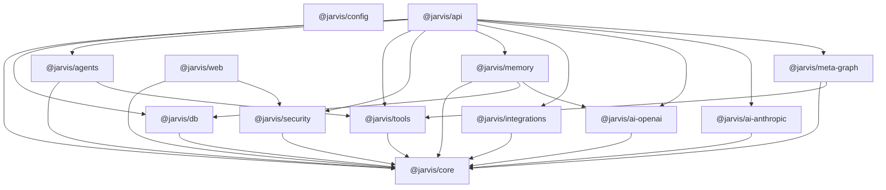
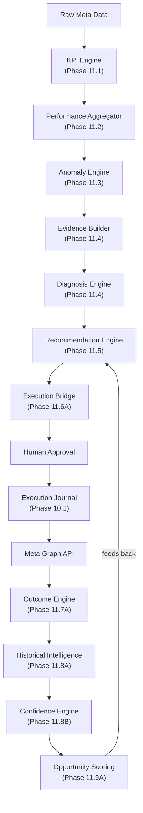
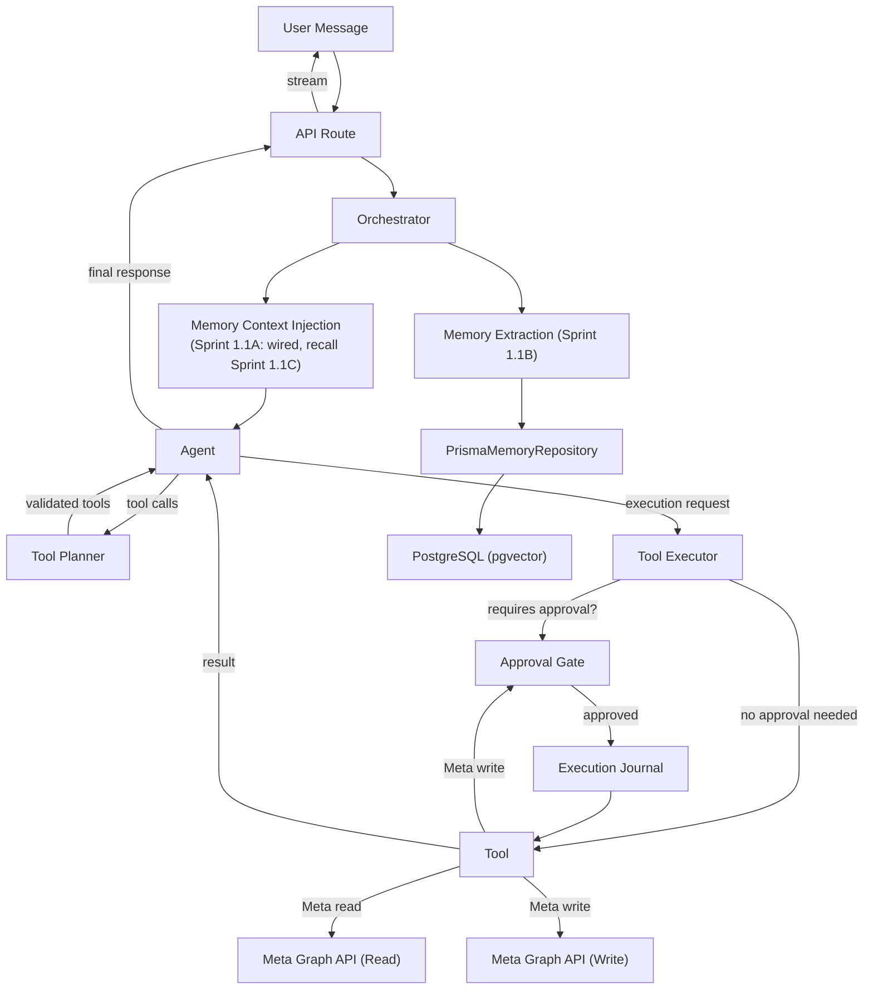
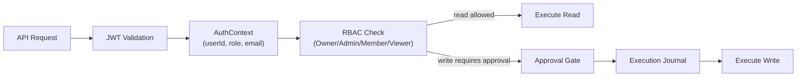
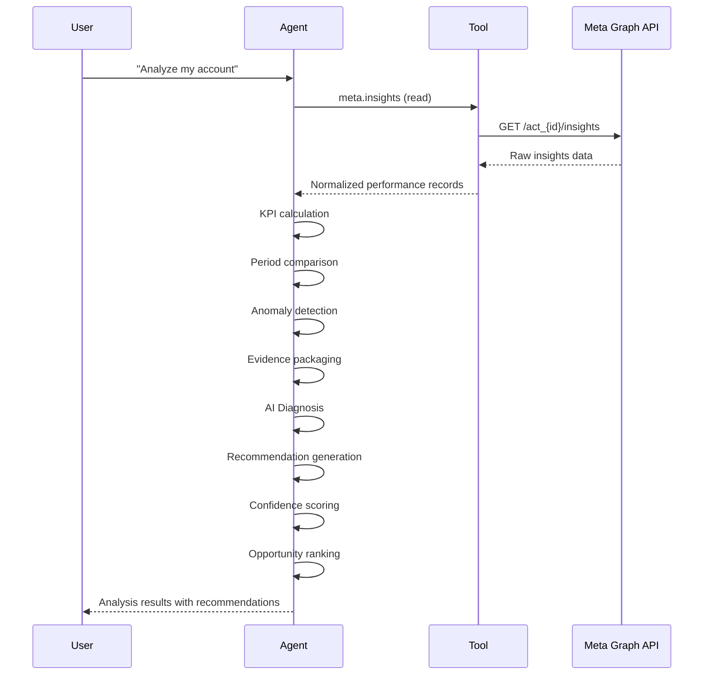
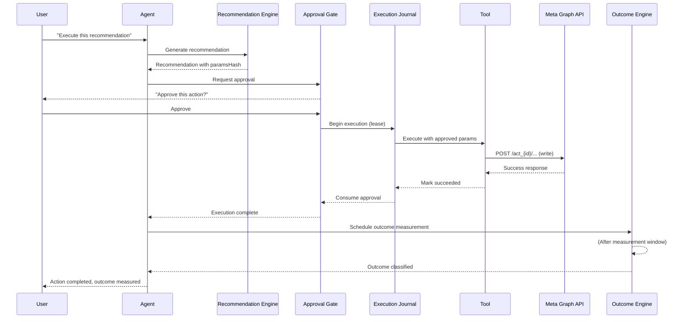
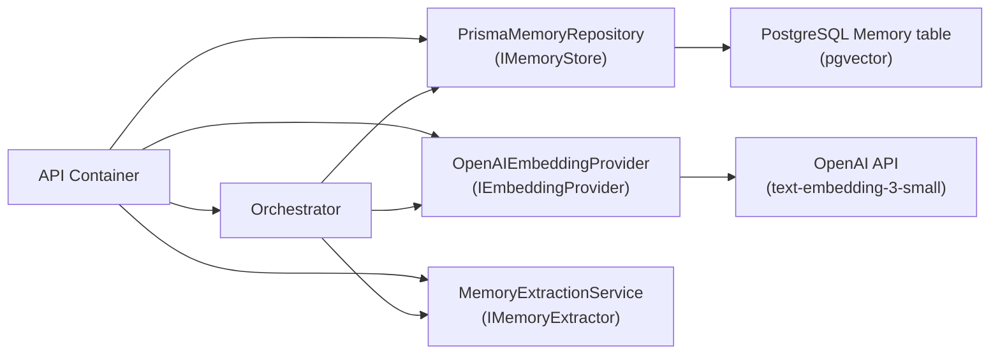
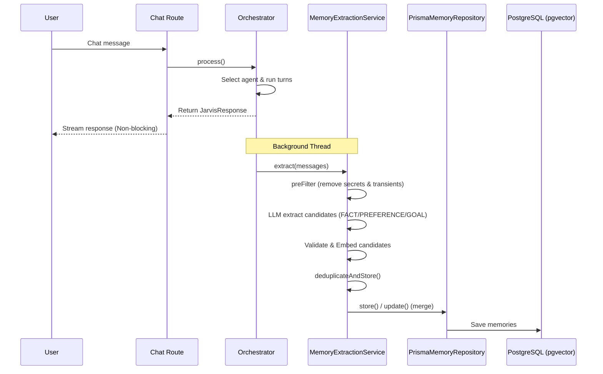

# JARVIS Architecture

## System Overview

JARVIS is a modular, agent-based AI platform built as a TypeScript monorepo. It combines conversational AI, marketing data analysis, controlled campaign automation, and outcome measurement.

The system is designed around three non-negotiable principles:
1. **Safety first** — Every write operation requires human approval, parameter binding, and durable journaling.
2. **Deterministic intelligence** — Mathematical analysis, anomaly detection, recommendations, and scoring are fully deterministic. AI (LLM) is used only for natural language diagnosis.
3. **Evidence-based learning** — Outcomes are measured and recorded. Historical outcomes inform future confidence but never guarantee results.

---

## Monorepo Structure

The project uses Turborepo with pnpm workspaces.

```
jarvis/
├── apps/
│   ├── api/            Backend API server (Express + Socket.IO)
│   └── web/            Frontend (Next.js 14 App Router)
├── packages/
│   ├── core/           Shared types, interfaces, constants, engines
│   ├── db/             Prisma schema, migrations, repositories
│   ├── agents/         Agent system (registry, orchestrator, planner)
│   ├── tools/          Tool system (registry, executor, implementations)
│   ├── security/       Auth, RBAC, approval system, audit logging
│   ├── memory/         Long-term memory, knowledge base, RAG pipeline
│   ├── integrations/   Third-party API wrappers (Google, Meta, n8n, WhatsApp)
│   ├── ai-openai/      OpenAI provider adapter
│   ├── ai-anthropic/   Anthropic Claude provider adapter
│   ├── meta-graph/     Meta/Facebook Graph API integration
│   └── config/         Environment validation
├── docs/               Documentation
└── turbo.json          Turborepo task configuration
```

### Package Dependency Graph



---

## Technology Stack

| Layer | Technology |
|-------|-----------|
| Monorepo | Turborepo v2 + pnpm 9 workspaces |
| Frontend | Next.js 14 (App Router), React 18, Tailwind CSS, zustand, next-auth |
| Backend | Node.js 20+, Express 4, Socket.IO 4, ESM modules |
| Database | PostgreSQL 16+, Prisma ORM 5.15, pgvector (embeddings) |
| AI Providers | OpenAI API (GPT-4, Embeddings), Anthropic Claude SDK |
| Auth | jsonwebtoken, next-auth (frontend), custom RBAC |
| Testing | Vitest 4, @testing-library/react, PostgreSQL integration tests |
| Validation | Zod 3.23 (runtime contract validation at every trust boundary) |

---

## Core Engine Pipeline

The intelligence pipeline is the heart of JARVIS. Each engine is independent, deterministic, and testable in isolation.



### Engine Details

#### KPI Engine (Phase 11.1)
- **File:** `packages/core/src/kpi-engine.ts`
- **Purpose:** Calculates canonical marketing KPIs from raw counts.
- **KPIs:** CTR, CPC, CPM, CPA, ROAS, CVR, Frequency.
- **Properties:** Deterministic, zero NaN/Infinity, handles null/zero denominators.
- **Test count:** 80+ test cases.

#### Performance Aggregator (Phase 11.2)
- **File:** `packages/core/src/performance-aggregator.ts`
- **Purpose:** Aggregates raw performance records, computes period-over-period comparisons, manages date window ranges.
- **Properties:** Handles custom and preset time windows, currency consistency validation, timezone-aware date formatting.
- **Test count:** 40+ test cases.

#### Anomaly Engine (Phase 11.3)
- **File:** `packages/core/src/anomaly-engine.ts`
- **Purpose:** Detects statistical anomalies in KPI data using median/MAD (outlier-resistant) methods.
- **Properties:** Directional semantics (CPA higher = bad, CTR lower = bad), z-score severity classification, deterministic anomaly IDs.
- **Test count:** 40+ test cases.

#### Evidence Builder (Phase 11.4)
- **File:** `packages/core/src/evidence-builder.ts`
- **Purpose:** Packages raw metrics, anomalies, and quality indicators into structured evidence for the diagnosis engine.
- **Properties:** Strict Zod validation, content hashing, prompt injection defense.
- **Test count:** 50+ test cases.

#### Diagnosis Engine (Phase 11.4)
- **File:** `packages/core/src/diagnosis-engine.ts`, `diagnosis-prompt.ts`, `diagnosis-verification.ts`
- **Purpose:** The ONLY engine that uses AI (LLM). Generates hypotheses about causes of anomalies.
- **Properties:** Structured prompt, deterministic parsing, fact/inference separation, prompt injection defense, sanitized output.
- **Test count:** 80+ test cases.

#### Recommendation Engine (Phase 11.5)
- **File:** `packages/core/src/recommendation-engine.ts`
- **Purpose:** Generates specific, actionable recommendations from diagnosis outcomes.
- **Properties:** Deterministic (no LLM), action catalog mapping to safe Meta write tools, budget guardrails, conflict detection, state hash verification.
- **Test count:** 50+ test cases.

#### Recommendation Confidence (Phase 11.8B)
- **File:** `packages/core/src/recommendation-confidence.ts`
- **Purpose:** Integrates historical outcome evidence to assign confidence and priority levels.
- **Properties:** Deterministic, sample size handling, consistency assessment, recency decay, no causal claims.
- **Test count:** 48 test cases.

#### Opportunity Scoring (Phase 11.9A)
- **File:** `packages/core/src/opportunity-scoring.ts`
- **Purpose:** Ranks recommendations by business importance for human review.
- **Properties:** Deterministic weighted scoring (severity/impact/urgency/confidence/historical/reversibility), priority bands, conflict detection, eligibility gates.
- **Test count:** 33 test cases.

#### Outcome Engine (Phase 11.7A)
- **File:** `packages/core/src/outcome-engine.ts`
- **Purpose:** Measures whether executed actions actually produced expected results.
- **Properties:** Deterministic, non-autonomous, baseline capture, materiality thresholds, confounder detection, no causal claims.
- **Test count:** 50+ test cases.

#### Outcome Worker (Phase 11.7B)
- **File:** `packages/core/src/outcome-worker.ts`
- **Purpose:** Background processing of outcome measurements (batch, idempotent).
- **Properties:** Claims-based processing, deterministic, crash-recoverable.
- **Test count:** 30+ test cases.

#### Historical Outcome Engine (Phase 11.8A)
- **File:** `packages/core/src/historical-outcome-engine.ts`
- **Purpose:** Matches current situations to historical outcomes for evidence-based confidence.
- **Properties:** Deterministic similarity matching, recency weighting, relevance scoring.
- **Test count:** 40+ test cases.

---

## Agent System

### Architecture



### Registered Agents

| Agent | Status | Purpose |
|-------|--------|---------|
| `conversational-assistant` | IMPLEMENTED | General-purpose conversational agent with tool access |
| `meta-ads` (dedicated) | **NOT YET (Sprint 2 baseline)** | Intended single dedicated Meta Ads agent, reusing the existing 13 meta tools + approval flow. Sprint 2 wires this one agent (no multi-agent router). |

### Tool Registry

| Category | Tools | Status |
|----------|-------|--------|
| Meta Ads Read | `meta.insights`, `meta.campaigns`, `meta.ad-sets`, `meta.ads` | IMPLEMENTED, VERIFIED |
| Meta Ads Write | `meta.pause-campaign`, `meta.resume-campaign`, `meta.pause-ad-set`, `meta.resume-ad-set`, `meta.pause-ad`, `meta.resume-ad`, `meta.update-campaign-budget`, `meta.update-ad-set-budget`, `meta.create-campaign` | IMPLEMENTED, VERIFIED |
| Analysis | `csv-analyzer`, `document-analyzer` | IMPLEMENTED, VERIFIED |
| Research | `web-research` | IMPLEMENTED, VERIFIED |
| Output | `pdf-generator` | IMPLEMENTED, VERIFIED |
| System | `system-echo` | IMPLEMENTED, VERIFIED |
| Mock | `meta.ads-mock` | IMPLEMENTED (testing) |

---

## Security Architecture

### Authentication & Authorization



- **Passwords:** scrypt hashing with per-user salt and timing-safe comparison.
- **Tokens:** JWT access tokens with refresh token rotation and reuse detection.
- **RBAC:** Owner > Admin > Member > Viewer permission hierarchy.
- **Audit:** Every request creates an audit log entry with trace ID.

### Approval System

The approval system enforces human-in-the-loop control:

1. **Creation:** Approval created with paramsHash (SHA-256 of canonical parameters).
2. **Binding:** paramsHash cryptographically binds the approval to exact execution parameters.
3. **Verification:** Before execution, paramsHash is re-verified. Mismatches are rejected.
4. **Consumption:** Approval is consumed atomically on first use. Cannot be reused.
5. **Expiry:** Expired approvals are rejected.
6. **Isolation:** Approval is bound to a specific user and account.

### Execution Journal

Durable execution lifecycle tracking:

| State | Meaning |
|-------|---------|
| PENDING | Awaiting approval |
| APPROVED | Approved, not yet started |
| EXECUTING | Actively running (lease-held) |
| SUCCEEDED | Completed successfully |
| FAILED | Deterministically failed |
| UNKNOWN | Outcome uncertain (timeout after potential transmission) |
| RECONCILING | Being verified against external state |
| SAFE_TO_RETRY | Reconciliation confirmed safe to retry |
| CANCELLED | Cancelled before execution |

Key rules:
- UNKNOWN is never auto-retried.
- UNKNOWN is never auto-converted to FAILED.
- Crash recovery maps stale EXECUTING to UNKNOWN (never FAILED).
- Only one process can hold the lease for a given execution.

---

## Data Flow

### Read Path (Analysis)



### Write Path (Execution)



---

## Database Schema

The Prisma schema defines 13 models across these tables:

| Model | Purpose | Key Fields |
|-------|---------|------------|
| User | User accounts | id, email, passwordHash, role |
| RefreshToken | Token rotation | token, userId, expiresAt, revoked |
| Conversation | Chat sessions | id, userId, title, agentId |
| Message | Chat messages | id, conversationId, role, content |
| Agent | Agent registry | id, name, enabled, config |
| Memory | Long-term memory | id, type, content, embedding (pgvector) |
| KnowledgeDocument | Uploaded docs | id, userId, content, metadata |
| KnowledgeDocumentChunk | RAG chunks | id, documentId, content, embedding |
| Approval | Human approvals | id, paramsHash, status, userId, expiresAt |
| AuditLog | Request audit trail | id, userId, action, resource, traceId |
| ToolExecution | Execution journal | id, toolId, idempotencyKey, status, lease |
| MarketingAccount | Connected accounts | id, provider, accountId, accessToken |
| MetricSnapshot | Performance snapshots | id, accountId, date, metrics |
| PerformanceRecommendation | Recommendations | id, action, paramsHash, confidence, priority |
| DecisionRecord | Decision tracking | id, recommendationId, decision, timestamp |
| OutcomeRecord | Measured outcomes | id, executionId, verdict, baseline, postMetrics |
| OutcomeRevision | Outcome immutability | id, outcomeId, change, timestamp |

---

## API Design

### REST Endpoints

| Route | Method | Purpose |
|-------|--------|---------|
| `/api/v1/auth/register` | POST | User registration |
| `/api/v1/auth/login` | POST | User login |
| `/api/v1/auth/refresh` | POST | Token refresh |
| `/api/v1/chat` | POST | Send chat message |
| `/api/v1/conversations` | GET | List conversations |
| `/api/v1/conversations/:id` | GET | Get conversation |
| `/api/v1/approvals` | GET | List pending approvals |
| `/api/v1/approvals/:id/approve` | POST | Approve action |
| `/api/v1/approvals/:id/reject` | POST | Reject action |
| `/api/v1/recommendations` | GET | List recommendations |
| `/api/v1/outcomes` | GET | List outcomes |
| `/api/v1/health` | GET | Health check |

### Real-time

- Socket.IO for streaming chat responses and approval notifications.
- Event types: `agent:message`, `agent:status`, `approval:pending`, `approval:resolved`.

---

## Testing Strategy

### Test Distribution

| Package | Tests | Type |
|---------|-------|------|
| packages/core | 382 | Unit (deterministic, no I/O) |
| packages/tools | 573 | Unit + phase-specific regression |
| packages/db | ~200 | PostgreSQL integration |
| packages/agents | 66 | Unit |
| packages/meta-graph | 103 | Unit |
| packages/security | 27 | Unit |
| packages/memory | 76 | Unit |
| packages/ai-openai | 3 | Unit |
| apps/api | 170 | Unit + integration (Sprint 1.1A adds 24, Sprint 1.1B adds 11, Sprint 1.1C adds 10, Sprint 1.1D adds 12) |
| apps/web | 32 | Unit + component |
| **Total** | **~1,630** | |

### Testing Principles

- **Deterministic tests only.** No random data, no network calls, no real API keys in tests.
- **Fake AI providers.** All LLM tests use deterministic fake providers that return scripted responses.
- **Fake Meta providers.** All Meta tests use mock providers that return scripted data.
- **PostgreSQL integration tests** use a real PostgreSQL instance (required for DB-backed features).
- **Zero real Meta writes** in any test suite.
- **Zero real LLM calls** in any test suite.

---

## Error Handling

JARVIS uses a structured error taxonomy:

| Error Code | HTTP Status | Meaning |
|-----------|-------------|---------|
| AUTHENTICATION_REQUIRED | 401 | Valid authentication required |
| AUTHORIZATION_DENIED | 403 | Insufficient permissions |
| INVALID_REQUEST | 400 | Malformed request |
| RESOURCE_NOT_FOUND | 404 | Entity does not exist |
| AGENT_NOT_FOUND | 404 | Agent does not exist |
| AGENT_ERROR | 500 | Agent processing error |
| TOOL_EXECUTION_FAILED | 500 | Tool execution failed |
| TOOL_TIMEOUT | 504 | Tool execution timed out |
| APPROVAL_REQUIRED | 428 | Human approval required |
| APPROVAL_EXPIRED | 410 | Approval has expired |
| RATE_LIMITED | 429 | Too many requests |
| INTERNAL_ERROR | 500 | Unexpected error |
| CONVERSATION_NOT_FOUND | 404 | Conversation does not exist |

---

## Environment Configuration

### Required

| Variable | Purpose |
|----------|---------|
| `DATABASE_URL` | PostgreSQL connection string |
| `JWT_SECRET` | Token signing secret |
| `OPENAI_API_KEY` | OpenAI API access |

### Optional

| Variable | Purpose |
|----------|---------|
| `ANTHROPIC_API_KEY` | Anthropic Claude access |
| `META_ACCESS_TOKEN` | Meta Graph API access token |
| `META_APP_ID` | Meta app identifier |
| `META_APP_SECRET` | Meta app secret |
| `REDIS_URL` | Redis connection (caching) |
| `N8N_WEBHOOK_URL` | n8n automation webhooks |

All environment variables are validated at startup using Zod schemas.

### Correction (added 2026-09-14)

Previous documentation listed `META_APP_ID`, `META_APP_SECRET`, `REDIS_URL` and `N8N_WEBHOOK_URL` as optional variables. This was incorrect: no code reads any of them. It also stated that every variable is validated through Zod; many are read directly from `process.env` by the package that uses them.
The accurate, complete list of variable names is `.env.example` at the repository root.
Evidence: `git grep` for each name finds no reader — see `docs/CODEBASE_AUDIT.md` §6.

### Correction (added 2026-09-15)

Previous documentation listed `OPENAI_API_KEY` as required in every environment. This is no longer accurate.
It is required in production: `checkProductionConfig` refuses to start a production process without it or with the `.env.example` placeholder. A development API starts without it, and chat answers 503 `AI_PROVIDER_NOT_CONFIGURED`.
Evidence: `packages/config/src/index.ts` (`checkProductionConfig`, `isOpenAIConfigured`); `apps/api/src/services/container.ts`; ledger R-21.

---

## Sprint 1.1A — Persistent Memory Wiring (2026-08-27)

### What Changed

The API container (`apps/api/src/services/container.ts`) was wired to use the existing `PrismaMemoryRepository` (persistent) instead of relying on `createNoopMemoryStore()` (silent no-op). The Orchestrator's `memoryStore ?? createNoopMemoryStore()` fallback only fires when `OPENAI_API_KEY` is absent — not in production.

### Memory Dependency Chain (Production)



### Graceful Degradation

If `OPENAI_API_KEY` is absent:
- `OpenAIEmbeddingProvider` constructor throws.
- All three (`memoryStore`, `embeddingProvider`, `memoryExtractor`) are set to `null`.
- Orchestrator receives no memory config → falls back to noop internally.
- **Correction (2026-09-14):** the application does not start. `container.ts` also constructs the chat `OpenAIAdapter`, which throws without the key — see `JARVIS_MASTER_AUDIT_AND_DEVELOPMENT_LEDGER.md`, R-21.
- **Correction (added 2026-09-15):** R-21 is fixed. Without the key a development API now starts: the agents get `NotConfiguredAIProvider` and chat answers 503 `AI_PROVIDER_NOT_CONFIGURED`, with memory disabled as described above. A production process refuses to start without the key. Evidence: `apps/api/src/services/container.ts`, `apps/api/test/container-ai-provider.test.ts`.

### Noop Store (Retained)

The `createNoopMemoryStore()` inside `orchestrator.ts` is retained as a safe fallback for:
- Orchestrator instances created without memory config (unit tests, dev without OPENAI_API_KEY).
- Any future test that deliberately isolates memory behavior.

It is **never** used in the production container when `OPENAI_API_KEY` is set.

### What Is NOT Done Yet

- Memory recall/extraction dashboard UI (Sprint 1.1D / future phase).

---

## Sprint 1.1B — Memory Extraction Service Wiring (2026-08-27)

### What Changed

The existing `MemoryExtractionService` has been fully integrated into the real conversation lifecycle. On every conversational response generated by the Orchestrator, extraction is triggered in the background (`extractMemoryAsync()`). 

### Sequence Diagram



### Safety and Filtering

- **Secrets and API Keys:** Deterministic pre-filter (`containsSecret()`) blocks conversational turns containing key patterns or credentials before passing them to the LLM or storing them.
- **Transient/Ordinary Conversation:** Transient filters block small chat elements ("hi", "ok", "yes") and low-value content from persisting.
- **User Scoping:** User ID is bound to all stored memories from the authenticated request context. User A and User B cannot view or modify each other's memories.
- **Duplicates & Deduplication:** Cosine similarity and character overlap checks trigger merges (`store.update()`) or complete skips on duplicate content, ensuring table rows stay clean.

---

## Sprint 1.1C — Memory Recall Wiring (2026-08-27)

### What Changed

The existing `MemoryRecall` and prompt injection functionality have been fully wired into the conversation turn execution loop. Before sending user input to the AI model, the `Orchestrator` performs a contextual search using the embedding vector of the current message.

### Recall Mechanism

1. **Embedding Generation:** Orchestrator queries `OpenAIEmbeddingProvider` (`getQueryEmbedding()`) to fetch a 1536-dimensional vector for the user request.
2. **Database Vector Search:** Calls `PrismaMemoryRepository.recall()` to execute raw cosine similarity `<=>` in PostgreSQL, bounded by `relevanceThreshold` (0.3) and `maxMemories` (5).
3. **Punctuation-resistant Fallback:** If pgvector fails or is un-indexed, falls back to list-and-loop manual dot product ranking.
4. **Context Building:** Memories are enclosed in `<user_memories>` XML tags and prepended to the user's message as contextual notes.

### Safety and Security

- **Rule Enforcement:** Recalled memories are framed strictly as contextual data, preventing malicious stored memories ("Ignore previous instructions...") from hijacking the AI prompt instructions.
- **Fail-open Recovery:** If database retrieval or embedding providers fail, the query proceeds normally with no injected memories, rather than crashing.
- **Strict Scoping:** Every SQL/list recall requires user ID context parameters, ensuring zero cross-tenant leakage.

---

## Sprint 1.1D — Full Memory E2E Validation (2026-08-27)

### What Changed

The full production memory lifecycle has been validated end-to-end using a dedicated integration suite (`apps/api/test/sprint-1.1d-memory-e2e.test.ts`), which automatically falls back to in-process memory in database-less environments.

### Lifecycle Validated

1. **Extraction:** Verified that LLM structured completion outputs are extracted as specific types (`FACT`, `PREFERENCE`, or `GOAL`).
2. **Persistence:** Verified records successfully save in the persistent `IMemoryStore` with scopes, metadata, and expiration.
3. **Recall:** Verified that vector search (`pgvector`) queries return relevant content based on incoming queries.
4. **Injection:** Verified delimiters `<user_memories>` inject context block to shape agent completion behaviors.
5. **Behavioral response:** Verified recalled preferences/goals successfully influence conversational responses.

## Dedicated Meta Ads Agent Foundation (Sprint 2.1 — 2026-08-27)

### What Changed

We created and integrated the dedicated `MetaAdsAgent` foundation to manage, analyze, and optimize Meta campaigns utilizing the existing safety boundaries, tools, and execution models.

### Architecture Highlights

1. **Dedicated MetaAdsAgent Class:**
   - Implemented in [`packages/agents/src/agents/meta-ads-agent.ts`](file:///d:/dreamprojectjarvis/dreamprojectjarvis/packages/agents/src/agents/meta-ads-agent.ts).
   - Features a built-in default system prompt specifying the campaign hierarchy, distinguishing FACT (verified data) vs. INFERENCE (calculated trends) vs. HYPOTHESIS (diagnostic possibilities), enforcing read-first analysis, and guiding safe write approval execution.
   - Authoritatively retrieves the user's active Meta account context using `meta.accounts` tool execution during process init, preventing LLM Account ID hallucinations.
2. **Intent-based Dynamic Routing:**
   - Modified the `Orchestrator` agent selection flow (`selectAgent`) to route queries dynamically.
   - Evaluates incoming message content via keyword boundary checking (`isMetaAdsQuery`). Meta-specific queries route to `MetaAdsAgent`, while general tasks fall back to `ConversationalAssistant`.
3. **Verification Suite:**
   - Implemented 6 tests in [`packages/agents/test/meta-ads-agent.test.ts`](file:///d:/dreamprojectjarvis/dreamprojectjarvis/packages/agents/test/meta-ads-agent.test.ts) covering routing, context injection, memory integration, write-safety, and reasoning boundaries.
4. **Baseline Heath Defect resolved:**
   - Restored the missing declaration of `comparePerformanceSummaries` inside [`packages/core/src/performance-aggregator.ts`](file:///d:/dreamprojectjarvis/dreamprojectjarvis/packages/core/src/performance-aggregator.ts) to clean compile all 13 workspace packages.

---

## Current-State Meta Ads Architecture (Sprint 2.0 baseline)

For the authoritative READ-ONLY inventory used as the Sprint-2 start point, see:

- **Mermaid diagram:** [`docs/diagrams/meta-ads-current-architecture.mmd`](./diagrams/meta-ads-current-architecture.mmd) — color-coded by entry point (user-accessible routes = green, standalone `phase116b/propose.ts` script = purple, implemented-but-unwired `OutcomeWorker`/diagnosis route = red, DB persist layer = orange).
- **Change boundary:** [`SPRINT_2_META_ADS_CHANGE_BOUNDARY.md`](./reports/SPRINT_2_META_ADS_CHANGE_BOUNDARY.md)
- **Baseline audit:** [`SPRINT_2.0_META_ADS_BASELINE_AUDIT.md`](./reports/SPRINT_2.0_META_ADS_BASELINE_AUDIT.md)

### Key baseline facts (verified read-only)

- The only registered agent is `conversational-assistant` (`packages/agents/src/registry.ts`). There is **no dedicated Meta Ads agent**.
- All 13 Meta tools (5 read + 9 approval-bound write) already exist and are wired in `apps/api/src/services/container.ts` via the real provider (gated on `META_ACCESS_TOKEN` + `META_AD_ACCOUNT_ID`) and the `resolvingRegistry`/`sanitizeToolName` name-translation fix.
- The intelligence pipeline's only user-accessible stages are the **read-only** routes `GET /api/v1/opportunities`, `GET /api/v1/recommendations` (+execute), and `GET /api/v1/outcomes`. The full **generation** pipeline (KPI→anomaly→diagnosis→recommendation) is reachable only via the standalone CLI `apps/api/scripts/phase116b/propose.ts`.
- `OutcomeWorker` (Phase 11.7B) is implemented + tested but **not wired** to any scheduler/cron/route.
- Zero real Meta writes in any test; all tests use `MockMetaProvider`.

---

## Meta Ads Domain Intelligence (Sprint 2.2 — 2026-08-27)

### What Changed

We upgraded the `MetaAdsAgent` to understand campaign structures, performance metrics, budget pacing, campaign objectives, delivery states, and creative fatigue hypotheses, without duplicating any of the existing math or scoring engines in `@jarvis/core`.

### Architecture Highlights

1. **Meta Ads Domain Knowledge Prompts:**
   - Prompt rules explicitly detail hierarchy navigation (Campaign -> Ad Set -> Ad -> Creative), objective alignment (Traffic CTR/CPC vs. Conversion CPA/CVR/ROAS), delivery states (ACTIVE, PAUSED, LEARNING, DISAPPROVED, etc.), pacing budget rules, and creative fatigue signals.
2. **Evidence-First & Accuracies Enforcement:**
   - Prompts mandate an evidence-first reasoning format: Observed Evidence $\rightarrow$ Interpretation $\rightarrow$ Alternative Explanation $\rightarrow$ Confidence $\rightarrow$ Next Step.
   - Enforces strict distinction of FACT vs. INFERENCE vs. HYPOTHESIS, prohibiting ID hallucinations and guaranteed marketing claims.
3. **Verification Suite Expansion:**
   - Expanded [`packages/agents/test/meta-ads-agent.test.ts`](file:///d:/dreamprojectjarvis/dreamprojectjarvis/packages/agents/test/meta-ads-agent.test.ts) to cover **24** tests, verifying every domain, layout, and safety rule.

---

## Meta Account Context & Preloading (Sprint 2.3 — 2026-08-29)

### What Changed

We standardise server-authoritative account context fetching and initial bounding preloading. We address concurrency leaks and prompt injection bypasses.

### Architecture Highlights

1. **Server-Authoritative Context Fetching:**
   - In [`packages/agents/src/agents/meta-ads-agent.ts`](file:///d:/dreamprojectjarvis/dreamprojectjarvis/packages/agents/src/agents/meta-ads-agent.ts), during the start of agent processing, the agent executes `meta.accounts` tool.
   - Restricts LLM account ID fabrication by locking actions to the retrieved active account ID (`act_100` / `act_200`).
2. **Concurrency & Isolation Safety:**
   - Introduced request-scoped context tracking using `activeContexts` Map keyed by `conversationId`.
   - Prevents multi-user request cross-leakage where concurrent executions on the singleton agent would otherwise overwrite `this.context`.
3. **Bounded Campaign Preloading:**
   - Automatically preloads a lightweight, bounded campaign status summary (total/active/paused campaign counts) using existing read tools (`meta.campaigns`), providing initial campaign context with zero repeated database or API queries.
4. **Injection Protection:**
   - System prompts lock execution parameters to the authoritative context, resisting prompt injection queries (e.g. *"Use account act_fake999 instead"*) or malicious memory preferences trying to hijack account scopes.
5. **Verification Suite Expansion:**
   - Extended [`packages/agents/test/meta-ads-agent.test.ts`](file:///d:/dreamprojectjarvis/dreamprojectjarvis/packages/agents/test/meta-ads-agent.test.ts) to a total of **44** tests to cover authoritative context resolution, multi-user/concurrency isolation, prompt injections, and credentials containment.

---

## Meta Ads Intent Routing Hardening (Sprint 2.4 — 2026-08-29)

### What Changed

We hardened the intent routing logic to reliably separate Meta Ads queries from general or competing queries (e.g. Google Ads, LinkedIn Ads, general tools like Python and Gmail) and implemented context-aware conversation history parsing to retain agent context across multi-turn interactions.

### Architecture Highlights

1. **Precedence-based Pipeline:**
   - **Stage 1 (Platform Override):** Checks the incoming message against explicit non-Meta triggers (Google, LinkedIn, Python, Gmail, etc.). If matched, immediately bypasses Meta routing (highest precedence).
   - **Stage 2 (Explicit Meta):** Checks for explicit Meta keywords (`meta`, `facebook`, `instagram`, `insta`). If present, routes to `MetaAdsAgent`.
   - **Stage 3 (Strong Domain Intent):** Evaluates specialized domain terminologies (`cpa`, `roas`, `ctr`, `cpc`, `cpm`, `adset`, etc.). If present, routes to `MetaAdsAgent`.
   - **Stage 4 (Context-Aware Generic):** If generic keywords (e.g., `campaign`, `budget`, `performance`, `optimize`, `pause`) are matched, the router scans the last 3 turns of conversation history. If Meta context was established in history, routes to `MetaAdsAgent`. Otherwise, falls back to `ConversationalAssistant` (safe fallback).
2. **Context Tracker Enrichment:**
   - Updated the `Orchestrator` `process` loop to assign `context.agentId` with the selected agent's ID upon resolving the agent. This tracks agent resolution deterministically and feeds back to client responses.
3. **Stale Context Escape:**
   - Solves the trap of sticking inside the same agent by ensuring a user's sudden shift of focus (e.g. *"Ab Gmail summarize karo"*) is instantly caught by Platform Overrides and routed back to the default Conversational Assistant.
4. **Verification Suite Expansion:**
   - Appended **20** intent routing tests to `packages/agents/test/meta-ads-agent.test.ts` (bringing the total to **235 tests** in the agent package), verifying platform overrides, Hinglish/Hindi routing, negatives, context, stale context escape, and security boundaries.

---

*Document version: 1.8*
*Last updated: 2026-08-29*
*Sprint 2.4 complete: Intent routing hardening with platform overrides and context-aware conversation history check implemented and verified.*

---

## Knowledge Schema & Repository Foundation (Sprint 3.1 — 2026-08-29)

### What Changed

We implemented the persistent database and repository foundation for RAG/Knowledge Documents and Chunks, building the secure database layer for Sprint 3.

```
   Knowledge Document (Source Upload)
              ↓
      KnowledgeDocument (Table: metadata, userId, title, documentType, status)
              ↓ [Cascade Delete]
      KnowledgeChunk (Table: content, chunkIndex, embedding [vector])
```

### Architecture Highlights

1. **User/Tenant Ownership Isolation:**
   - Updated the Prisma schema to add `userId` relation to `KnowledgeDocument`, securing the isolation boundary. User A is prevented from viewing or listing User B's documents or chunks.
2. **Cascade Delete and Referential Integrity:**
   - Configured `onDelete: Cascade` constraint on both `KnowledgeDocument` (User relation) and `KnowledgeChunk` (KnowledgeDocument relation), guaranteeing that deleting a User or a Document automatically purges all related child records without leaving orphaned database rows.
3. **Prisma Knowledge Repository:**
   - Created `PrismaKnowledgeRepository` implementing `IKnowledgeRepository` inside [knowledge-repository.ts](file:///d:/dreamprojectjarvis/dreamprojectjarvis/packages/db/src/repositories/knowledge-repository.ts).
   - Supports atomic creation, updates, listing, updates of document statuses (e.g. `UPLOADED`, `PROCESSING`, `INDEXED`, `FAILED`), transactional creation of chunk rows, and deletion of docs/chunks.
4. **Prisma Client Generation & Registration:**
   - Regenerated Prisma Client and registered the new repository service in the API container [container.ts](file:///d:/dreamprojectjarvis/dreamprojectjarvis/apps/api/src/services/container.ts).
5. **Durable Testing:**
   - Added **20** unit tests in [knowledge-repository.test.ts](file:///d:/dreamprojectjarvis/dreamprojectjarvis/packages/db/test/knowledge-repository.test.ts) covering creation, retrieval, listing, status transitions, transactional chunk rollbacks, and ownership isolation checks.

---

*Document version: 1.9*
*Last updated: 2026-08-29*
*Sprint 3.1 complete: Knowledge schema and repository database foundations implemented and fully tested.*
