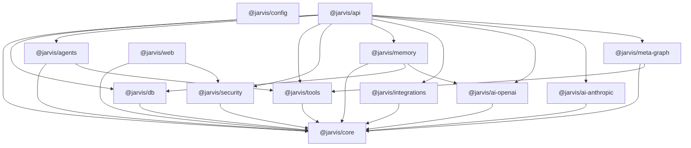
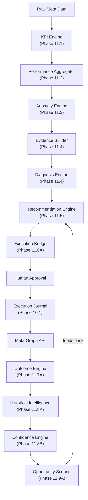
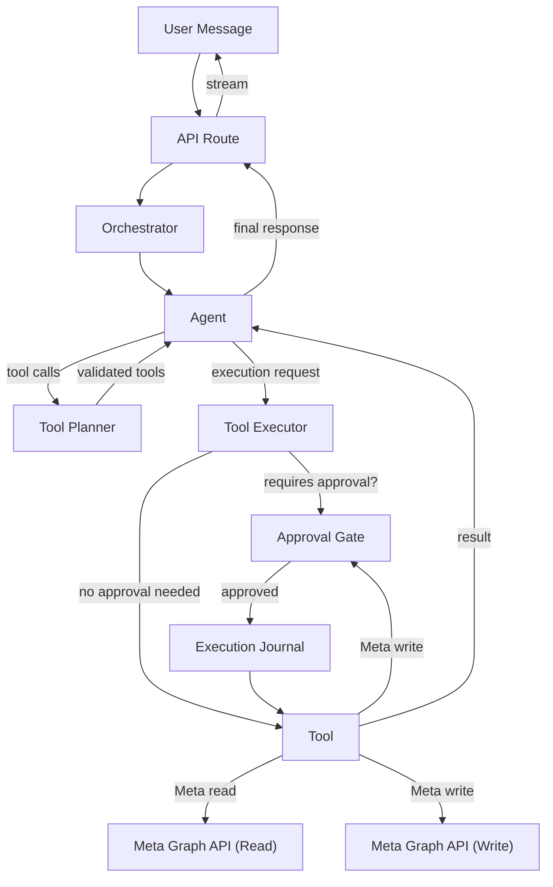
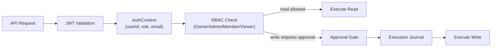
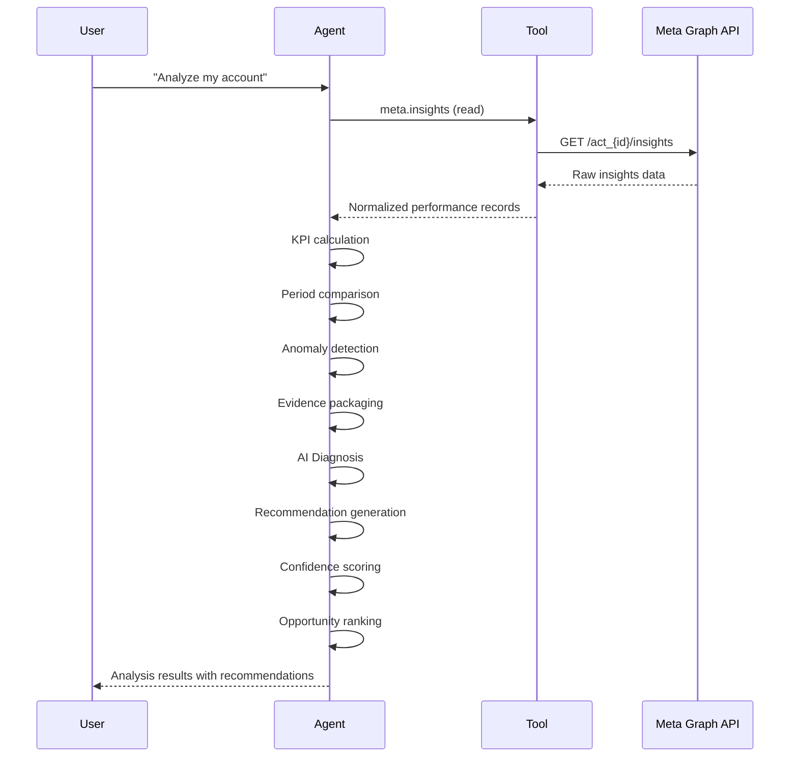
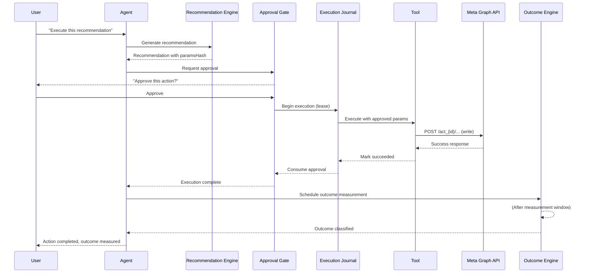

# JARVIS Architecture

## System Overview

JARVIS is a modular, agent-based AI platform built as a TypeScript monorepo. It combines conversational AI, marketing data analysis, controlled campaign automation, and outcome measurement.

The system is designed around three non-negotiable principles:
1. **Safety first** — Every write operation requires human approval, parameter binding, and durable journaling.
2. **Deterministic intelligence** — Mathematical analysis, anomaly detection, recommendations, and scoring are fully deterministic. AI (LLM) is used only for natural language diagnosis.
3. **Evidence-based learning** — Outcomes are measured and recorded. Historical outcomes inform future confidence but never guarantee results.

---

## Monorepo Structure

The project uses Turborepo with pnpm workspaces.

```
jarvis/
├── apps/
│   ├── api/            Backend API server (Express + Socket.IO)
│   └── web/            Frontend (Next.js 14 App Router)
├── packages/
│   ├── core/           Shared types, interfaces, constants, engines
│   ├── db/             Prisma schema, migrations, repositories
│   ├── agents/         Agent system (registry, orchestrator, planner)
│   ├── tools/          Tool system (registry, executor, implementations)
│   ├── security/       Auth, RBAC, approval system, audit logging
│   ├── memory/         Long-term memory, knowledge base, RAG pipeline
│   ├── integrations/   Third-party API wrappers (Google, Meta, n8n, WhatsApp)
│   ├── ai-openai/      OpenAI provider adapter
│   ├── ai-anthropic/   Anthropic Claude provider adapter
│   ├── meta-graph/     Meta/Facebook Graph API integration
│   └── config/         Environment validation
├── docs/               Documentation
└── turbo.json          Turborepo task configuration
```

### Package Dependency Graph



---

## Technology Stack

| Layer | Technology |
|-------|-----------|
| Monorepo | Turborepo v2 + pnpm 9 workspaces |
| Frontend | Next.js 14 (App Router), React 18, Tailwind CSS, zustand, next-auth |
| Backend | Node.js 20+, Express 4, Socket.IO 4, ESM modules |
| Database | PostgreSQL 16+, Prisma ORM 5.15, pgvector (embeddings) |
| AI Providers | OpenAI API (GPT-4, Embeddings), Anthropic Claude SDK |
| Auth | jsonwebtoken, next-auth (frontend), custom RBAC |
| Testing | Vitest 4, @testing-library/react, PostgreSQL integration tests |
| Validation | Zod 3.23 (runtime contract validation at every trust boundary) |

---

## Core Engine Pipeline

The intelligence pipeline is the heart of JARVIS. Each engine is independent, deterministic, and testable in isolation.



### Engine Details

#### KPI Engine (Phase 11.1)
- **File:** `packages/core/src/kpi-engine.ts`
- **Purpose:** Calculates canonical marketing KPIs from raw counts.
- **KPIs:** CTR, CPC, CPM, CPA, ROAS, CVR, Frequency.
- **Properties:** Deterministic, zero NaN/Infinity, handles null/zero denominators.
- **Test count:** 80+ test cases.

#### Performance Aggregator (Phase 11.2)
- **File:** `packages/core/src/performance-aggregator.ts`
- **Purpose:** Aggregates raw performance records, computes period-over-period comparisons, manages date window ranges.
- **Properties:** Handles custom and preset time windows, currency consistency validation, timezone-aware date formatting.
- **Test count:** 40+ test cases.

#### Anomaly Engine (Phase 11.3)
- **File:** `packages/core/src/anomaly-engine.ts`
- **Purpose:** Detects statistical anomalies in KPI data using median/MAD (outlier-resistant) methods.
- **Properties:** Directional semantics (CPA higher = bad, CTR lower = bad), z-score severity classification, deterministic anomaly IDs.
- **Test count:** 40+ test cases.

#### Evidence Builder (Phase 11.4)
- **File:** `packages/core/src/evidence-builder.ts`
- **Purpose:** Packages raw metrics, anomalies, and quality indicators into structured evidence for the diagnosis engine.
- **Properties:** Strict Zod validation, content hashing, prompt injection defense.
- **Test count:** 50+ test cases.

#### Diagnosis Engine (Phase 11.4)
- **File:** `packages/core/src/diagnosis-engine.ts`, `diagnosis-prompt.ts`, `diagnosis-verification.ts`
- **Purpose:** The ONLY engine that uses AI (LLM). Generates hypotheses about causes of anomalies.
- **Properties:** Structured prompt, deterministic parsing, fact/inference separation, prompt injection defense, sanitized output.
- **Test count:** 80+ test cases.

#### Recommendation Engine (Phase 11.5)
- **File:** `packages/core/src/recommendation-engine.ts`
- **Purpose:** Generates specific, actionable recommendations from diagnosis outcomes.
- **Properties:** Deterministic (no LLM), action catalog mapping to safe Meta write tools, budget guardrails, conflict detection, state hash verification.
- **Test count:** 50+ test cases.

#### Recommendation Confidence (Phase 11.8B)
- **File:** `packages/core/src/recommendation-confidence.ts`
- **Purpose:** Integrates historical outcome evidence to assign confidence and priority levels.
- **Properties:** Deterministic, sample size handling, consistency assessment, recency decay, no causal claims.
- **Test count:** 48 test cases.

#### Opportunity Scoring (Phase 11.9A)
- **File:** `packages/core/src/opportunity-scoring.ts`
- **Purpose:** Ranks recommendations by business importance for human review.
- **Properties:** Deterministic weighted scoring (severity/impact/urgency/confidence/historical/reversibility), priority bands, conflict detection, eligibility gates.
- **Test count:** 33 test cases.

#### Outcome Engine (Phase 11.7A)
- **File:** `packages/core/src/outcome-engine.ts`
- **Purpose:** Measures whether executed actions actually produced expected results.
- **Properties:** Deterministic, non-autonomous, baseline capture, materiality thresholds, confounder detection, no causal claims.
- **Test count:** 50+ test cases.

#### Outcome Worker (Phase 11.7B)
- **File:** `packages/core/src/outcome-worker.ts`
- **Purpose:** Background processing of outcome measurements (batch, idempotent).
- **Properties:** Claims-based processing, deterministic, crash-recoverable.
- **Test count:** 30+ test cases.

#### Historical Outcome Engine (Phase 11.8A)
- **File:** `packages/core/src/historical-outcome-engine.ts`
- **Purpose:** Matches current situations to historical outcomes for evidence-based confidence.
- **Properties:** Deterministic similarity matching, recency weighting, relevance scoring.
- **Test count:** 40+ test cases.

---

## Agent System

### Architecture



### Registered Agents

| Agent | Status | Purpose |
|-------|--------|---------|
| `conversational-assistant` | IMPLEMENTED | General-purpose conversational agent with tool access |

### Tool Registry

| Category | Tools | Status |
|----------|-------|--------|
| Meta Ads Read | `meta.insights`, `meta.campaigns`, `meta.ad-sets`, `meta.ads` | IMPLEMENTED, VERIFIED |
| Meta Ads Write | `meta.pause-campaign`, `meta.resume-campaign`, `meta.pause-ad-set`, `meta.resume-ad-set`, `meta.pause-ad`, `meta.resume-ad`, `meta.update-campaign-budget`, `meta.update-ad-set-budget`, `meta.create-campaign` | IMPLEMENTED, VERIFIED |
| Analysis | `csv-analyzer`, `document-analyzer` | IMPLEMENTED, VERIFIED |
| Research | `web-research` | IMPLEMENTED, VERIFIED |
| Output | `pdf-generator` | IMPLEMENTED, VERIFIED |
| System | `system-echo` | IMPLEMENTED, VERIFIED |
| Mock | `meta.ads-mock` | IMPLEMENTED (testing) |

---

## Security Architecture

### Authentication & Authorization



- **Passwords:** scrypt hashing with per-user salt and timing-safe comparison.
- **Tokens:** JWT access tokens with refresh token rotation and reuse detection.
- **RBAC:** Owner > Admin > Member > Viewer permission hierarchy.
- **Audit:** Every request creates an audit log entry with trace ID.

### Approval System

The approval system enforces human-in-the-loop control:

1. **Creation:** Approval created with paramsHash (SHA-256 of canonical parameters).
2. **Binding:** paramsHash cryptographically binds the approval to exact execution parameters.
3. **Verification:** Before execution, paramsHash is re-verified. Mismatches are rejected.
4. **Consumption:** Approval is consumed atomically on first use. Cannot be reused.
5. **Expiry:** Expired approvals are rejected.
6. **Isolation:** Approval is bound to a specific user and account.

### Execution Journal

Durable execution lifecycle tracking:

| State | Meaning |
|-------|---------|
| PENDING | Awaiting approval |
| APPROVED | Approved, not yet started |
| EXECUTING | Actively running (lease-held) |
| SUCCEEDED | Completed successfully |
| FAILED | Deterministically failed |
| UNKNOWN | Outcome uncertain (timeout after potential transmission) |
| RECONCILING | Being verified against external state |
| SAFE_TO_RETRY | Reconciliation confirmed safe to retry |
| CANCELLED | Cancelled before execution |

Key rules:
- UNKNOWN is never auto-retried.
- UNKNOWN is never auto-converted to FAILED.
- Crash recovery maps stale EXECUTING to UNKNOWN (never FAILED).
- Only one process can hold the lease for a given execution.

---

## Data Flow

### Read Path (Analysis)



### Write Path (Execution)



---

## Database Schema

The Prisma schema defines 13 models across these tables:

| Model | Purpose | Key Fields |
|-------|---------|------------|
| User | User accounts | id, email, passwordHash, role |
| RefreshToken | Token rotation | token, userId, expiresAt, revoked |
| Conversation | Chat sessions | id, userId, title, agentId |
| Message | Chat messages | id, conversationId, role, content |
| Agent | Agent registry | id, name, enabled, config |
| Memory | Long-term memory | id, type, content, embedding (pgvector) |
| KnowledgeDocument | Uploaded docs | id, userId, content, metadata |
| KnowledgeDocumentChunk | RAG chunks | id, documentId, content, embedding |
| Approval | Human approvals | id, paramsHash, status, userId, expiresAt |
| AuditLog | Request audit trail | id, userId, action, resource, traceId |
| ToolExecution | Execution journal | id, toolId, idempotencyKey, status, lease |
| MarketingAccount | Connected accounts | id, provider, accountId, accessToken |
| MetricSnapshot | Performance snapshots | id, accountId, date, metrics |
| PerformanceRecommendation | Recommendations | id, action, paramsHash, confidence, priority |
| DecisionRecord | Decision tracking | id, recommendationId, decision, timestamp |
| OutcomeRecord | Measured outcomes | id, executionId, verdict, baseline, postMetrics |
| OutcomeRevision | Outcome immutability | id, outcomeId, change, timestamp |

---

## API Design

### REST Endpoints

| Route | Method | Purpose |
|-------|--------|---------|
| `/api/v1/auth/register` | POST | User registration |
| `/api/v1/auth/login` | POST | User login |
| `/api/v1/auth/refresh` | POST | Token refresh |
| `/api/v1/chat` | POST | Send chat message |
| `/api/v1/conversations` | GET | List conversations |
| `/api/v1/conversations/:id` | GET | Get conversation |
| `/api/v1/approvals` | GET | List pending approvals |
| `/api/v1/approvals/:id/approve` | POST | Approve action |
| `/api/v1/approvals/:id/reject` | POST | Reject action |
| `/api/v1/recommendations` | GET | List recommendations |
| `/api/v1/outcomes` | GET | List outcomes |
| `/api/v1/health` | GET | Health check |

### Real-time

- Socket.IO for streaming chat responses and approval notifications.
- Event types: `agent:message`, `agent:status`, `approval:pending`, `approval:resolved`.

---

## Testing Strategy

### Test Distribution

| Package | Tests | Type |
|---------|-------|------|
| packages/core | 382 | Unit (deterministic, no I/O) |
| packages/tools | 573 | Unit + phase-specific regression |
| packages/db | ~200 | PostgreSQL integration |
| packages/agents | 66 | Unit |
| packages/meta-graph | 103 | Unit |
| packages/security | 27 | Unit |
| packages/memory | 76 | Unit |
| packages/ai-openai | 3 | Unit |
| apps/api | 65 | Unit + integration |
| apps/web | 32 | Unit + component |
| **Total** | **~1,527** | |

### Testing Principles

- **Deterministic tests only.** No random data, no network calls, no real API keys in tests.
- **Fake AI providers.** All LLM tests use deterministic fake providers that return scripted responses.
- **Fake Meta providers.** All Meta tests use mock providers that return scripted data.
- **PostgreSQL integration tests** use a real PostgreSQL instance (required for DB-backed features).
- **Zero real Meta writes** in any test suite.
- **Zero real LLM calls** in any test suite.

---

## Error Handling

JARVIS uses a structured error taxonomy:

| Error Code | HTTP Status | Meaning |
|-----------|-------------|---------|
| AUTHENTICATION_REQUIRED | 401 | Valid authentication required |
| AUTHORIZATION_DENIED | 403 | Insufficient permissions |
| INVALID_REQUEST | 400 | Malformed request |
| RESOURCE_NOT_FOUND | 404 | Entity does not exist |
| AGENT_NOT_FOUND | 404 | Agent does not exist |
| AGENT_ERROR | 500 | Agent processing error |
| TOOL_EXECUTION_FAILED | 500 | Tool execution failed |
| TOOL_TIMEOUT | 504 | Tool execution timed out |
| APPROVAL_REQUIRED | 428 | Human approval required |
| APPROVAL_EXPIRED | 410 | Approval has expired |
| RATE_LIMITED | 429 | Too many requests |
| INTERNAL_ERROR | 500 | Unexpected error |
| CONVERSATION_NOT_FOUND | 404 | Conversation does not exist |

---

## Environment Configuration

### Required

| Variable | Purpose |
|----------|---------|
| `DATABASE_URL` | PostgreSQL connection string |
| `JWT_SECRET` | Token signing secret |
| `OPENAI_API_KEY` | OpenAI API access |

### Optional

| Variable | Purpose |
|----------|---------|
| `ANTHROPIC_API_KEY` | Anthropic Claude access |
| `META_ACCESS_TOKEN` | Meta Graph API access token |
| `META_APP_ID` | Meta app identifier |
| `META_APP_SECRET` | Meta app secret |
| `REDIS_URL` | Redis connection (caching) |
| `N8N_WEBHOOK_URL` | n8n automation webhooks |

All environment variables are validated at startup using Zod schemas.

---

*Document version: 1.0*
*Last updated: 2026-08-25*
