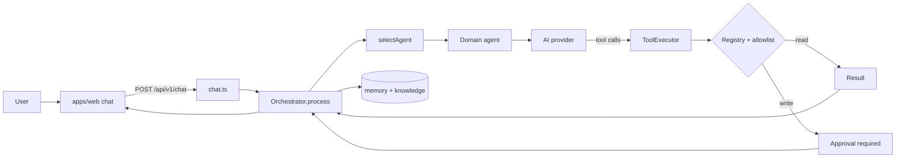
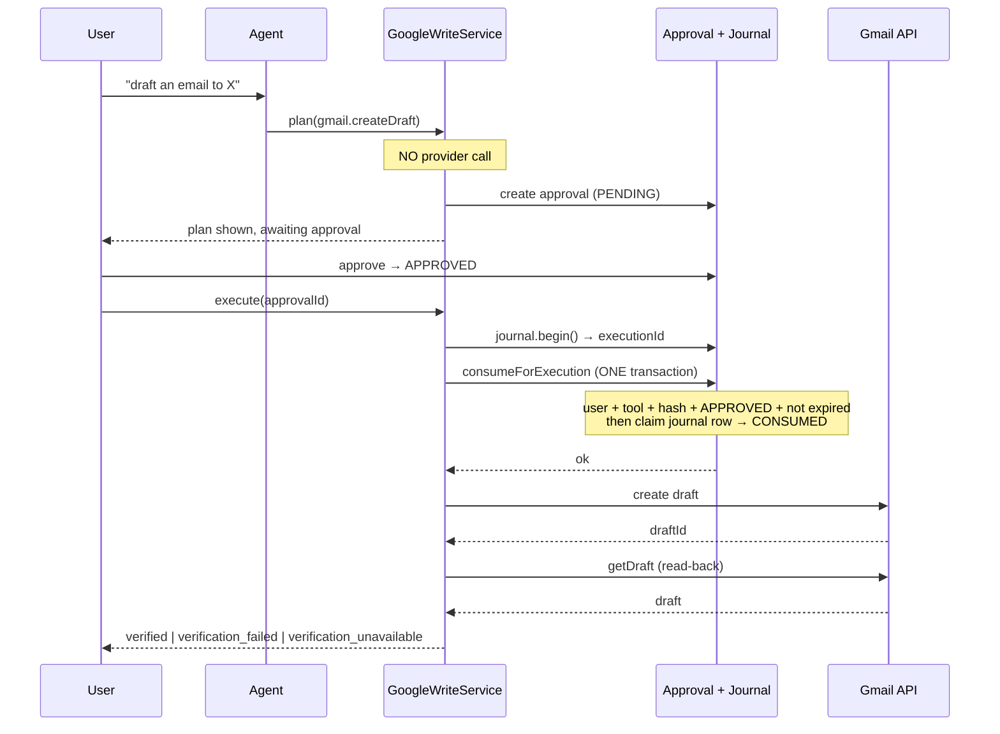
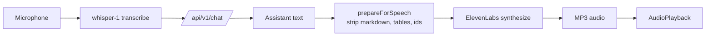
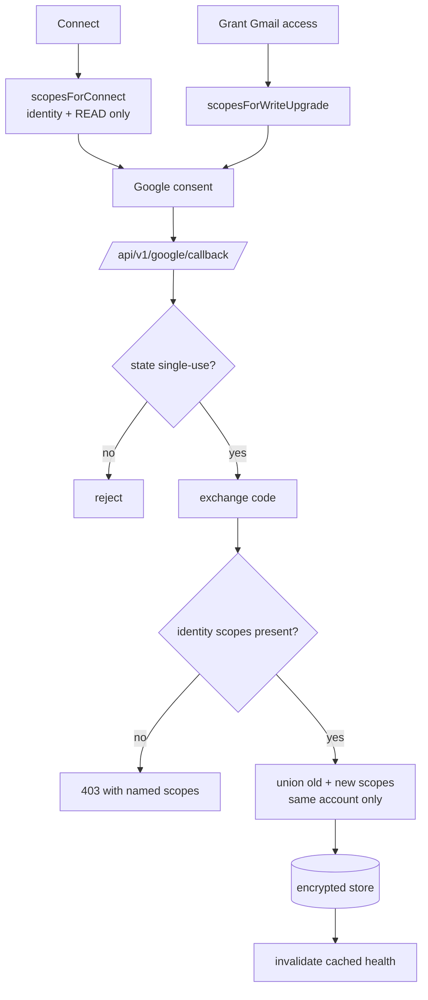
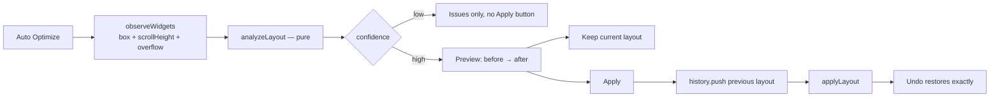
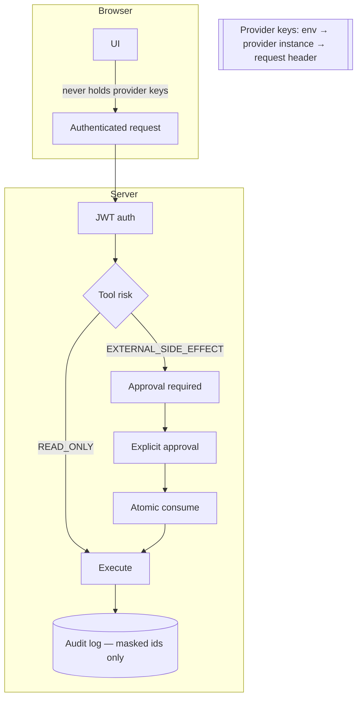
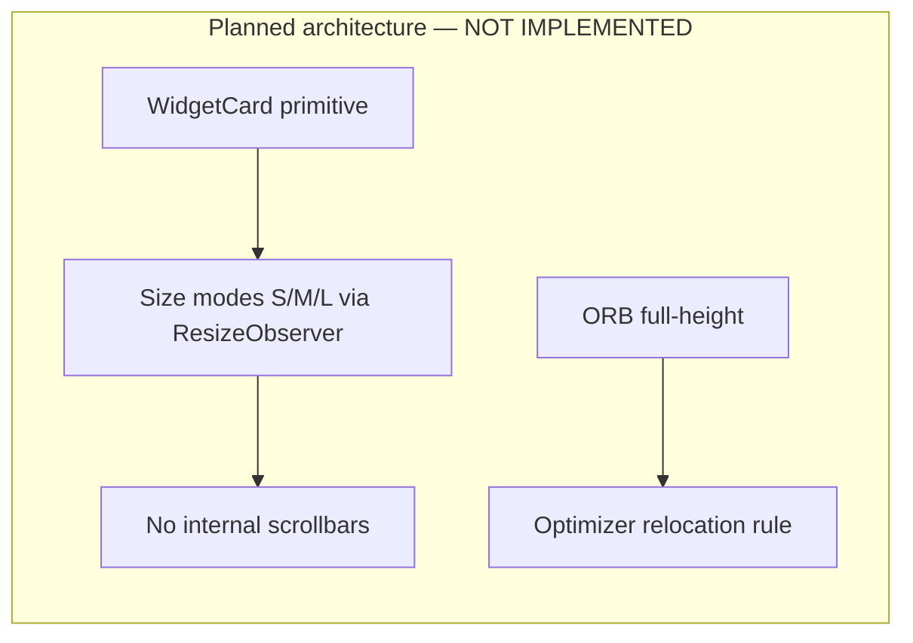

# JARVIS — Master Audit and Development Ledger

**Audit date:** 2026-09-13
**Audited commit:** `66a8855` — "ui dashboard me changes" (2026-09-13 20:05:10 +0530)
**Branch:** `main`
**Working tree:** clean
**Auditor:** automated repository audit, evidence-based
**Scope:** `D:\dreamprojectjarvis\dreamprojectjarvis` only. The separate `ai youtube agent` project was neither read nor executed.

> **Provenance note.** The task referred to a "supplied master audit document" as a starting structure. No such document was provided with the request and none existed in the repository. This file was therefore created from the section-12 specification in the task itself. Every status below is derived from commands run against this repository on the audit date; nothing was inherited from a prior document.

> **Relocation note (2026-09-14).** This ledger moved from the repository root to `docs/`, and the phase and sprint reports it cites by file name moved to `docs/reports/`. File names are unchanged, so every citation below still identifies its report. See `docs/CODEBASE_AUDIT.md`.

---

## 1. Executive summary

JARVIS is a working, non-trivial AI assistant monorepo with a genuinely strong backend and a partially finished frontend. It is **not** a prototype: 1,709 automated tests pass in isolation, typecheck is clean across 33 tasks, and the production build succeeds across 18 packages.

The honest shape of it:

- **Backend, integrations, approval and security: mature.** The Google write path — plan → approval → atomic consume → execute → read-back verification — is complete and covered by tests at every step. Secrets handling survived a full-repository scan.
- **Voice: complete and verified against live providers.** ElevenLabs TTS and whisper-1 STT run side by side behind one interface.
- **Dashboard: functional but visually unfinished.** Drag, eight-way resize, persistence, reset, keyboard control and auto-optimization all work and are browser-verified. The *visual* upgrade repeatedly requested — shared card primitive, spacing, scrollbar removal, adaptive content — is largely **NOT IMPLEMENTED**.
- **Documentation: stale.** `docs/JARVIS_CAPABILITY_MATRIX.md` mentions none of the last four weeks of work.
- **Tooling gap: lint has never run.** There is no ESLint configuration anywhere in the repository.

**Maturity: PARTIAL — backend production-shaped, frontend mid-refactor, documentation lagging.**

---

## 2. What JARVIS is

A personal AI operating system, built as a pnpm/Turborepo monorepo:

- **`apps/api`** — Express + Socket.IO backend on port 3001. Owns agents, tools, approvals, integrations, voice transport and audit.
- **`apps/web`** — Next.js 14 app-router frontend on port 3000. Dashboard, chat, approvals, integrations.
- **16 shared packages** under `packages/`.
- **PostgreSQL with pgvector** for conversations, memory, approvals, execution journal and integration state.

The organising idea is that every capability is a **tool** behind an **allowlist**, every external write passes an **approval boundary**, and every provider sits behind a **port** so the agent layer never touches a vendor SDK directly.

---

## 3. Current capabilities (summary)

| Area | Status |
|---|---|
| Text chat, agent routing, orchestration | **COMPLETE** |
| Memory (extraction, recall, e2e) | **COMPLETE** (one flaky suite) |
| Voice — STT (whisper-1) | **COMPLETE** |
| Voice — TTS (ElevenLabs) | **COMPLETE**, live-verified |
| Google OAuth + scope upgrade | **COMPLETE**, live-verified |
| Gmail draft plan → approve → execute → verify | **COMPLETE**, live-verified by user |
| Integration health checks | **COMPLETE**, live-verified |
| Meta Ads (read + approval-gated write) | **COMPLETE** |
| Dashboard drag / 8-way resize / persist / reset | **COMPLETE**, browser-verified |
| Dashboard auto-optimization (preview/apply/undo) | **COMPLETE**, browser-verified |
| Dashboard visual system (WidgetCard, spacing, scrollbars) | **NOT IMPLEMENTED** |
| Adaptive widget content (size modes) | **NOT IMPLEMENTED** |
| ORB full-height layout | **NOT IMPLEMENTED** |
| Lint | **COMPLETE** — flat config, 18/18 packages green |

---

## 4. Capability matrix

Evidence column cites the command or file that proves the claim. "Live" means verified against a real third-party API during development.

### 4.1 Core assistant

| Capability | Implemented? | Evidence | Main files | Tests | User-facing behaviour | Limitations | Next action |
|---|---|---|---|---|---|---|---|
| Text chat | COMPLETE | `apps/api/test` 1157 pass | `routes/chat.ts` | `chat.test.ts` | Chat replies in UI | — | — |
| Agent routing | COMPLETE | `agent-router.ts`, 498 agent tests | `packages/agents/src/agent-router.ts` | `sprint6-agent-architecture.test.ts` | Domain agents selected by message | Heuristic, not learned | — |
| Orchestrator | COMPLETE | `orchestrator.ts` (1,334 lines) | `packages/agents/src/orchestrator.ts` | `tool-execution-anti-hallucination.test.ts` | Tool loop, memory, surfaces | — | — |
| Intent detection | COMPLETE | `intent-detector.ts` | `packages/agents/src/intent-detector.ts` | covered in agents suite | CONFIRM/REJECT/MODIFY | Regex heuristics | — |
| Error handling → safe codes | COMPLETE | `tool-failure-classifier.ts` | `packages/core/src/tool-failure-classifier.ts` | `tool-failure-classifier.test.ts` (26) | Real cause instead of "Data retrieval failed" | Unrecognised errors still generic (by design) | — |
| Conversation history | COMPLETE | `conversations.ts` route | `routes/conversations.ts` | api suite | Sidebar list | — | — |
| Streaming | NOT IMPLEMENTED | no SSE/stream handler found in `routes/chat.ts` | — | — | Replies arrive whole | Perceived latency on long replies | Roadmap P6-1 |

### 4.2 Voice

| Capability | Implemented? | Evidence | Main files | Tests | Limitations |
|---|---|---|---|---|---|
| STT (whisper-1) | COMPLETE | `openai-voice-provider.ts` | same | `voice-provider.test.ts` | — |
| Hinglish handling | COMPLETE | explicit `language` hint; 18/18 Latin-script fixture result documented in source | `openai-voice-provider.ts` | `voice-provider.test.ts` | Measured during development, not re-measured in this audit — **PARTIALLY VERIFIED** |
| ElevenLabs TTS | COMPLETE | live `POST /voice/speak` → 48,527-byte MP3, ID3 magic, 1,112 ms | `packages/ai-elevenlabs/src/elevenlabs-voice-provider.ts` | 24 tests | Requires network |
| CompositeVoiceProvider | COMPLETE | startup log `ttsProvider: elevenlabs`, `sttModel: whisper-1` | `composite-voice-provider.ts` | via provider tests | — |
| Voice settings | COMPLETE | stability/similarity/style/speed asserted in tests | `elevenlabs-voice-provider.ts` | 24 tests | ElevenLabs ignores unsupported params silently |
| Playback / mute / stop / retry / fallback / cancellation | COMPLETE (pre-existing) | `voice-store.ts` state machine | `apps/web/src/lib/voice/voice-store.ts` | `voice.test.ts`, `voice-concurrency.test.ts` | Not re-verified against ElevenLabs audio in a browser — **PARTIALLY VERIFIED** |
| Speech text preparation | COMPLETE | tables summarised, ids/enums stripped | `packages/core/src/speech-preparation.ts` | 19 tests | — |
| Overlapping speech prevention | COMPLETE | turn-identity model in store | `voice-store.ts` | `voice-concurrency.test.ts` | — |

### 4.3 Dashboard

| Capability | Implemented? | Evidence | Limitations |
|---|---|---|---|
| Widget registry / rendering | COMPLETE | `widgets/registry.ts`, 8 widgets | — |
| Drag | COMPLETE | `dashboard-acceptance.mjs` — "orb moved", "weather moved", "tasks moved" | grip-only by design |
| Resize N / S / E / W | COMPLETE | `north-west-resize.mjs` — all handles present, correct cursors | — |
| Resize NE / NW / SE / SW | COMPLETE | same script, 8 of each handle rendered (64 total) | — |
| Grid snapping | COMPLETE | react-grid-layout 12-col | — |
| Collision handling | COMPLETE | `findCollisions` + acceptance "no widgets overlap" | vertical compaction closes deliberate gaps |
| Persistence | COMPLETE | acceptance "layout persisted across a full re-login" | — |
| Reset | COMPLETE | acceptance step 9 | — |
| Keyboard controls | COMPLETE | `widget-frame.tsx` nudge/resize | Behind a disclosure |
| Reduced motion | COMPLETE | `globals.css` `prefers-reduced-motion` block | — |
| Responsive breakpoints | COMPLETE | `viewport-audit.mjs` — 5 resolutions, no page scroll | Phone falls back to a single column |
| Auto-optimization | COMPLETE | `optimize-flow.mjs` ALL PASSED | Resize-only; cannot relocate |
| Preview / apply / undo / history | COMPLETE | same script; 31 unit tests | History is in-memory, session-scoped |
| Loading / empty / error states | PARTIAL | widgets show text states; no skeletons | — |
| Internal scrolling removal | **NOT IMPLEMENTED** | `viewport-audit.mjs`: Location, System, Markets scroll internally at ≤1366px | — |
| ORB full-height | **NOT IMPLEMENTED** | orb is 4×7 of a 12-row grid in `DEFAULT_LAYOUT` | Blocked by clock/worldclock occupying its columns |
| WidgetCard primitive | **NOT IMPLEMENTED** | no `widget-card.tsx` exists | — |
| Framer Motion polish | PARTIAL | dependency installed and used elsewhere; no widget motion pass | — |
| Accessibility | PARTIAL | aria labels + focus states exist; no audit performed | **NOT VERIFIED** |

### 4.4 Google integrations

| Capability | Implemented? | Evidence | Limitations |
|---|---|---|---|
| OAuth (PKCE, single-use state) | COMPLETE | `google-integration.test.ts` 41 tests | — |
| Connected account identity | COMPLETE | live: `sirish.digitalonebox@gmail.com`, 9 scopes | — |
| Scope canonicalization | COMPLETE | `scope-canonicalization.test.ts` | — |
| Write-scope upgrade | COMPLETE | `google-oauth-scope-boundary.test.ts` (12) | — |
| Scope union on upgrade | COMPLETE | 4 merge tests | Over-claims if a scope is revoked out-of-band |
| Account-email boundary | COMPLETE | tested | — |
| Gmail read + write planning | COMPLETE | 10 `google.plan.*` tools | — |
| Calendar / Drive | COMPLETE | write planners + verification | — |
| Google Ads | PARTIAL | read-only; **`adwords` scope currently absent** from the live connection | Lost in a pre-fix upgrade |
| Health checks | COMPLETE | startup log `status: connected`, 10 ms | Google only; no Meta/WhatsApp checker |
| Reauthentication | COMPLETE | `needs_reauth` path tested | — |
| Error mapping | COMPLETE | per-status classification | — |

### 4.5 Approval and execution

| Capability | Implemented? | Evidence | Limitations |
|---|---|---|---|
| Approval creation | COMPLETE | `google-write-approval.test.ts` | — |
| Approval display | COMPLETE | `approval-card.tsx` + `GoogleWritePlanDetail` | — |
| User confirmation | COMPLETE | Approvals page + chat CONFIRM | — |
| Expiry | COMPLETE | tested | — |
| Atomic claim | COMPLETE | single transaction in `approval-repository.ts` | — |
| Execution | COMPLETE | `execute-approved-action.ts` (16 tests) | — |
| Idempotency | COMPLETE | journal key = action + payload hash | — |
| Audit reference | COMPLETE | `auditRef` surfaced in UI | — |
| Read-back verification | COMPLETE | Gmail/Drive/Calendar; 35 tests | Gmail send is `verification_unavailable` without `gmail.readonly` |
| Voice cannot execute | COMPLETE | `voice: false` asserted | — |

### 4.6 Security

| Check | Result | Evidence |
|---|---|---|
| Secrets in source / docs / bundles | **CLEAN** | 8 secret-bearing vars scanned against 1,655 files — zero hits |
| `.env` git-tracked | **CLEAN** | `git ls-files` shows none |
| `NEXT_PUBLIC_*` secrets | **CLEAN** | no matches |
| localStorage credentials | **CLEAN** | only a `remember` boolean |
| Provider object serialization | **FIXED** | `#apiKey` true private field; test asserts `JSON.stringify` is clean |
| Provider error-body leakage | **CLEAN** | bodies read and discarded |
| Key in URL / query | **CLEAN** | header-only (`xi-api-key`) |
| Approval boundary | **INTACT** | consume-transaction untouched all session |
| Optimizer external writes | **IMPOSSIBLE** | pure geometry function; test asserts change shape is 4 numbers + a string |

---

## 5. Architecture

```
apps/web (Next.js 14)  ──HTTP/WS──▶  apps/api (Express + Socket.IO)
                                          │
                    ┌─────────────────────┼─────────────────────┐
                    ▼                     ▼                     ▼
              @jarvis/agents        @jarvis/tools        @jarvis/security
             (orchestrator,        (registry, executor,   (approval svc,
              domain agents)        journal)               permissions)
                    │                     │                     │
                    └─────────┬───────────┴──────────┬──────────┘
                              ▼                      ▼
                        @jarvis/core            @jarvis/db (Prisma + pgvector)
                        (types, ports)
                              │
   providers: ai-openai · ai-anthropic · ai-elevenlabs · google-ads ·
              google-workspace · meta-graph · whatsapp · n8n · browser
```

### 5.1 Package inventory

| Package | Purpose | Tests | Status |
|---|---|---|---|
| `core` | Types, ports, classifiers, catalogues | 18 files | COMPLETE |
| `agents` | Orchestrator, router, 9 domain agents | 17 | COMPLETE |
| `tools` | Registry, executor, journal, all tool impls | 26 | COMPLETE |
| `db` | Prisma repositories | 17 | COMPLETE (8 failing integration tests) |
| `security` | Approvals, permissions, encryption | 4 | COMPLETE |
| `config` | Env schema, voice config | 1 | COMPLETE |
| `ai-openai` | Chat, embeddings, vision, voice | 2 | COMPLETE |
| `ai-anthropic` | Chat provider | 0 | **NO TESTS** |
| `ai-elevenlabs` | TTS + composite provider | 1 (24 tests) | COMPLETE |
| `google-ads` | OAuth + Ads read | 4 | COMPLETE |
| `google-workspace` | Gmail/Drive/Calendar read+write | 1 | PARTIAL — thin coverage |
| `meta-graph` | Meta Ads API | 5 | COMPLETE |
| `memory` | Extraction, recall, vectors | 9 | COMPLETE |
| `browser` | Headless browsing tools | 4 | COMPLETE |
| `whatsapp` | Cloud API | 2 | COMPLETE |
| `n8n` | Workflow triggers | 1 | PARTIAL — thin coverage |

---

## 6. Mermaid diagrams

All diagrams below reflect **actual source-code behaviour** unless labelled otherwise.

### 6.1 Request → response



### 6.2 Gmail draft: plan → approve → execute → verify



### 6.3 Voice round trip



### 6.4 OAuth + scope upgrade



### 6.5 Dashboard auto-optimization



### 6.6 Security and approval boundaries



### 6.7 Planned — not yet implemented



---

## 7. Development timeline

Dates from `git log --date=short`. 37 commits, 2026-08-17 → 2026-09-13.

| Date | Commit | Milestone | Status |
|---|---|---|---|
| 2026-08-17 | `c7a0285` | Initial JARVIS project | COMPLETE |
| 2026-08-17 | `901285a` | Backend foundation | COMPLETE |
| 2026-08-18 | `afc137a` | Chat page | COMPLETE |
| 2026-08-20 → 08-26 | multiple | Phases 9–11: marketing intelligence, outcomes, opportunity scoring | COMPLETE |
| 2026-08-27 → 08-29 | multiple | Sprints 1.1 (memory), 2.x (Meta Ads), 3.x (knowledge) | COMPLETE |
| 2026-09-08 | `5ced1f5` | Command Center V3 — auth, Orb, live widgets, customisation | COMPLETE |
| 2026-09-09 | `ef1e691`, `f681b77` | Framer Motion, Maps + integrations page | COMPLETE |
| 2026-09-10 → 09-11 | `8a27c40`, `3bd3052` | Dashboard UI iterations | COMPLETE |
| 2026-09-12 | `10dcba7`, `83b06a0` | Testing; Google integration working | COMPLETE |
| 2026-09-13 | `2c43bd1` | Google Workspace approval-gated write planning *(message mislabelled — contains capability/voice/Meta work)* | COMPLETE |
| 2026-09-13 | `66a8855` | **This session:** Gmail fixes, health checks, ElevenLabs, 8 resize handles, auto-optimization (66 files, +7,468/−95) | COMPLETE |

### 7.1 Session detail (2026-09-13, commit `66a8855`)

| # | Work | Root cause found | Status |
|---|---|---|---|
| 1 | Capability answers | Registry dump: flat `{id,label,group}` arrays + raw tool ids as labels | FIXED |
| 2 | Meta insights dates | Dates `required`, no server default, no current date in prompt → model produced 2023 | FIXED |
| 3 | Meta account id | Model copied it from prompt; guessed placeholders when context lacked "Meta" | FIXED |
| 4 | Voice tiredness | Instructions literally said "measured, unhurried pace" + `onyx` | FIXED |
| 5 | Execute button | `GoogleWriteExecute` existed but was never imported | FIXED |
| 6 | Google "not configured" | `/status` gated on Ads predicate requiring `GOOGLE_ADS_DEVELOPER_TOKEN` | FIXED |
| 7 | Callback 403 | Callback required `adwords`; Workspace consent never asks for it | FIXED |
| 8 | Identity rejected | Google returns `userinfo.email`, code compared literal `email` | FIXED |
| 9 | "Data retrieval failed" | `invalid` missing from planner's actionable set; orchestrator flattened all failures | FIXED |
| 10 | "Tool not found" | Chat confirm sent the write ACTION to the ToolExecutor; execution is a service call | FIXED |
| 11 | "not in a claimable state" | Service invented an `executionId` the journal discarded | FIXED |
| 12 | Gmail draft verification | Was always `verification_unavailable`; now re-reads | IMPLEMENTED |
| 13 | ElevenLabs | New provider + composite | IMPLEMENTED, live |
| 14 | Resize handles | Only `s,e,se` — top/left resizing impossible | FIXED |
| 15 | Auto-optimization | Did not exist | IMPLEMENTED |

---

## 8. Test evidence

All commands run 2026-09-13 from the repository root.

| Area | Command | Result | Isolated? | Known issue |
|---|---|---|---|---|
| Typecheck | `npx turbo typecheck` | **33/33 tasks** | full | — |
| Build | `pnpm build` | **18/18 tasks** | full | — |
| API | `pnpm --filter @jarvis/api exec vitest run` | **1157/1157, 43 files** | isolated | — |
| Web | `pnpm --filter @jarvis/web exec vitest run` | **552/552, 26 files** | isolated | — |
| Web (turbo) | `npx turbo test --filter=@jarvis/web` | 552/552 | isolated | — |
| Full suite | `npx turbo test --filter='!@jarvis/db'` | **29/31 tasks**, web failed | full | Flaky under parallel load |
| DB | `pnpm --filter @jarvis/db exec vitest run` | **188 passed / 8 failed** | isolated | **PRE-EXISTING** |
| Dashboard acceptance | `node .claude/skills/run-jarvis/dashboard-acceptance.mjs` | **32 ok, 0 FAIL** | browser | — |
| 8 resize handles | `node .claude/skills/run-jarvis/north-west-resize.mjs` | **ALL PASSED** | browser | — |
| Auto-optimize flow | `node .claude/skills/run-jarvis/optimize-flow.mjs` | **ALL PASSED** | browser | — |
| Viewport audit | `node .claude/skills/run-jarvis/viewport-audit.mjs` | 5/5 resolutions, no page scroll | browser | Reports internal scroll in 3 widgets |
| ElevenLabs live | `POST /api/v1/voice/speak` | 48,527-byte MP3, ID3, 1,112 ms | live API | Requires network + quota |
| Lint | `npx turbo lint` | **18/18 tasks** | full | Baseline rule set only — see R-1 |

### 8.1 Flaky tests — disclosed, not hidden

| Test | Behaviour | Cause |
|---|---|---|
| `apps/api/test/sprint-1.1d-memory-e2e.test.ts` | Different test fails each parallel run; **13/13 in isolation** | DB-dependent; documented in the run-jarvis skill |
| `apps/web/test/auth-session.test.tsx` | Failed twice under turbo; **552/552 isolated** | Parallel-load timing |
| `packages/core` perf tests (×4) | Fail only while Chrome is running | Timing budgets vs CPU contention |
| `apps/api/test/phase116a-bridge-pg.integration.test.ts` | Intermittent | Postgres row-lock concurrency |

### Correction (added 2026-09-14)

Previous documentation stated that `apps/api/test/sprint-1.1d-memory-e2e.test.ts` fails a different test on each parallel run and passes 13/13 in isolation. This was incorrect.
The accurate information is: 6 of 13 tests fail deterministically, including when the file is run alone, with the same six failing on every run.
Evidence: `pnpm --filter @jarvis/api exec vitest run test/sprint-1.1d-memory-e2e.test.ts` → 6 failed, 7 passed; reproduced three times on 2026-09-14, once with that branch's source edits reverted. Failing assertions at lines 617, 639, 660, 691, 710 and 813. Tracked as R-17.

### 8.2 Pre-existing failures — not caused by recent work

**Verified by `git stash` + re-run during the session.**

| Suite | Failures |
|---|---|
| `packages/db` outcome/recommendation Postgres integration | 8 |

---

## 9. Security audit

| # | Finding | Severity | Location | Status |
|---|---|---|---|---|
| S-1 | TS `private` is compile-time only — `JSON.stringify(provider)` serialised the ElevenLabs API key | **High** | `elevenlabs-voice-provider.ts` | **FIXED** — true `#apiKey` field; test asserts |
| S-2 | Provider error bodies could echo request details outward | Medium | same | **FIXED** — bodies read and discarded |
| S-3 | Google OAuth callback burned single-use state before a check that could fail | Medium | `google-auth.ts` | **MITIGATED** — check now passes for valid consents; ordering unchanged (correct: the code is spent) |
| S-4 | Scope merge over-claims if a scope is revoked out-of-band | Low | `google-auth.ts` | **ACCEPTED** — self-corrects at point of use via 401/403 |
| S-5 | `.env` contains 8 live secrets | Informational | `.env` | **CORRECT** — gitignored, never bundled; scan clean |
| S-6 | No ESLint config → no static security linting | Low | repo-wide | **PARTIALLY RESOLVED** — lint runs, but the baseline carries no security rules; see R-14 |
| S-7 | Approval boundary | — | `approval-repository.ts` | **INTACT** — untouched all session |
| S-8 | Optimizer cannot perform external actions | — | `optimizer.ts` | **STRUCTURALLY SAFE** — pure function, asserted |
| S-9 | Database dump with real user rows — emails, password hashes, refresh-token hashes, IP addresses, chat history — committed in `7b35c4f` and pushed | **Critical** | `.claude/skills/run-jarvis/backups/` | **PARTIALLY RESOLVED** 2026-09-14 — untracked and ignored, then purged from local history and GitHub `main`; pull-request refs and password resets outstanding (R-16) |
| S-10 | Access log wrote OAuth `code` and `state`, and the WhatsApp `hub.verify_token` | Medium | `apps/api/src/index.ts` | **FIXED** 2026-09-14 — `middleware/access-log.ts` redacts them; 6 tests |
| S-11 | Write-confirmation hash ignored nested values (`{campaign:{budget:10}}` equalled `{campaign:{budget:10000}}`) | Low, latent | `apps/api/src/services/integrations/confirmations.ts` | **FIXED** 2026-09-14 — uses canonical `computeParamsHash`; 4 tests |

No secret value appears in any source file, document, config, or built bundle (1,655 files scanned).

---

## 10. Markdown inventory

**100 Markdown files.** 75 are agent skill files under `.claude/skills/` — **never delete** (task rule + actively loaded by the agent runtime). 42 are project documents.

### 10.1 Keep — active

| File | Refs | Purpose |
|---|---|---|
| `README.md` | — | Required |
| `AGENTS.md` | — | Agent operating rules |
| `docs/ARCHITECTURE.md` | 15 | Most-referenced doc |
| `docs/JARVIS_ARCHITECTURE.md` | 13 | Technical architecture |
| `docs/JARVIS_CAPABILITY_MATRIX.md` | 13 | **STALE** — see below |
| `docs/JARVIS_USER_MANUAL.md` | 12 | User manual |
| `docs/CONTRACTS.md` | 1 | Runtime contracts |
| `docs/INTEGRATIONS.md` | 1 | Integration reference |
| `docs/DOCUMENTATION_PROTOCOL.md` | 1 | Governs docs |
| `docs/DOCUMENTATION_AUDIT.md` | 1 | Prior audit |
| `docs/phases/phase-9/10/11.md` | 2 each | Phase records |
| `.claude/skills/**` (75) | runtime | Agent skills |
| This ledger | — | Master record |

### 10.2 Archive candidates — historical, zero references

29 root-level `SPRINT_*` / `PHASE_*` / `JARVIS_*_REPORT` files, last touched 2026-08-20 → 2026-09-09, all with **0 code/CI references**. They are point-in-time completion reports whose content is superseded by this ledger and `docs/phases/`.

### 10.3 Deletion proposal — **AWAITING YOUR APPROVAL. NOTHING DELETED.**

| File | Reason | Refs found | Risk | Action |
|---|---|---|---|---|
| `PHASE_9.3_REPORT.md` | Superseded by `docs/phases/phase-9.md` | 0 | Low | **Archive** |
| `PHASE_9.3-R_REPORT.md` | Revision of above | 0 | Low | **Archive** |
| `PHASE_9.3_SMOKE_TEST_REPORT.md` | Point-in-time smoke test | 0 | Low | **Archive** |
| `PHASE_10_PRODUCTION_READINESS_AUDIT.md` | Superseded by this ledger | 0 | Low | **Archive** |
| `PHASE_11.6B/11.7A/11.8B/11.9A/11.9B/11.9_UAT` (6) | Superseded by `docs/phases/phase-11.md` | 0 | Low | **Archive** |
| `PHASE_11_MARKETING_INTELLIGENCE_ARCHITECTURE.md` | Architecture, may still be cited by humans | 0 | **Medium** | **Review — do not delete** |
| `SPRINT_1.1A/B/C/D` (4) | Memory sprint reports | 0 | Low | **Archive** |
| `SPRINT_2.0_BASELINE_DEFECT_REPORT.md` | Defect log | 0 | Low | **Archive** |
| `SPRINT_2.0_META_ADS_BASELINE_AUDIT.md` | Baseline audit | **2** | **Medium** | **Keep** |
| `SPRINT_2.1/2.2/2.3/2.4` (4) | Meta sprint reports | 0 | Low | **Archive** |
| `SPRINT_2_FINAL_META_E2E_UAT_REPORT.md` | UAT record | 0 | Low | **Archive** |
| `SPRINT_2_META_ADS_CHANGE_BOUNDARY.md` | Safety boundary doc | **6** | **High** | **KEEP — never delete** |
| `SPRINT_3.0/3.1` (2) | Knowledge sprint reports | 0 | Low | **Archive** |
| `JARVIS_COMMAND_CENTER_V3_FINAL_REPORT.md` | Superseded | 0 | Low | **Archive** |
| `JARVIS_UI_V2_AUTH_ORB_FINAL_REPORT.md` | Superseded | 0 | Low | **Archive** |
| `JARVIS_GOOGLE_MAPS_USAGE_GUARD_REPORT.md` | Usage guard record | 0 | **Medium** | **Review** — describes a cost guard still in code |
| `JARVIS_GOOGLE_MAPS_INTEGRATION_FINAL_REPORT.md` | Integration record | **1** | Medium | **Keep** |

**Recommendation:** move the 21 "Archive" files to `docs/archive/` rather than deleting. Zero information is lost, the root directory becomes navigable, and no reference breaks. **No file will be touched without your explicit go-ahead.**

### 10.4 Stale documentation — action required

`docs/JARVIS_CAPABILITY_MATRIX.md` (13 references) contains **zero** mentions of ElevenLabs, Gmail draft flow, auto-optimization or health checks. It is the most-cited capability document and is four weeks out of date. **Status: OUTDATED — CONTRADICTED BY REPOSITORY EVIDENCE.**

---

## 11. Technical debt and risk register

| # | Risk | Severity | Evidence | Impact | Recommended action | Status |
|---|---|---|---|---|---|---|
| R-1 | Lint has never run | **High** | Root cause was **not** the missing config alone: 16 `lint` scripts read `eslint src/` with no `--ext`, so ESLint 8 looked for `.js` and found none of the 437 `.ts`/`.tsx` files | No static analysis; style/security drift | Flat config at the root, ESLint 9, baseline rule set kept green | **RESOLVED** — `turbo lint` 18/18. Rule set is correctness-only; widening it is R-14 |
| R-2 | Capability matrix stale | **High** | 0 mentions of 4 weeks of work | Future work built on wrong assumptions | Regenerate from this ledger | OPEN |
| R-3 | Dashboard visual system unbuilt | **Medium** | No `widget-card.tsx`; 3 widgets scroll internally | Repeated UX complaints | Roadmap P2 | OPEN |
| R-4 | 8 DB integration tests failing | **Medium** | `188 passed / 8 failed` | Outcome-record paths unverified | Investigate | PRE-EXISTING |
| R-5 | Parallel-run flakiness | **Medium** | 4 suites fail under load, pass isolated | CI unreliable | Serialise perf/DB suites | OPEN |
| R-6 | `adwords` scope lost | **Medium** | Live connection has 9 scopes, no `adwords` | Google Ads unusable | Re-grant Ads | OPEN |
| R-7 | Vertical compaction blocks ORB full-height | **Medium** | `optimize-flow.mjs` finding | Task A unachievable by resize | Add relocation rule | OPEN |
| R-8 | `ai-anthropic` has zero tests | Low | 0 test files | Untested provider | Add smoke tests | OPEN |
| R-9 | `google-workspace` thin coverage | Low | 1 test file for 10 modules | Regression risk | Expand | OPEN |
| R-10 | Layout history is in-memory | Low | `layout-history.ts` | Undo lost on refresh | Persist if needed | ACCEPTED |
| R-11 | Accessibility unaudited | Low | No audit performed | Unknown gaps | Run axe | **NOT VERIFIED** |
| R-12 | Voice playback not re-verified with ElevenLabs in browser | Low | Only API-level proof | Playback assumed | Manual check | **PARTIALLY VERIFIED** |
| R-13 | Commit `2c43bd1` message mislabelled | Informational | Contains unrelated work | History confusion | Leave; documented here | ACCEPTED |
| R-14 | Lint baseline is correctness-only | Medium | `eslint.config.mjs` enables ~8 rules; no type-aware rules, no security rules, tests unlinted | Most of what a linter catches is still uncaught | Ratchet one rule at a time, fixing as you go | OPEN |
| R-15 | `apps/web/tsconfig.tsbuildinfo` is tracked in git | Low | Build artifact appears in `git diff` after every `pnpm build` | Noisy diffs, spurious conflicts | Add to `.gitignore`, `git rm --cached` | **RESOLVED** 2026-09-14 — `*.tsbuildinfo` ignored; both tracked copies untracked |
| R-16 | Database dump remains in git history on GitHub | **Critical** | Commit `7b35c4f`, reachable from `origin/main` | Password hashes and personal data readable by anyone with repository access | Purge history and force-push; reset the 6 real accounts; revoke refresh tokens issued on or before 2026-09-03 | **PARTIALLY RESOLVED** 2026-09-14 — history rewritten and `main` force-pushed (`ec2e895` → `a0ed04f`); GitHub still serves the old commits through `refs/pull/1`–`3` until GitHub Support purges them; password resets are with the owner |
| R-17 | Memory end-to-end suite fails deterministically | **High** | `apps/api/test/sprint-1.1d-memory-e2e.test.ts`: 6 of 13 fail, including in isolation | End-to-end memory behaviour is unverified | Root-cause before further memory work | **RESOLVED** 2026-09-14 on `fix/b1-memory-e2e`. Root cause: a test-harness race, not a production memory bug — fire-and-forget extraction shared the suite's `MockAIProvider`, which kept only its last request, and overwrote the chat request the assertions read. Fix: extraction gets a non-recording view of the mock; test file only. The six tests passed three consecutive runs (6 passed, 7 skipped each); API suite 1,159 passed, 8 skipped. **RUN** with the in-process store. **NOT VERIFIED:** the Postgres-backed tests and the full repository suite — only the API and `@jarvis/memory` suites were re-run. Command in `docs/MEMORY.md` |
| R-18 | API test files fail their own typecheck | Low | `pnpm --filter @jarvis/api run typecheck:tests` exits 2 with 60 `error TS` in 18 test files. Most frequent: TS6133 unused declaration (27), TS2322 (7), TS2345 (6), TS7006 implicit `any` (5) | Type errors in test code go unnoticed: no quality gate runs this script, and `pnpm typecheck` covers `src/` only | Fix file by file, then add the script to the quality gates | OPEN — **PRE-EXISTING**. With the B-1 fix stashed the count was identical (60), including the same 6 errors in `sprint-1.1d-memory-e2e.test.ts`, so the fix did not cause them. **RUN** 2026-09-14 |

---

## 12. Roadmap

### Phase 0 — Audit and cleanup
| ID | Task | Priority | Acceptance | Status |
|---|---|---|---|---|
| P0-1 | This ledger | High | Evidence-based, all claims labelled | **DONE** |
| P0-2 | Approve archive of 21 docs | High | User approves; move to `docs/archive/` | **DONE** 2026-09-14 — all 29 reports moved, none deleted, to `docs/reports/`; legacy `docs/ARCHITECTURE.md` archived to `docs/archive/` |
| P0-3 | Regenerate capability matrix | High | Mentions all current capabilities | TODO |

### Phase 1 — Reliability and security
| ID | Task | Priority | Dependencies | Acceptance | Status |
|---|---|---|---|---|---|
| P1-1 | Fix 8 DB integration tests | High | — | `@jarvis/db` green | TODO |
| P1-2 | Stabilise flaky suites | High | — | Full suite green 3× consecutively | TODO |
| P1-3 | Add ESLint config | High | — | `turbo lint` runs and passes | **DONE** — 18/18, branch `feat/p1-3-eslint` |
| P1-4 | Re-grant `adwords` | Medium | User action | Ads capability returns | TODO |

### Phase 2 — Dashboard foundation
| ID | Task | Priority | Files | Acceptance | Status |
|---|---|---|---|---|---|
| P2-1 | `WidgetCard` primitive | High | new `widget-card.tsx`, 8 widgets | All widgets share header/padding/states | TODO |
| P2-2 | Remove internal scrollbars | High | map, system, markets | `viewport-audit` reports none at ≥1280px | TODO |
| P2-3 | Adaptive size modes | Medium | `ResizeObserver` per widget | S/M/L verified | TODO |
| P2-4 | ORB full height | Medium | `DEFAULT_LAYOUT` + relocation | Orb spans 12 rows | TODO (needs P3-1) |
| P2-5 | Visual polish | Low | `globals.css` | — | TODO |

### Phase 3 — Auto-optimization
| ID | Task | Priority | Acceptance | Status |
|---|---|---|---|---|
| P3-0 | Engine + preview/apply/undo | High | Browser-verified | **DONE** |
| P3-1 | Relocation rule | Medium | Can move low-priority widgets to free the orb column | TODO |
| P3-2 | Persist layout history | Low | Undo survives refresh | TODO |

### Phase 4 — Voice experience
| ID | Task | Priority | Acceptance | Status |
|---|---|---|---|---|
| P4-1 | ElevenLabs integration | High | Live-verified | **DONE** |
| P4-2 | Browser playback verification | Medium | Audio audibly plays, stop/mute work | TODO |
| P4-3 | Voice settings UI | Low | User can pick voice/speed | TODO |

### Phase 5 — Integrations
| ID | Task | Priority | Acceptance | Status |
|---|---|---|---|---|
| P5-1 | Health checkers for Meta/WhatsApp/n8n | Medium | All integrations report status | TODO |
| P5-2 | Health status in Integrations UI | Medium | Cached status + timestamp shown | TODO |
| P5-3 | Expand `google-workspace` tests | Low | Each module covered | TODO |

### Phase 6 — Performance and release
| ID | Task | Priority | Acceptance | Status |
|---|---|---|---|---|
| P6-1 | Streaming chat responses | Medium | Tokens stream to UI | TODO |
| P6-2 | Accessibility audit | Medium | axe clean | TODO |
| P6-3 | Deployment runbook | Medium | Documented | TODO |

---

## 13. Definition of Done

A task is DONE only when **all** hold:

1. Typecheck passes.
2. Build passes.
3. Relevant tests pass **in isolation**, and flakes are disclosed.
4. Behaviour verified in the real running app where user-facing.
5. No secret reachable from browser, log, response or bundle.
6. Approval boundary unchanged unless explicitly in scope.
7. This ledger updated.
8. Limitations stated plainly.

---

## 14. Daily development log

| Date | Task | Objective | Files changed | Tests | Result | Limitations | Next task |
|---|---|---|---|---|---|---|---|
| 2026-09-13 | Session work (`66a8855`) | Gmail flow, health, voice, resize, optimizer | 66 (+7,468/−95) | typecheck 33/33; api 1157; web 552; browser 3 suites | 11 root causes fixed, 4 features shipped | Dashboard visual work not started | P0-2 |
| 2026-09-13 | Repository audit (this file) | Evidence-based master record | 1 (this file) | typecheck, build, full suite, 4 browser scripts, security scan | Documented | Accessibility & browser voice playback unverified | Await archive approval |
| 2026-09-14 | P1-3 — ESLint (`feat/p1-3-eslint`) | Close the only entirely absent quality gate | 10 (config, turbo.json, 6 manifests, 2 regexes, lockfile) | lint 18/18; typecheck 33/33; build 18/18; n8n 65/65; memory 453/453 | R-1 resolved; root cause was the missing `--ext`, not only the missing config | Baseline is correctness-only (R-14); tests still unlinted | P0-3 — regenerate the capability matrix |
| 2026-09-14 | Foundation cleanup V1.0 (`feat/p1-3-eslint`, 8 commits, not pushed) | Audit the codebase; remove proven dead code, duplicates and data exposure; one env template; consolidate docs | 31 moved, 25 modified, 10 new, 7 deleted, 3 untracked | typecheck 33/33; lint 18/18; build 18/18; tests 4,619 passed, 6 failed (R-17), 8 skipped | S-10 and S-11 fixed; S-9 untracked; 29 reports moved; 5 accurate docs; see `docs/CODEBASE_AUDIT.md` | History purge (R-16) pending; API and web boot not run | GitHub Support purge and password resets (R-16), then R-17 |

---

## 15. Recommended next task

**Update 2026-09-14, after the foundation cleanup:** finish **R-16** — ask GitHub Support to purge the pull-request refs, and reset the affected accounts — then **R-17**, the six deterministic memory e2e failures, then CI. The recommendation below predates the cleanup.

**P0-3 — regenerate `docs/JARVIS_CAPABILITY_MATRIX.md`**, then **P1-1 / P1-2 (the failing and flaky suites)**.

Rationale: the capability matrix has 13 references and is four weeks stale, so every future decision that consults it starts from wrong information. It is cheap to fix and prevents compounding error. P1-1 and P1-2 follow because they are the last two reliability items, and R-4 in particular has been carried as "pre-existing" without a diagnosis.

P1-3 (ESLint) is **done** as of 2026-09-14. Widening its rule set is tracked separately as R-14 and should be taken one rule at a time rather than as a project.

**Not recommended next:** more dashboard visual work. It has been attempted three times and repeatedly displaced; P2 should be taken as a single dedicated block after P0/P1.

---

## 16. Git status

- **Branch:** `main`, clean, nothing staged or untracked
- **HEAD:** `66a8855` (2026-09-13 20:05:10 +0530)
- **Total commits:** 37 (2026-08-17 → 2026-09-13)
- **Ignored (correctly):** `.env`, `.turbo/`, `apps/web/.env.local`, driver state, logs, screenshots
- **This audit modified:** one new file — this ledger. No source, config, schema or behaviour changed.

---

## 17. Unverified and partially verified claims

Recorded so nothing here is mistaken for proof.

| Claim | Label | Why |
|---|---|---|
| Hinglish STT accuracy (18/18 Latin script) | **PARTIALLY VERIFIED** | Documented in source from earlier measurement; not re-measured in this audit |
| Voice playback of ElevenLabs audio in the browser | **PARTIALLY VERIFIED** | API returns valid MP3; audible playback not confirmed |
| Accessibility compliance | **NOT VERIFIED** | No audit run |
| Widget loading/empty/error state quality | **PARTIALLY VERIFIED** | States exist; not systematically reviewed |
| Gmail draft appears in the real mailbox | **VERIFIED BY USER** | User confirmed manually; not re-confirmed by this audit |
| Performance under real load | **NOT VERIFIED** | No load testing exists |
| `docs/*` accuracy beyond the capability matrix | **NOT VERIFIED** | Only the matrix was checked for currency |

---

*End of ledger. Update after every meaningful session — see §13.*
