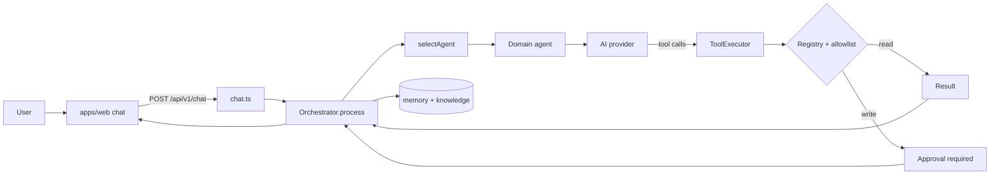
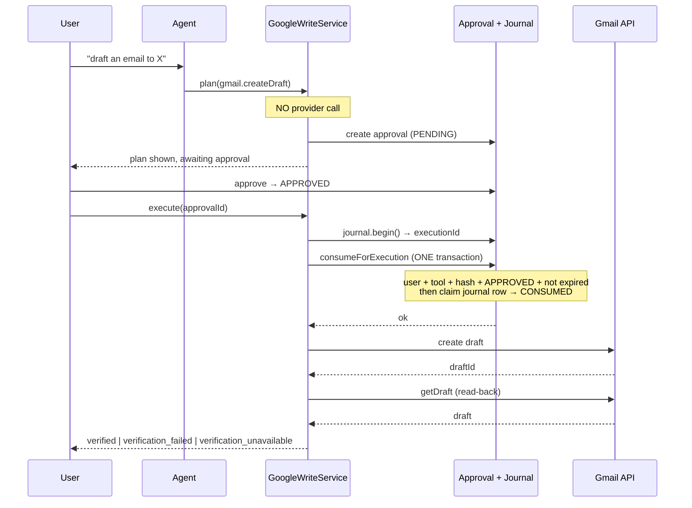
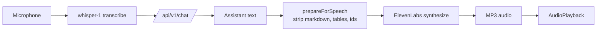
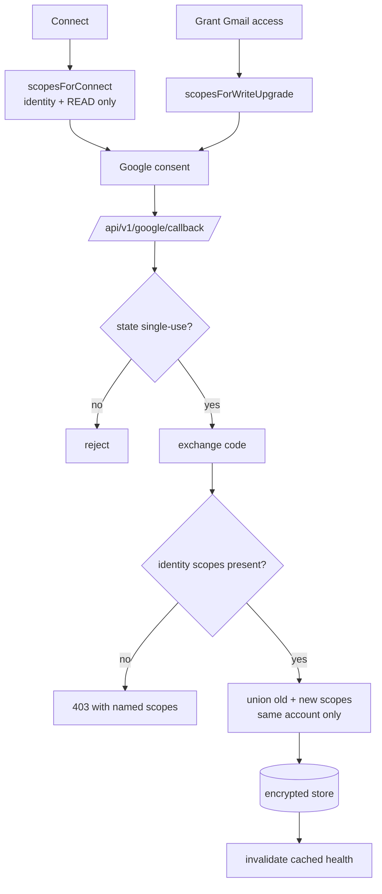
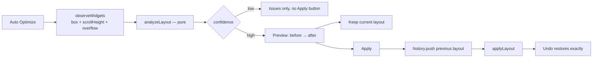
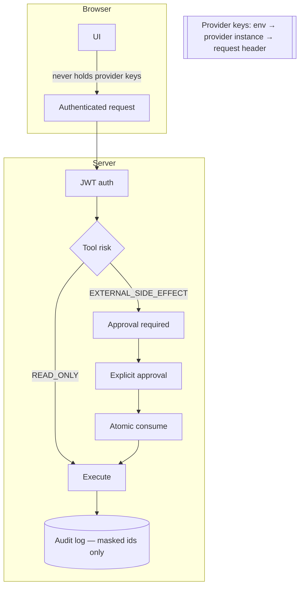
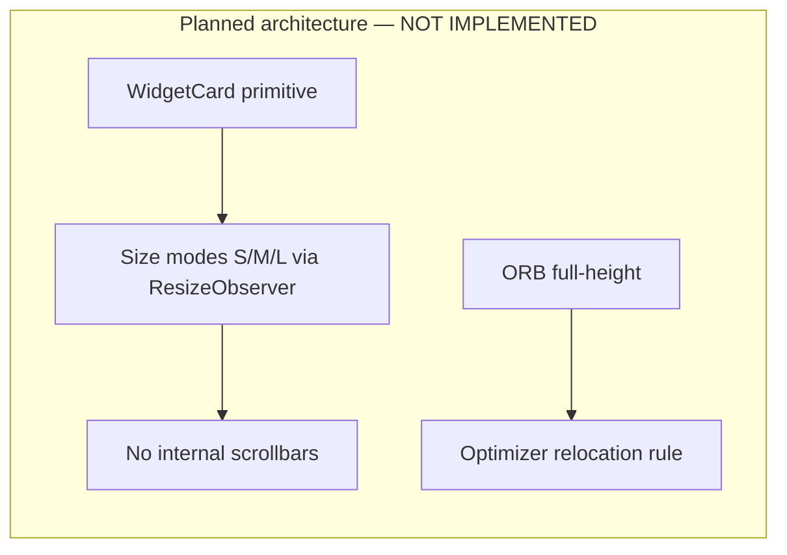

# JARVIS — Master Audit and Development Ledger

**Audit date:** 2026-09-13
**Audited commit:** `66a8855` — "ui dashboard me changes" (2026-09-13 20:05:10 +0530)
**Branch:** `main`
**Working tree:** clean
**Auditor:** automated repository audit, evidence-based
**Scope:** `D:\dreamprojectjarvis\dreamprojectjarvis` only. The separate `ai youtube agent` project was neither read nor executed.

> **Provenance note.** The task referred to a "supplied master audit document" as a starting structure. No such document was provided with the request and none existed in the repository. This file was therefore created from the section-12 specification in the task itself. Every status below is derived from commands run against this repository on the audit date; nothing was inherited from a prior document.

> **Relocation note (2026-09-14).** This ledger moved from the repository root to `docs/`, and the phase and sprint reports it cites by file name moved to `docs/reports/`. File names are unchanged, so every citation below still identifies its report. See `docs/CODEBASE_AUDIT.md`.

---

## 1. Executive summary

JARVIS is a working, non-trivial AI assistant monorepo with a genuinely strong backend and a partially finished frontend. It is **not** a prototype: 1,709 automated tests pass in isolation, typecheck is clean across 33 tasks, and the production build succeeds across 18 packages.

The honest shape of it:

- **Backend, integrations, approval and security: mature.** The Google write path — plan → approval → atomic consume → execute → read-back verification — is complete and covered by tests at every step. Secrets handling survived a full-repository scan.
- **Voice: complete and verified against live providers.** ElevenLabs TTS and whisper-1 STT run side by side behind one interface.
- **Dashboard: functional but visually unfinished.** Drag, eight-way resize, persistence, reset, keyboard control and auto-optimization all work and are browser-verified. The *visual* upgrade repeatedly requested — shared card primitive, spacing, scrollbar removal, adaptive content — is largely **NOT IMPLEMENTED**.
- **Documentation: stale.** `docs/JARVIS_CAPABILITY_MATRIX.md` mentions none of the last four weeks of work.
- **Tooling gap: lint has never run.** There is no ESLint configuration anywhere in the repository.

**Maturity: PARTIAL — backend production-shaped, frontend mid-refactor, documentation lagging.**

---

## 2. What JARVIS is

A personal AI operating system, built as a pnpm/Turborepo monorepo:

- **`apps/api`** — Express + Socket.IO backend on port 3001. Owns agents, tools, approvals, integrations, voice transport and audit.
- **`apps/web`** — Next.js 14 app-router frontend on port 3000. Dashboard, chat, approvals, integrations.
- **16 shared packages** under `packages/`.
- **PostgreSQL with pgvector** for conversations, memory, approvals, execution journal and integration state.

The organising idea is that every capability is a **tool** behind an **allowlist**, every external write passes an **approval boundary**, and every provider sits behind a **port** so the agent layer never touches a vendor SDK directly.

---

## 3. Current capabilities (summary)

| Area | Status |
|---|---|
| Text chat, agent routing, orchestration | **COMPLETE** |
| Memory (extraction, recall, e2e) | **COMPLETE** (one flaky suite) |
| Voice — STT (whisper-1) | **COMPLETE** |
| Voice — TTS (ElevenLabs) | **COMPLETE**, live-verified |
| Google OAuth + scope upgrade | **COMPLETE**, live-verified |
| Gmail draft plan → approve → execute → verify | **COMPLETE**, live-verified by user |
| Integration health checks | **COMPLETE**, live-verified |
| Meta Ads (read + approval-gated write) | **COMPLETE** |
| Dashboard drag / 8-way resize / persist / reset | **COMPLETE**, browser-verified |
| Dashboard auto-optimization (preview/apply/undo) | **COMPLETE**, browser-verified |
| Dashboard visual system (WidgetCard, spacing, scrollbars) | **NOT IMPLEMENTED** |
| Adaptive widget content (size modes) | **NOT IMPLEMENTED** |
| ORB full-height layout | **NOT IMPLEMENTED** |
| Lint | **COMPLETE** — flat config, 18/18 packages green |

---

## 4. Capability matrix

Evidence column cites the command or file that proves the claim. "Live" means verified against a real third-party API during development.

### 4.1 Core assistant

| Capability | Implemented? | Evidence | Main files | Tests | User-facing behaviour | Limitations | Next action |
|---|---|---|---|---|---|---|---|
| Text chat | COMPLETE | `apps/api/test` 1157 pass | `routes/chat.ts` | `chat.test.ts` | Chat replies in UI | — | — |
| Agent routing | COMPLETE | `agent-router.ts`, 498 agent tests | `packages/agents/src/agent-router.ts` | `sprint6-agent-architecture.test.ts` | Domain agents selected by message | Heuristic, not learned | — |
| Orchestrator | COMPLETE | `orchestrator.ts` (1,334 lines) | `packages/agents/src/orchestrator.ts` | `tool-execution-anti-hallucination.test.ts` | Tool loop, memory, surfaces | — | — |
| Intent detection | COMPLETE | `intent-detector.ts` | `packages/agents/src/intent-detector.ts` | covered in agents suite | CONFIRM/REJECT/MODIFY | Regex heuristics | — |
| Error handling → safe codes | COMPLETE | `tool-failure-classifier.ts` | `packages/core/src/tool-failure-classifier.ts` | `tool-failure-classifier.test.ts` (26) | Real cause instead of "Data retrieval failed" | Unrecognised errors still generic (by design) | — |
| Conversation history | COMPLETE | `conversations.ts` route | `routes/conversations.ts` | api suite | Sidebar list | — | — |
| Streaming | NOT IMPLEMENTED | no SSE/stream handler found in `routes/chat.ts` | — | — | Replies arrive whole | Perceived latency on long replies | Roadmap P6-1 |

### 4.2 Voice

| Capability | Implemented? | Evidence | Main files | Tests | Limitations |
|---|---|---|---|---|---|
| STT (whisper-1) | COMPLETE | `openai-voice-provider.ts` | same | `voice-provider.test.ts` | — |
| Hinglish handling | COMPLETE | explicit `language` hint; 18/18 Latin-script fixture result documented in source | `openai-voice-provider.ts` | `voice-provider.test.ts` | Measured during development, not re-measured in this audit — **PARTIALLY VERIFIED** |
| ElevenLabs TTS | COMPLETE | live `POST /voice/speak` → 48,527-byte MP3, ID3 magic, 1,112 ms | `packages/ai-elevenlabs/src/elevenlabs-voice-provider.ts` | 24 tests | Requires network |
| CompositeVoiceProvider | COMPLETE | startup log `ttsProvider: elevenlabs`, `sttModel: whisper-1` | `composite-voice-provider.ts` | via provider tests | — |
| Voice settings | COMPLETE | stability/similarity/style/speed asserted in tests | `elevenlabs-voice-provider.ts` | 24 tests | ElevenLabs ignores unsupported params silently |
| Playback / mute / stop / retry / fallback / cancellation | COMPLETE (pre-existing) | `voice-store.ts` state machine | `apps/web/src/lib/voice/voice-store.ts` | `voice.test.ts`, `voice-concurrency.test.ts` | Not re-verified against ElevenLabs audio in a browser — **PARTIALLY VERIFIED** |
| Speech text preparation | COMPLETE | tables summarised, ids/enums stripped | `packages/core/src/speech-preparation.ts` | 19 tests | — |
| Overlapping speech prevention | COMPLETE | turn-identity model in store | `voice-store.ts` | `voice-concurrency.test.ts` | — |

### 4.3 Dashboard

| Capability | Implemented? | Evidence | Limitations |
|---|---|---|---|
| Widget registry / rendering | COMPLETE | `widgets/registry.ts`, 8 widgets | — |
| Drag | COMPLETE | `dashboard-acceptance.mjs` — "orb moved", "weather moved", "tasks moved" | grip-only by design |
| Resize N / S / E / W | COMPLETE | `north-west-resize.mjs` — all handles present, correct cursors | — |
| Resize NE / NW / SE / SW | COMPLETE | same script, 8 of each handle rendered (64 total) | — |
| Grid snapping | COMPLETE | react-grid-layout 12-col | — |
| Collision handling | COMPLETE | `findCollisions` + acceptance "no widgets overlap" | vertical compaction closes deliberate gaps |
| Persistence | COMPLETE | acceptance "layout persisted across a full re-login" | — |
| Reset | COMPLETE | acceptance step 9 | — |
| Keyboard controls | COMPLETE | `widget-frame.tsx` nudge/resize | Behind a disclosure |
| Reduced motion | COMPLETE | `globals.css` `prefers-reduced-motion` block | — |
| Responsive breakpoints | COMPLETE | `viewport-audit.mjs` — 5 resolutions, no page scroll | Phone falls back to a single column |
| Auto-optimization | COMPLETE | `optimize-flow.mjs` ALL PASSED | Resize-only; cannot relocate |
| Preview / apply / undo / history | COMPLETE | same script; 31 unit tests | History is in-memory, session-scoped |
| Loading / empty / error states | PARTIAL | widgets show text states; no skeletons | — |
| Internal scrolling removal | **NOT IMPLEMENTED** | `viewport-audit.mjs`: Location, System, Markets scroll internally at ≤1366px | — |
| ORB full-height | **NOT IMPLEMENTED** | orb is 4×7 of a 12-row grid in `DEFAULT_LAYOUT` | Blocked by clock/worldclock occupying its columns |
| WidgetCard primitive | **NOT IMPLEMENTED** | no `widget-card.tsx` exists | — |
| Framer Motion polish | PARTIAL | dependency installed and used elsewhere; no widget motion pass | — |
| Accessibility | PARTIAL | aria labels + focus states exist; no audit performed | **NOT VERIFIED** |

### 4.4 Google integrations

| Capability | Implemented? | Evidence | Limitations |
|---|---|---|---|
| OAuth (PKCE, single-use state) | COMPLETE | `google-integration.test.ts` 41 tests | — |
| Connected account identity | COMPLETE | live: `sirish.digitalonebox@gmail.com`, 9 scopes | — |
| Scope canonicalization | COMPLETE | `scope-canonicalization.test.ts` | — |
| Write-scope upgrade | COMPLETE | `google-oauth-scope-boundary.test.ts` (12) | — |
| Scope union on upgrade | COMPLETE | 4 merge tests | Over-claims if a scope is revoked out-of-band |
| Account-email boundary | COMPLETE | tested | — |
| Gmail read + write planning | COMPLETE | 10 `google.plan.*` tools | — |
| Calendar / Drive | COMPLETE | write planners + verification | — |
| Google Ads | PARTIAL | read-only; **`adwords` scope currently absent** from the live connection | Lost in a pre-fix upgrade |
| Health checks | COMPLETE | startup log `status: connected`, 10 ms | Google only; no Meta/WhatsApp checker |
| Reauthentication | COMPLETE | `needs_reauth` path tested | — |
| Error mapping | COMPLETE | per-status classification | — |

### 4.5 Approval and execution

| Capability | Implemented? | Evidence | Limitations |
|---|---|---|---|
| Approval creation | COMPLETE | `google-write-approval.test.ts` | — |
| Approval display | COMPLETE | `approval-card.tsx` + `GoogleWritePlanDetail` | — |
| User confirmation | COMPLETE | Approvals page + chat CONFIRM | — |
| Expiry | COMPLETE | tested | — |
| Atomic claim | COMPLETE | single transaction in `approval-repository.ts` | — |
| Execution | COMPLETE | `execute-approved-action.ts` (16 tests) | — |
| Idempotency | COMPLETE | journal key = action + payload hash | — |
| Audit reference | COMPLETE | `auditRef` surfaced in UI | — |
| Read-back verification | COMPLETE | Gmail/Drive/Calendar; 35 tests | Gmail send is `verification_unavailable` without `gmail.readonly` |
| Voice cannot execute | COMPLETE | `voice: false` asserted | — |

### 4.6 Security

| Check | Result | Evidence |
|---|---|---|
| Secrets in source / docs / bundles | **CLEAN** | 8 secret-bearing vars scanned against 1,655 files — zero hits |
| `.env` git-tracked | **CLEAN** | `git ls-files` shows none |
| `NEXT_PUBLIC_*` secrets | **CLEAN** | no matches |
| localStorage credentials | **CLEAN** | only a `remember` boolean |
| Provider object serialization | **FIXED** | `#apiKey` true private field; test asserts `JSON.stringify` is clean |
| Provider error-body leakage | **CLEAN** | bodies read and discarded |
| Key in URL / query | **CLEAN** | header-only (`xi-api-key`) |
| Approval boundary | **INTACT** | consume-transaction untouched all session |
| Optimizer external writes | **IMPOSSIBLE** | pure geometry function; test asserts change shape is 4 numbers + a string |

---

## 5. Architecture

```
apps/web (Next.js 14)  ──HTTP/WS──▶  apps/api (Express + Socket.IO)
                                          │
                    ┌─────────────────────┼─────────────────────┐
                    ▼                     ▼                     ▼
              @jarvis/agents        @jarvis/tools        @jarvis/security
             (orchestrator,        (registry, executor,   (approval svc,
              domain agents)        journal)               permissions)
                    │                     │                     │
                    └─────────┬───────────┴──────────┬──────────┘
                              ▼                      ▼
                        @jarvis/core            @jarvis/db (Prisma + pgvector)
                        (types, ports)
                              │
   providers: ai-openai · ai-anthropic · ai-elevenlabs · google-ads ·
              google-workspace · meta-graph · whatsapp · n8n · browser
```

### 5.1 Package inventory

| Package | Purpose | Tests | Status |
|---|---|---|---|
| `core` | Types, ports, classifiers, catalogues | 18 files | COMPLETE |
| `agents` | Orchestrator, router, 9 domain agents | 17 | COMPLETE |
| `tools` | Registry, executor, journal, all tool impls | 26 | COMPLETE |
| `db` | Prisma repositories | 17 | COMPLETE (8 failing integration tests) |
| `security` | Approvals, permissions, encryption | 4 | COMPLETE |
| `config` | Env schema, voice config | 1 | COMPLETE |
| `ai-openai` | Chat, embeddings, vision, voice | 2 | COMPLETE |
| `ai-anthropic` | Chat provider | 0 | **NO TESTS** |
| `ai-elevenlabs` | TTS + composite provider | 1 (24 tests) | COMPLETE |
| `google-ads` | OAuth + Ads read | 4 | COMPLETE |
| `google-workspace` | Gmail/Drive/Calendar read+write | 1 | PARTIAL — thin coverage |
| `meta-graph` | Meta Ads API | 5 | COMPLETE |
| `memory` | Extraction, recall, vectors | 9 | COMPLETE |
| `browser` | Headless browsing tools | 4 | COMPLETE |
| `whatsapp` | Cloud API | 2 | COMPLETE |
| `n8n` | Workflow triggers | 1 | PARTIAL — thin coverage |

---

## 6. Mermaid diagrams

All diagrams below reflect **actual source-code behaviour** unless labelled otherwise.

### 6.1 Request → response



### 6.2 Gmail draft: plan → approve → execute → verify



### 6.3 Voice round trip



### 6.4 OAuth + scope upgrade



### 6.5 Dashboard auto-optimization



### 6.6 Security and approval boundaries



### 6.7 Planned — not yet implemented



---

## 7. Development timeline

Dates from `git log --date=short`. 37 commits, 2026-08-17 → 2026-09-13.

| Date | Commit | Milestone | Status |
|---|---|---|---|
| 2026-08-17 | `c7a0285` | Initial JARVIS project | COMPLETE |
| 2026-08-17 | `901285a` | Backend foundation | COMPLETE |
| 2026-08-18 | `afc137a` | Chat page | COMPLETE |
| 2026-08-20 → 08-26 | multiple | Phases 9–11: marketing intelligence, outcomes, opportunity scoring | COMPLETE |
| 2026-08-27 → 08-29 | multiple | Sprints 1.1 (memory), 2.x (Meta Ads), 3.x (knowledge) | COMPLETE |
| 2026-09-08 | `5ced1f5` | Command Center V3 — auth, Orb, live widgets, customisation | COMPLETE |
| 2026-09-09 | `ef1e691`, `f681b77` | Framer Motion, Maps + integrations page | COMPLETE |
| 2026-09-10 → 09-11 | `8a27c40`, `3bd3052` | Dashboard UI iterations | COMPLETE |
| 2026-09-12 | `10dcba7`, `83b06a0` | Testing; Google integration working | COMPLETE |
| 2026-09-13 | `2c43bd1` | Google Workspace approval-gated write planning *(message mislabelled — contains capability/voice/Meta work)* | COMPLETE |
| 2026-09-13 | `66a8855` | **This session:** Gmail fixes, health checks, ElevenLabs, 8 resize handles, auto-optimization (66 files, +7,468/−95) | COMPLETE |

### 7.1 Session detail (2026-09-13, commit `66a8855`)

| # | Work | Root cause found | Status |
|---|---|---|---|
| 1 | Capability answers | Registry dump: flat `{id,label,group}` arrays + raw tool ids as labels | FIXED |
| 2 | Meta insights dates | Dates `required`, no server default, no current date in prompt → model produced 2023 | FIXED |
| 3 | Meta account id | Model copied it from prompt; guessed placeholders when context lacked "Meta" | FIXED |
| 4 | Voice tiredness | Instructions literally said "measured, unhurried pace" + `onyx` | FIXED |
| 5 | Execute button | `GoogleWriteExecute` existed but was never imported | FIXED |
| 6 | Google "not configured" | `/status` gated on Ads predicate requiring `GOOGLE_ADS_DEVELOPER_TOKEN` | FIXED |
| 7 | Callback 403 | Callback required `adwords`; Workspace consent never asks for it | FIXED |
| 8 | Identity rejected | Google returns `userinfo.email`, code compared literal `email` | FIXED |
| 9 | "Data retrieval failed" | `invalid` missing from planner's actionable set; orchestrator flattened all failures | FIXED |
| 10 | "Tool not found" | Chat confirm sent the write ACTION to the ToolExecutor; execution is a service call | FIXED |
| 11 | "not in a claimable state" | Service invented an `executionId` the journal discarded | FIXED |
| 12 | Gmail draft verification | Was always `verification_unavailable`; now re-reads | IMPLEMENTED |
| 13 | ElevenLabs | New provider + composite | IMPLEMENTED, live |
| 14 | Resize handles | Only `s,e,se` — top/left resizing impossible | FIXED |
| 15 | Auto-optimization | Did not exist | IMPLEMENTED |

---

## 8. Test evidence

All commands run 2026-09-13 from the repository root.

| Area | Command | Result | Isolated? | Known issue |
|---|---|---|---|---|
| Typecheck | `npx turbo typecheck` | **33/33 tasks** | full | — |
| Build | `pnpm build` | **18/18 tasks** | full | — |
| API | `pnpm --filter @jarvis/api exec vitest run` | **1157/1157, 43 files** | isolated | — |
| Web | `pnpm --filter @jarvis/web exec vitest run` | **552/552, 26 files** | isolated | — |
| Web (turbo) | `npx turbo test --filter=@jarvis/web` | 552/552 | isolated | — |
| Full suite | `npx turbo test --filter='!@jarvis/db'` | **29/31 tasks**, web failed | full | Flaky under parallel load |
| DB | `pnpm --filter @jarvis/db exec vitest run` | **188 passed / 8 failed** | isolated | **PRE-EXISTING** |
| Dashboard acceptance | `node .claude/skills/run-jarvis/dashboard-acceptance.mjs` | **32 ok, 0 FAIL** | browser | — |
| 8 resize handles | `node .claude/skills/run-jarvis/north-west-resize.mjs` | **ALL PASSED** | browser | — |
| Auto-optimize flow | `node .claude/skills/run-jarvis/optimize-flow.mjs` | **ALL PASSED** | browser | — |
| Viewport audit | `node .claude/skills/run-jarvis/viewport-audit.mjs` | 5/5 resolutions, no page scroll | browser | Reports internal scroll in 3 widgets |
| ElevenLabs live | `POST /api/v1/voice/speak` | 48,527-byte MP3, ID3, 1,112 ms | live API | Requires network + quota |
| Lint | `npx turbo lint` | **18/18 tasks** | full | Baseline rule set only — see R-1 |

### 8.1 Flaky tests — disclosed, not hidden

| Test | Behaviour | Cause |
|---|---|---|
Re-examined 2026-09-16 under P1-2. Each entry now records what was actually reproduced and what was done about it.

| Test | Behaviour | Cause | Status 2026-09-16 |
|---|---|---|---|
| `apps/api/test/sprint-1.1d-memory-e2e.test.ts` | Six tests failed deterministically, not flakily | A race in the test harness, not the product | **Fixed** 2026-09-14 (R-17). The "flaky, 13/13 in isolation" description was wrong and is corrected below |
| `apps/web/test/auth-session.test.tsx` | Failed twice under turbo | Parallel-load timing | **Not reproduced** 2026-09-16: 15/15 in five consecutive runs. Left alone rather than changed on a guess |
| `packages/core` timing-budget tests | Failed under concurrent load | The 2,600-entity scale test bounded WALL-CLOCK time, but its file is one of 22 that vitest runs in parallel threads, and this machine has four cores — so the bound measured the scheduler as much as the engine: ~1s running the file alone, 11.9s during R-19 beside a Docker image build, 10.1s against the 10s bound inside the full suite on 2026-09-16 | **Fixed** 2026-09-16, test-only, on the owner's decision: the bound is now on CPU time (`process.cpuUsage()`), which sibling files cannot inflate. Nothing was relaxed — the deterministic assertions in the same test are untouched: 2,600 created, 2,600 state lookups (the no-N+1 guarantee), 2,600 duplicates on replay, 2,600 stored rows, zero LLM calls. 625/625 in three consecutive package-level runs, which is the contention case that produced the failure |
| `apps/api/test/phase116a-bridge-pg.integration.test.ts` | Intermittent, ~1 run in 3 | The loser of the single-winner race can legitimately return `APPROVAL_PENDING` — the bridge branch for it states "Nothing consumed, nothing written" — and the allowed-status list omitted it | **Fixed** 2026-09-16, test-only: the third legal outcome is accepted; the invariants (one EXECUTED, one provider write, one SUCCEEDED journal row) are unchanged. 8/8 in five consecutive runs |
| `packages/db/test/phase105-reconciliation-pg.integration.test.ts` | Intermittent, ~1 run in 3. **Found 2026-09-16**, not previously recorded | `findStaleReconciliations` matches every stale `RECONCILING` row with no owner or user scoping, and the sibling file `phase106` calls `runStartupRecovery` six times in a parallel thread against the same database. Either sweep may recover the row first, emptying this call's batch | **Fixed** 2026-09-16, test-only: asserts the row's persisted state (`UNKNOWN`, lease reason recorded, still re-claimable) instead of this invocation's return value. 196/196 in five consecutive runs |
| `apps/api/test/agent-recovery-after-provider-failure.test.ts` | Failed in the full suite, passed alone. **Found 2026-09-16** | The fake upstream picks its scripted reply inside the server's `end` handler, but a hanging request ends on the adapter's 300 ms client timeout. Under load the first request consumed no script entry, so the second took the `hang` reply meant for the first | **Fixed** 2026-09-16, test-only: the test waits for the upstream to have received the first request before sending the second. Bounded, and no assertion relaxed — the call count is still asserted exactly. 31/31 in five consecutive runs |

### Correction (added 2026-09-14)

Previous documentation stated that `apps/api/test/sprint-1.1d-memory-e2e.test.ts` fails a different test on each parallel run and passes 13/13 in isolation. This was incorrect.
The accurate information is: 6 of 13 tests fail deterministically, including when the file is run alone, with the same six failing on every run.
Evidence: `pnpm --filter @jarvis/api exec vitest run test/sprint-1.1d-memory-e2e.test.ts` → 6 failed, 7 passed; reproduced three times on 2026-09-14, once with that branch's source edits reverted. Failing assertions at lines 617, 639, 660, 691, 710 and 813. Tracked as R-17.

### 8.2 Pre-existing failures — not caused by recent work

**Verified by `git stash` + re-run during the session.**

| Suite | Failures |
|---|---|
| `packages/db` outcome/recommendation Postgres integration | 8 |

**Update 2026-09-14 — the 8 classified (R-4).** Run against a dedicated pgvector database, never the development one. Seven full runs of `@jarvis/db`: 188 passed / 8 failed in six, 187 / 9 in one. The same 8 failed every time. None is a product bug.

| # | Test (`packages/db/test/…`) | Root cause | Class | Next action |
|---|---|---|---|---|
| 1–2 | `phase117a-outcome-pg.integration.test.ts` › "2 — cross-account read returns null (account isolation)"; "3 — cross-user read returns null (user isolation)" | `beforeAll` creates one recommendation and every test creates another outcome for it. `OutcomeRecord.recommendation_id` is unique (`OutcomeRecord_recommendation_id_key`), so each `create` after the first throws `DuplicateOutcomeError`. Tests, constraint and repository arrived together in `5321863` | Test bug | Give each test its own recommendation |
| 3–6 | `phase117b-outcome-pg.integration.test.ts` › "should enforce pagination on revision history"; "should enforce database level immutability via check_outcome_record_immutability trigger"; "should retrieve learning history of finalized outcomes"; "should handle concurrency leases correctly" | Same as 1–2 | Test bug | Same; the immutability and learning-history tests also need `finalize()` (see 7) |
| 7 | `phase118a-outcome-pg.integration.test.ts` › "should query finalized outcomes matching filtering criteria including diagnosisCategory" | `create()` always stores `WAITING_FOR_DATA` and `isFinal: false` by design. The test expects a finalized outcome and never calls `finalize()` | Test bug | Finalize through `finalize()` before querying |
| 8 | `phase115-recommendation-pg.integration.test.ts` › "counts budget actions per account inside the window only" | The fixture's `createdAt` is the fixed `NOW_ISO = "2026-08-23T10:00:00.000Z"`, stored verbatim; the query compares with the real clock minus 24 hours, so the test could pass only until 2026-08-24 | Stale test (time-dependent) | Make fixture times relative to now |

**Not classified:** `phase102-concurrency-pg.integration.test.ts` › "crash + restart recovery against live database" failed once in the seven runs, at `recovered.some(…)` (line 124). It never failed alone (0 of 10) or run together with `phase103-approval-pg` (0 of 20). Cause not established; not labelled flaky.

**Also found:** without a database, `phase117a-outcome-pg` reports its 7 tests as passed; each returns early instead of skipping. On Postgres, the API's `phase116a-bridge-pg` passed 8/8 and `sprint-1.1d-memory-e2e` 13/13 (`memory backend: prisma-memory`), three runs each.

---

## 9. Security audit

| # | Finding | Severity | Location | Status |
|---|---|---|---|---|
| S-1 | TS `private` is compile-time only — `JSON.stringify(provider)` serialised the ElevenLabs API key | **High** | `elevenlabs-voice-provider.ts` | **FIXED** — true `#apiKey` field; test asserts |
| S-2 | Provider error bodies could echo request details outward | Medium | same | **FIXED** — bodies read and discarded |
| S-3 | Google OAuth callback burned single-use state before a check that could fail | Medium | `google-auth.ts` | **MITIGATED** — check now passes for valid consents; ordering unchanged (correct: the code is spent) |
| S-4 | Scope merge over-claims if a scope is revoked out-of-band | Low | `google-auth.ts` | **ACCEPTED** — self-corrects at point of use via 401/403 |
| S-5 | `.env` contains 8 live secrets | Informational | `.env` | **CORRECT** — gitignored, never bundled; scan clean |
| S-6 | No ESLint config → no static security linting | Low | repo-wide | **PARTIALLY RESOLVED** — lint runs, but the baseline carries no security rules; see R-14 |
| S-7 | Approval boundary | — | `approval-repository.ts` | **INTACT** — untouched all session |
| S-8 | Optimizer cannot perform external actions | — | `optimizer.ts` | **STRUCTURALLY SAFE** — pure function, asserted |
| S-9 | Database dump with real user rows — emails, password hashes, refresh-token hashes, IP addresses, chat history — committed in `7b35c4f` and pushed | **Critical** | `.claude/skills/run-jarvis/backups/` | **PARTIALLY RESOLVED** 2026-09-14 — untracked and ignored, then purged from local history and GitHub `main`; pull-request refs and password resets outstanding (R-16) |
| S-10 | Access log wrote OAuth `code` and `state`, and the WhatsApp `hub.verify_token` | Medium | `apps/api/src/index.ts` | **FIXED** 2026-09-14 — `middleware/access-log.ts` redacts them; 6 tests |
| S-11 | Write-confirmation hash ignored nested values (`{campaign:{budget:10}}` equalled `{campaign:{budget:10000}}`) | Low, latent | `apps/api/src/services/integrations/confirmations.ts` | **FIXED** 2026-09-14 — uses canonical `computeParamsHash`; 4 tests |

No secret value appears in any source file, document, config, or built bundle (1,655 files scanned).

---

## 10. Markdown inventory

**100 Markdown files.** 75 are agent skill files under `.claude/skills/` — **never delete** (task rule + actively loaded by the agent runtime). 42 are project documents.

### 10.1 Keep — active

| File | Refs | Purpose |
|---|---|---|
| `README.md` | — | Required |
| `AGENTS.md` | — | Agent operating rules |
| `docs/ARCHITECTURE.md` | 15 | Most-referenced doc |
| `docs/JARVIS_ARCHITECTURE.md` | 13 | Technical architecture |
| `docs/JARVIS_CAPABILITY_MATRIX.md` | 13 | **STALE** — see below |
| `docs/JARVIS_USER_MANUAL.md` | 12 | User manual |
| `docs/CONTRACTS.md` | 1 | Runtime contracts |
| `docs/INTEGRATIONS.md` | 1 | Integration reference |
| `docs/DOCUMENTATION_PROTOCOL.md` | 1 | Governs docs |
| `docs/DOCUMENTATION_AUDIT.md` | 1 | Prior audit |
| `docs/phases/phase-9/10/11.md` | 2 each | Phase records |
| `.claude/skills/**` (75) | runtime | Agent skills |
| This ledger | — | Master record |

### 10.2 Archive candidates — historical, zero references

29 root-level `SPRINT_*` / `PHASE_*` / `JARVIS_*_REPORT` files, last touched 2026-08-20 → 2026-09-09, all with **0 code/CI references**. They are point-in-time completion reports whose content is superseded by this ledger and `docs/phases/`.

### 10.3 Deletion proposal — **AWAITING YOUR APPROVAL. NOTHING DELETED.**

| File | Reason | Refs found | Risk | Action |
|---|---|---|---|---|
| `PHASE_9.3_REPORT.md` | Superseded by `docs/phases/phase-9.md` | 0 | Low | **Archive** |
| `PHASE_9.3-R_REPORT.md` | Revision of above | 0 | Low | **Archive** |
| `PHASE_9.3_SMOKE_TEST_REPORT.md` | Point-in-time smoke test | 0 | Low | **Archive** |
| `PHASE_10_PRODUCTION_READINESS_AUDIT.md` | Superseded by this ledger | 0 | Low | **Archive** |
| `PHASE_11.6B/11.7A/11.8B/11.9A/11.9B/11.9_UAT` (6) | Superseded by `docs/phases/phase-11.md` | 0 | Low | **Archive** |
| `PHASE_11_MARKETING_INTELLIGENCE_ARCHITECTURE.md` | Architecture, may still be cited by humans | 0 | **Medium** | **Review — do not delete** |
| `SPRINT_1.1A/B/C/D` (4) | Memory sprint reports | 0 | Low | **Archive** |
| `SPRINT_2.0_BASELINE_DEFECT_REPORT.md` | Defect log | 0 | Low | **Archive** |
| `SPRINT_2.0_META_ADS_BASELINE_AUDIT.md` | Baseline audit | **2** | **Medium** | **Keep** |
| `SPRINT_2.1/2.2/2.3/2.4` (4) | Meta sprint reports | 0 | Low | **Archive** |
| `SPRINT_2_FINAL_META_E2E_UAT_REPORT.md` | UAT record | 0 | Low | **Archive** |
| `SPRINT_2_META_ADS_CHANGE_BOUNDARY.md` | Safety boundary doc | **6** | **High** | **KEEP — never delete** |
| `SPRINT_3.0/3.1` (2) | Knowledge sprint reports | 0 | Low | **Archive** |
| `JARVIS_COMMAND_CENTER_V3_FINAL_REPORT.md` | Superseded | 0 | Low | **Archive** |
| `JARVIS_UI_V2_AUTH_ORB_FINAL_REPORT.md` | Superseded | 0 | Low | **Archive** |
| `JARVIS_GOOGLE_MAPS_USAGE_GUARD_REPORT.md` | Usage guard record | 0 | **Medium** | **Review** — describes a cost guard still in code |
| `JARVIS_GOOGLE_MAPS_INTEGRATION_FINAL_REPORT.md` | Integration record | **1** | Medium | **Keep** |

**Recommendation:** move the 21 "Archive" files to `docs/archive/` rather than deleting. Zero information is lost, the root directory becomes navigable, and no reference breaks. **No file will be touched without your explicit go-ahead.**

### 10.4 Stale documentation — action required

`docs/JARVIS_CAPABILITY_MATRIX.md` was four weeks out of date and contradicted by the repository: version 2.0 (2026-09-02) described the Meta-era pipeline only, with zero mentions of voice, Gmail, Drive, Calendar, Maps, browser control, the Command Center or health checks, while listing document chunking, upload and RAG retrieval as "NOT IMPLEMENTED" when all three ship. **Status: REGENERATED 2026-09-16 (P0-3)** as version 3.0, verified against the source, with every capability marked implemented, partially implemented, approval required, not connected, or planned.

---

## 11. Technical debt and risk register

| # | Risk | Severity | Evidence | Impact | Recommended action | Status |
|---|---|---|---|---|---|---|
| R-1 | Lint has never run | **High** | Root cause was **not** the missing config alone: 16 `lint` scripts read `eslint src/` with no `--ext`, so ESLint 8 looked for `.js` and found none of the 437 `.ts`/`.tsx` files | No static analysis; style/security drift | Flat config at the root, ESLint 9, baseline rule set kept green | **RESOLVED** — `turbo lint` 18/18. Rule set is correctness-only; widening it is R-14 |
| R-2 | Capability matrix stale | **High** | 0 mentions of 4 weeks of work | Future work built on wrong assumptions | Regenerate from this ledger | OPEN |
| R-3 | Dashboard visual system unbuilt | **Medium** | No `widget-card.tsx`; 3 widgets scroll internally | Repeated UX complaints | Roadmap P2 | OPEN |
| R-4 | 8 DB integration tests failing | **Medium** | Reproduced 2026-09-14 on a dedicated test database: 188 passed / 8 failed, the same 8 in every run — §8.2 | The outcome-record and budget-window behaviour those tests target has no passing test | Fix the tests, test code only: one recommendation per outcome test, `finalize()` where a finalized outcome is needed, fixture times relative to now | **RESOLVED** 2026-09-16 on local `main`, not committed. Test code only, in four files. Every test that stores an outcome now owns its recommendation (`OutcomeRecord.recommendation_id` is unique, so the suite's shared one made each later `create` throw `DuplicateOutcomeError`); the states the repository owns are reached through it — `finalize()` for FINALIZED, which `create` never stores because it always writes `WAITING_FOR_DATA`, and `updateMeasurementState` for the SCHEDULED a lease claim requires; the 11.5 budget-window fixture is dated from the real clock instead of the fixed `NOW_ISO`; and each suite deletes its own audit rows before its users, since `AuditLog.userId` is ON DELETE RESTRICT and the cascade never reached them — three `afterAll` hooks had been failing and leaving test data behind, which the 2026-09-14 classification did not record. `phase117a` also stopped reporting a missing database as success: `describe.runIf(dbUp)` plus `ctx.skip()` for a missing precondition. **RUN** 2026-09-16 against a throwaway pgvector database (container `jarvis-r4-pgvector-test-2`, port 5435, tmpfs, migrations 24/24): baseline reproduced the ledger's 188 passed / 8 failed, then focused 28/28 and the full suite 196/196 twice, exit 0; with no database reachable `phase117a` reports 7 skipped where it used to report 7 passed, and the whole suite 84 passed / 112 skipped / 0 failed; leftover rows stopped accumulating. Ports 5432 and 5433 were never used. **Found while fixing:** R-32 |
| R-5 | Parallel-run flakiness | **Medium** | 4 suites fail under load, pass isolated | CI unreliable | Serialise perf/DB suites | OPEN |
| R-6 | `adwords` scope lost | **Medium** | Live connection has 9 scopes, no `adwords` | Google Ads unusable | Re-grant Ads | OPEN |
| R-7 | Vertical compaction blocks ORB full-height | **Medium** | `optimize-flow.mjs` finding | Task A unachievable by resize | Add relocation rule | OPEN |
| R-8 | `ai-anthropic` has zero tests | Low | 0 test files | Untested provider | Add smoke tests | **PARTIALLY RESOLVED** 2026-09-15 — 17 error-classification and retry tests (R-28), with vitest added to the package. The adapter itself, message conversion and wiring are still untested; D-3 is open |
| R-9 | `google-workspace` thin coverage | Low | 1 test file for 10 modules | Regression risk | Expand | OPEN |
| R-10 | Layout history is in-memory | Low | `layout-history.ts` | Undo lost on refresh | Persist if needed | ACCEPTED |
| R-11 | Accessibility unaudited | Low | No audit performed | Unknown gaps | Run axe | **NOT VERIFIED** |
| R-12 | Voice playback not re-verified with ElevenLabs in browser | Low | Only API-level proof | Playback assumed | Manual check | **PARTIALLY VERIFIED** |
| R-13 | Commit `2c43bd1` message mislabelled | Informational | Contains unrelated work | History confusion | Leave; documented here | ACCEPTED |
| R-14 | Lint baseline is correctness-only | Medium | `eslint.config.mjs` enables ~8 rules; no type-aware rules, no security rules, tests unlinted | Most of what a linter catches is still uncaught | Ratchet one rule at a time, fixing as you go | OPEN |
| R-15 | `apps/web/tsconfig.tsbuildinfo` is tracked in git | Low | Build artifact appears in `git diff` after every `pnpm build` | Noisy diffs, spurious conflicts | Add to `.gitignore`, `git rm --cached` | **RESOLVED** 2026-09-14 — `*.tsbuildinfo` ignored; both tracked copies untracked |
| R-16 | Database dump remains in git history on GitHub | **Critical** | Commit `7b35c4f`, reachable from `origin/main` | Password hashes and personal data readable by anyone with repository access | Purge history and force-push; reset the 6 real accounts; revoke refresh tokens issued on or before 2026-09-03 | **PARTIALLY RESOLVED** 2026-09-14 — history rewritten and `main` force-pushed (`ec2e895` → `a0ed04f`); GitHub still serves the old commits through `refs/pull/1`–`3` until GitHub Support purges them; password resets are with the owner |
| R-17 | Memory end-to-end suite fails deterministically | **High** | `apps/api/test/sprint-1.1d-memory-e2e.test.ts`: 6 of 13 fail, including in isolation | End-to-end memory behaviour is unverified | Root-cause before further memory work | **RESOLVED** 2026-09-14 on `fix/b1-memory-e2e`. Root cause: a test-harness race, not a production memory bug — fire-and-forget extraction shared the suite's `MockAIProvider`, which kept only its last request, and overwrote the chat request the assertions read. Fix: extraction gets a non-recording view of the mock; test file only. The six tests passed three consecutive runs (6 passed, 7 skipped each); API suite 1,159 passed, 8 skipped. **RUN** with the in-process store, and on 2026-09-14 against Postgres: 13/13 in three runs. **NOT VERIFIED:** the full repository suite. Command in `docs/MEMORY.md` |
| R-18 | API test files fail their own typecheck | Low | `pnpm --filter @jarvis/api run typecheck:tests` exits 2 with 60 `error TS` in 18 test files. Most frequent: TS6133 unused declaration (27), TS2322 (7), TS2345 (6), TS7006 implicit `any` (5) | Type errors in test code go unnoticed: no quality gate runs this script, and `pnpm typecheck` covers `src/` only | Fix file by file, then add the script to the quality gates | OPEN — **PRE-EXISTING**. With the B-1 fix stashed the count was identical (60), including the same 6 errors in `sprint-1.1d-memory-e2e.test.ts`, so the fix did not cause them. **RUN** 2026-09-14 |
| R-19 | Production runs an end-of-life Node that the test toolchain no longer supports | **Medium** | `Dockerfile` uses `node:20-alpine` and the root `engines` says `>=20`; Node 20 reached end-of-life on 2026-04-30. The tests' dev dependencies jsdom 30.0.1 (engines `^22.22.2 \|\| ^24.15.0 \|\| >=26.0.0`) and undici 8.10.0 (`>=22.19.0`) do not support it: on Node 20.20.2 all 26 web test files fail to start with `webidl.util.markAsUncloneable is not a function` | Node 20 gets no security fixes. CI runs Node 24 so the web tests can run, which means CI does not exercise the runtime production uses | Owner decision: move the image and `engines` to Node 22 or 24, or pin the test toolchain to versions that support Node 20 | **RESOLVED** 2026-09-16 on local `main`, not committed — Node 24 is the owner's selected runtime and is now what the image, `engines`, CI and the docs all say. **Earlier evidence — RUN** 2026-09-14 in a clean checkout on Node 20.20.2 with pnpm 9.0.0: install, lint, typecheck and build passed; `@jarvis/memory` 453/453 and `@jarvis/n8n` 65/65 passed; web tests could not start. On Node 24.16.0 the same web tests passed 552/552. **Container verification 2026-09-14:** images built with the corrected package list on Node 20.20.2 (Alpine 3.23.4) and Node 24.21.0 (Alpine 3.24.1) behaved identically — build, `migrate deploy`, API start, health live and ready 200, register, login and an authenticated read, web start with 4 pages 200, no runtime warnings. The Node 24 build printed one `DEP0169` (`url.parse`) warning from pnpm 9.0.0. Not verified: AI chat (placeholder key), integrations, voice, browser tools, `docker compose` itself. Technically safe for what was tested. **Change made 2026-09-16:** `Dockerfile` base `node:20-alpine` → `node:24-alpine`; root `engines` `>=20.0.0` → `>=24.15.0` (jsdom 30's floor inside the 24 line; there is no `engine-strict`, so an older Node warns rather than fails); the CI comments that called Node 24 a deviation now record that it matches production (`node-version: 24` itself unchanged); `ARCHITECTURE.md`, `DEVELOPMENT.md` and the `run-jarvis` skill updated. **RUN** on host Node 24.16.0 / pnpm 9.15.9: `install --frozen-lockfile` clean with the lockfile unchanged, lint 18/18, typecheck 33/33, build 18/18, `pnpm test` 33/33 tasks — 5,021 passed, 120 skipped, 0 failed, which against the 2026-09-15 baseline of 5,028 / 113 is −7 passed and +7 skipped, all of it R-4's `phase117a` skip change. The image built on `node:24-alpine` (Node v24.21.0, Alpine 3.24.1, Corepack 0.36.0, pnpm 9.0.0 baked, runs as `node`) and was smoked against a throwaway pgvector database on 5436: `prisma migrate deploy` applied 24 of 24 inside the container, `/health/live`, `/health/ready` (database ok) and `/health` all 200 in production mode, and the web container served `/` and `/login` 200. No deprecation or experimental warning in the build or in either container — the 2026-09-14 `DEP0169` from pnpm did not reappear; Corepack still announces a pnpm download at container start (R-23). **NOT VERIFIED:** `docker compose` itself — the smoke used plain `docker run` with its own tag, so `jarvis-app:latest` and the running stack were untouched — the workflow on GitHub, chat, integrations, voice, browser tools, and a browser UI drive. **Deliberately unchanged:** `@types/node` stays `^20.14.0` in all 18 manifests; a type-level bump touches the lockfile and the typecheck surface and belongs in its own change |
| R-20 | One API test fails on a fresh Windows checkout | Low | `apps/api/test/google-write-reachability.test.ts` reads `src/routes/google-writes.ts` and looks for a snippet containing `\n`. The repository has no `.gitattributes`, and this machine's Git has `core.autocrlf=true` (the Git for Windows installer default), so a clean Windows checkout gets CRLF line endings and the assertion fails: 1 failed, 39 passed. Converting only that file to LF made the file pass, 40/40 | A contributor on Windows sees a false failure. The Ubuntu CI runner is not affected: every file is stored with LF and checked out that way | Add a `.gitattributes` (`* text=auto eol=lf`), or have the test normalise line endings | **RESOLVED** 2026-09-16 on local `main`, not committed: a root `.gitattributes` with `* text=auto eol=lf`, `*.sql text eol=lf` and `binary` for the two tracked binaries. **Earlier evidence — RUN** 2026-09-14 on Node 20.20.2 in a clean Windows checkout. **Also:** Prisma migration checksums depend on line endings. `20260824010000_phase117b_outcome_worker` is recorded as `0923…` (LF) in the compose database and hashes to `8767…` from this Windows checkout (CRLF). The effect on `prisma migrate dev` across platforms is not verified. **Fixed 2026-09-16 — and nothing was rewritten to do it.** Git already stored every tracked text file with LF: the index held 0 CRLF files before the change and holds 0 after, `git status` shows only the new untracked `.gitattributes`, `git diff --stat` is empty, and a blob-hash comparison of all 987 tracked files — the hash Git would store under the new attributes against the hash already in the index — found **0 files whose stored content would change, including 0 of 24 migrations**. (`git add --renormalize -n` lists every path it inspects, not paths that would change, which is why its output looks alarming and means nothing here.) All 24 migration checksums are byte-identical before and after. **Owner decision: the local worktree was deliberately NOT renormalized**, so this checkout keeps its 496 CRLF files, including those three migrations; a `prisma migrate` run from here still meets the pre-existing mismatch until the files are checked out again. **Fresh-clone verification 2026-09-16** (throwaway clone of a throwaway clone carrying the committed `.gitattributes`, deleted afterwards, the application database never contacted): 985 files check out `w/lf` and **none** `w/crlf`; the three migrations arrive as LF and hash to `0923…`, `8c14…` and `ebd2…`, which are the values a database recorded from LF content; `google-write-reachability.test.ts`'s line-spanning assertion passes; the only files still containing a CR byte are the two binaries, as intended; and the tree object of `2444e90` is `a4316b1d…` in both the working repo and the clone, with all 987 blob hashes identical. **Existing clones keep CRLF** until they check out again or are renormalized |
| R-21 | The API does not start without `OPENAI_API_KEY` | **Medium** | `apps/api/src/services/container.ts:761` constructs `OpenAIAdapter` unconditionally, and its constructor throws `OpenAI API key is required`. **RUN** 2026-09-14: the production container exits at startup, on Node 20 and Node 24 alike | A deployment without the key cannot boot. `docs/MEMORY.md` said chat still works without it | Owner decision 2026-09-15: the key is required in production; development starts without it | **RESOLVED** 2026-09-15 on local `main`, not committed. `checkProductionConfig` refuses a production start when the key is missing, blank or the `.env.example` placeholder; a blank key counts as unset; `container.ts` wires `NotConfiguredAIProvider` when there is no key, and chat answers 503 `AI_PROVIDER_NOT_CONFIGURED`. **Found during the fix:** agents marked themselves `error` after the refusal, so only the first message got the 503 and later ones got 500 — agents now stay `ready` after this one refusal (`BaseAgent.statusAfterFailure`); every other failure is unchanged, see R-24. **RUN** with the built API: without the key `/health`, `/live` and `/ready` 200, login, conversations and capabilities 200, two chats 503; production without the key or with the placeholder exits 1 naming `OPENAI_API_KEY`; with the key chat 200. Full suite 32/32 tasks, 4,755 passed, 113 skipped, 0 failed. **NOT VERIFIED:** the Docker image (not rebuilt); the `@jarvis/db` Postgres tests (skipped, no database on 5432); how the web UI renders the 503 |
| R-22 | A fresh database could not be migrated (PostgreSQL 55P04) | **Critical** | `20260824010000_phase117b_outcome_worker` adds `SCHEDULED` and `COLLECTING` to `MeasurementState` (lines 12–13) and uses `'SCHEDULED'` in `SET DEFAULT` (line 19). Prisma sends a migration file as one statement — the server log shows one statement and no BEGIN/COMMIT — so it runs in one transaction, and PostgreSQL rejects a new enum value until it is committed. Every fresh database stopped at migration 13 of 23 (P3018), the API container exited at startup, and `prisma migrate dev` failed its shadow replay (P3006). Existing databases worked only because 117b had been recovered by hand: the compose database shows it failed on 2026-09-08 and was re-applied a minute later with the same checksum | New deployments, CI with a database and new developers were blocked | — | **RESOLVED** 2026-09-14 in `39b190d`. New migration `20260824005000_phase117b_measurement_state_values`, ordered before 117b, adds the two values in its own transaction; 117b's `ADD VALUE IF NOT EXISTS` then does nothing. No applied migration was edited: editing 117b would change a recorded checksum, and `migrate dev` on an existing database then stopped for an interactive confirmation. **RUN** on PostgreSQL 16.15: a fresh database applies 24 of 24, with the same enum order and default as the compose database; on an existing database only the new migration applies, as a no-op, with 117b's rows untouched; a database stuck on 117b recovers with `migrate resolve --rolled-back` and `deploy`; shadow replay and `migrate dev` succeed; the production image migrated an empty database at startup (health ready 200); `@jarvis/db` 188/8, the same 8. Unchanged: the migrations and `schema.prisma` still disagree on the outcome tables and `PerformanceRecommendation.priority` |
| R-23 | The production image did not build, and its build context carried secrets | **Critical** | The Dockerfile's deps stage copied `packages/integrations/package.json` — deleted in `5a5c2d1` (2026-09-12) — and never `ai-elevenlabs` or `google-workspace`, so `docker build` failed. `.dockerignore` excluded neither `.env` files nor `.claude/`: a build from the repository root sent `.env`, `apps/web/.env.local`, `packages/db/.env`, a 603 KB database dump in `.claude/skills/run-jarvis/backups/`, logs and the 5 GB `.turbo` cache. `COPY . .` put them in the build stage, and `packages/db/.env` and `apps/web/.env.local` would have reached the runtime image | No production image could be built from `main`; one built from a working copy would carry credentials | — | **RESOLVED** 2026-09-14 in `a79a094`. Package list corrected; `.dockerignore` excludes `.env` files, `.claude/`, SQL other than migrations, dumps, backups, bundles, logs and `.turbo`. **RUN:** build from the repository root 18/18; build context 2,011 files and 19 MB, with no `.env` file, `.claude/`, dump or log; none in the build stage or runtime image; 23 migrations present; API and web containers started (health live and ready 200; register, login, authenticated read; 4 pages 200). Unchanged: Node 20; every container downloads pnpm through Corepack when it starts |
| R-24 | One model-provider failure takes an agent out of service until the process restarts | **Medium** | `ConversationalAssistant`, `DomainAgent` and `MetaAdsAgent` set `status = "error"` when a turn throws. `Orchestrator.selectAgent` skips an agent in `error` when routing and refuses it when requested by id, and nothing resets the status. **RUN** 2026-09-15 during R-21, before its narrow fix: three messages through the real orchestrator with a refusing provider returned 503, 500, 500 | Inferred for real OpenAI errors (timeout, rate limit, outage) from the same code path, not reproduced against OpenAI: after one failure the general assistant stops answering, and later messages fall to another agent or to 500 "No available agents" until restart. Tested in `packages/agents/test/agent-status-after-provider-failure.test.ts`, `packages/ai-openai/test/error-classification.test.ts` and `apps/api/test/agent-recovery-after-provider-failure.test.ts` | Classify the failure: transient failures keep the agent in service, permanent and unexpected ones keep today's behaviour | **RESOLVED** 2026-09-15 on local `main`, not committed. `classifyOpenAIError` adds `transient` — true for a timeout or dropped connection (`APIConnectionError`), 408, 429 and any 5xx — and `toJarvisError` puts it on `details`; `retryable`, and with it the adapter's own retries, is unchanged. `BaseAgent` classifies a failed turn: `AI_PROVIDER_NOT_CONFIGURED`, `RATE_LIMITED` or `details.transient` → `ready`; `AUTHENTICATION_REQUIRED`, `AUTHORIZATION_FAILED`, `INVALID_REQUEST` and anything else → `error`, as before. **RUN:** the real SDK against a local upstream, through the real adapter, agent and orchestrator — after a timeout, 429, 500, 503 or 504 the next request succeeds; after an invalid key or a malformed 200 the next request gets `AGENT_ERROR` without calling upstream. Full suite 32/32 tasks, 4,797 passed, 113 skipped, 0 failed. **Still open:** an agent left in `error` by a permanent or unexpected failure still needs a restart; no back-off between failing requests; `ai-anthropic` (not wired) marks nothing transient; a provider 401 reaches the browser as HTTP 401, and `apps/web/src/lib/api.ts` then refreshes the session and resends the message once (read, not run) |
| R-25 | A conversation that outgrows the model's context window took the agent out of service | **Medium** | OpenAI answers 400 `context_length_exceeded`, which was classified `INVALID_REQUEST` — permanent after R-24 — so one long conversation left the assistant unselectable for every user | Everyone loses the assistant because one conversation is long | Isolate the failure to its request | **RESOLVED** 2026-09-15 on local `main`, not committed. New code `CONTEXT_LENGTH_EXCEEDED`, HTTP 413, safe message. Detected by the SDK's `code`, or by the "maximum context length" wording when no code is sent; a single over-long message (`string_above_max_length`) stays `INVALID_REQUEST`. Not retried; the agent stays `ready`. **RUN** on the built API: 413 after one upstream call, the next request 200. **Not done:** conversation history is never trimmed or summarised — there is nothing to integrate with — so the same conversation keeps failing until the user starts a new one |
| R-26 | Provider retries were unbounded in time and skipped timeouts, dropped connections and 504 | **Medium** | `executeWithRetry` retried only 408/429/500/502/503, waited an uncapped `1000·2ⁿ` plus jitter, ignored Retry-After and had no time budget; `ai-openai` and `ai-anthropic` carried near-identical copies | A timeout or 504 failed on the first attempt; waits could grow without bound | One bounded policy | **RESOLVED** 2026-09-15, not committed. `runWithRetry` in `packages/core/src/provider-retry.ts`, used by both adapters. Retries exactly the transient failures — timeout, dropped connection, 408, 429, any 5xx — and never an auth, permission, invalid-model, invalid-request, context-length or aborted failure. Defaults: 2 retries; 1s doubling; jitter ≤ 1s; every wait ≤ 8s; `retry-after-ms` / `retry-after` honoured, capped at 8s; no retry starts after 45s; an abort ends a wait at once. Only the SDK call repeats. **RUN** on the built API: a 429 and a timeout that failed once recovered in the same request (2 upstream calls); an always-failing 429, 500, 502, 503, 504 or timeout gave one error after 3 calls. **Limit:** the per-attempt timeout stays 30s, so an attempt started inside the budget can end past it |
| R-27 | Every message kept calling a failing provider | **Medium** | No provider health state existed anywhere | Added latency and load through an outage | In-memory circuit breaker | **RESOLVED** 2026-09-15, not committed. `CircuitBreaker` in `packages/core/src/provider-circuit-breaker.ts`, one per `OpenAIAdapter` — owner decision: per adapter, which is per key per process, shared by all users. Opens after 5 consecutive transient failures (a request whose retries are exhausted counts once); refuses for 30s; then 1 probe — success closes, a transient failure reopens. Missing key, rejected key, invalid model or request, context length and abort do not count. While open: 503 `AI_PROVIDER_UNAVAILABLE`, marked transient, agent stays `ready`. Transitions logged as `ai_provider_circuit` with states and a count only. Configurable through `OpenAIAdapterConfig.circuitBreaker`; no environment variables, no database state. **RUN** on the built API: opened after five 503 requests; the next two answered 503 in about 40ms with no upstream call; closed after a successful probe 31s later. **Not covered:** the embedding, vision and voice clients; `ai-anthropic` |
| R-28 | `ai-anthropic` misclassified real SDK errors | Low | The SDK keeps the whole body on `error` — `{ type: "error", error: { type, message } }` — so every type-based rule missed; 404 and 529 became non-retryable `INTERNAL_ERROR`; nothing was marked transient | Wired as it was, a transient Anthropic failure would take an agent out of service | Same contract as OpenAI | **RESOLVED at adapter level** 2026-09-15, not committed. Reads `error.error`. 401 → `AI_PROVIDER_AUTH_FAILED`; 403 → `AUTHORIZATION_FAILED`; 400 and 404 → `INVALID_REQUEST`; "prompt is too long" or "exceed context limit" → `CONTEXT_LENGTH_EXCEEDED`; 429 → `RATE_LIMITED`; 408, 5xx, 529 and connection errors → transient; abort → aborted; shared retry policy. 17 tests with Anthropic SDK 0.39 classes, 14 of which failed against the old handler; vitest ^4.1.10 added as a devDependency (lockfile +3 lines, nothing downloaded). One existing `@jarvis/tools` test that expected the old 401 code was updated. **NOT VERIFIED:** wiring (D-3 open), end-to-end, a breaker for this adapter |
| R-29 | A rejected provider key looked like an expired user session | **Medium** | A provider 401 became `AUTHENTICATION_REQUIRED` and HTTP 401; `apps/web/src/lib/api.ts` answers 401 by refreshing the session and resending `POST /chat`, whose handler had already saved the user's message | A duplicated user message, a needless session refresh, a misleading error | Distinguish on the server (owner decision) | **RESOLVED** 2026-09-15, not committed. A provider 401 is now `AI_PROVIDER_AUTH_FAILED`, HTTP 503, with a safe administrator-facing message, for OpenAI and Anthropic; the agent still stays `error`. The web client is unchanged: its 401 path was already bounded (one refresh, one resend) and safe, because the API answers 401 only from its auth middleware, before any handler runs. Pinned by 7 API-client tests and 4 chat-store tests. **RUN** on the built API: 503 `AI_PROVIDER_AUTH_FAILED`, no `/auth/refresh`. **Not driven in a browser** |
| R-30 | After a permanent provider failure, ordinary chat falls through to a domain agent | **Medium** | The orchestrator skips an agent in `error` and routes to the next available one. **RUN** 2026-09-15 on the built API: after an invalid-model failure took the general assistant out of service, a plain message was answered by `meta-ads-agent` | General questions answered with a Meta Ads prompt and tool allowlist, with nothing telling the user; the general assistant stays unusable until restart | Owner decisions 2026-09-15: no second provider yet (D-3 stays open); a permanently failed provider is skipped for a cooldown, then probed; with no usable provider the browser gets `AI_PROVIDER_UNAVAILABLE` with the original code as `cause` | **RESOLVED** 2026-09-15 on local `main`, not committed. Provider health moved from the agent to the provider: every agent calls `FallbackAIProvider` (`packages/core/src/provider-fallback.ts`), an explicit, ordered chain that today holds OpenAI only. A rejected key, missing access or unknown model (now marked `details.scope: "provider"`) disables that provider for 5 minutes, after which one request at a time probes it; a transient failure or open circuit moves to the next provider without a cooldown; context-length and invalid-request failures are returned as-is. Each provider is called at most once per request, and the adapters' own retry policy and circuit breaker are untouched. With nothing usable: 503 `AI_PROVIDER_UNAVAILABLE`, a fixed recovery message, `details: { transient, cause }`. Agents now go to `error` only on an unexpected failure, and when the router's registered candidates are all unavailable the orchestrator answers `AGENT_ERROR` instead of taking the first ready agent. **RUN** on the built API: a rejected key answered 503 with cause `AI_PROVIDER_AUTH_FAILED` after one upstream call; the next two requests answered 503 with no upstream call and no other agent; context length still 413; health 200. Full suite 33/33 tasks, 4,962 passed, 113 skipped, 0 failed. **Changed behaviour:** a single-provider permanent failure now reaches the browser as `AI_PROVIDER_UNAVAILABLE` (cause kept), no longer as `AI_PROVIDER_AUTH_FAILED`. **NOT VERIFIED at runtime:** recovery after the 5-minute cooldown (tested with a short one); a real second provider |
| R-31 | Some provider error text still reaches the user | Low | Transient and invalid-request failures pass the provider's sanitised message through, e.g. "The server is overloaded", "The model `gpt-unknown` does not exist…" (**RUN** 2026-09-15). Keys and bearer tokens are redacted; context-length, key and circuit failures already use messages of their own | Provider wording, model names and internal hints in front of users | Replace with fixed messages per code, as R-25, R-27 and R-29 did | **RESOLVED** 2026-09-15 on local `main`, not committed. Both classifiers (`@jarvis/ai-openai`, `@jarvis/ai-anthropic`) now give each category a fixed message from `PROVIDER_ERROR_MESSAGES` (`packages/core/src/provider-error-safety.ts`): invalid request, unknown model, no access, rate limit, timeout, unavailable, unknown. The R-25, R-27 and R-29 messages are unchanged. The provider's own account of the failure — status, type, provider code, request id, and its text with secrets redacted and capped at 300 characters — is attached to the error under a non-enumerable symbol, logged once per failed call as `ai_provider_error`, and never serialised. The orchestrator's error response keeps `details.cause` only when it is an error code, so R-30's `AI_PROVIDER_UNAVAILABLE` body is unchanged. Codes, `details`, retries, the circuit breaker and the fallback chain are unchanged. Found while testing: a 200 whose body was not JSON put the SDK's `invalid json response body at http://…`, including the upstream URL, into the message. Knowledge, vision and voice routes were inspected and already answer with fixed messages. **RUN** 2026-09-15 on the built API (development mode, compose database on 5433) against a local fake upstream whose failures carried the key, a bearer token, a model name, organisation and project ids, URLs, a stack-like line and an HTML page: 400 answered 400 `INVALID_REQUEST` with the fixed message; 401, 403, 429, a timeout, a 500 and an HTML 502 answered 503 `AI_PROVIDER_UNAVAILABLE` with only a code as `cause`; a 200 that was not JSON answered 500 `INTERNAL_ERROR` with the fixed message. None of the 11 failure bodies contained provider text, a URL, a model name, an organisation or project id, a stack trace, a key, a bearer token or a provider request id. The server log had 8 `ai_provider_error` lines and no key, bearer value or JWT; it does keep model names, ids and URLs from the provider's text. **NOT VERIFIED:** a browser UI run, production mode, the Anthropic adapter at runtime |
| R-32 | `measureOutcome` never copies `diagnosisCategory` onto the record it builds | **High** | `packages/core/src/outcome-engine.ts:660` assembles `outcomeRecord` without the field, although `OutcomeRecordSchema` declares it, `PrismaOutcomeRepository.create` persists `record.diagnosisCategory ?? null`, and `findFinalizedOutcomes` filters on that column. Found 2026-09-16 while fixing the R-4 tests: the 11.8A query test passed the category as measurement input, the stored row was null, and the filtered query returned nothing | Category-based historical matching silently returns no matches. **No impact today:** no runtime path creates an outcome record — `OutcomeWorker` only writes revisions, and the only callers of `create` are tests | Carry the category through `measureOutcome`, then cover creation and category-filtered retrieval with a product-level test. Product change: not part of R-4, which is test-only | OPEN |

---

## 12. Roadmap

### Phase 0 — Audit and cleanup
| ID | Task | Priority | Acceptance | Status |
|---|---|---|---|---|
| P0-1 | This ledger | High | Evidence-based, all claims labelled | **DONE** |
| P0-2 | Approve archive of 21 docs | High | User approves; move to `docs/archive/` | **DONE** 2026-09-14 — all 29 reports moved, none deleted, to `docs/reports/`; legacy `docs/ARCHITECTURE.md` archived to `docs/archive/` |
| P0-3 | Regenerate capability matrix | High | Mentions all current capabilities | **DONE** 2026-09-16 — `docs/JARVIS_CAPABILITY_MATRIX.md` rewritten as version 3.0 against the source: nine agents with their registration conditions, advertising, Google Workspace reads and the ten approval-gated write planners, maps, browser, voice, memory, the knowledge and RAG stack, the Command Center, integration management and capability discovery, the marketing-intelligence pipeline with its real limits, the five tool classes that exist but are never registered, and a planned/not-implemented list. Capabilities are described in user-facing language; internal tool ids stay in `SKILLS.md`. Documentation only — no product code touched |

### Phase 1 — Reliability and security
| ID | Task | Priority | Dependencies | Acceptance | Status |
|---|---|---|---|---|---|
| P1-1 | Fix 8 DB integration tests | High | — | `@jarvis/db` green | **DONE** 2026-09-16 on local `main`, not committed (R-4): test code only in four files; `@jarvis/db` 196/196, exit 0, in two consecutive runs against a throwaway pgvector database. Test isolation, lifecycle setup, cleanup and database-precondition handling corrected; product behaviour unchanged |
| P1-2 | Stabilise flaky suites | High | — | Full suite green 3× consecutively | TODO |
| P1-3 | Add ESLint config | High | — | `turbo lint` runs and passes | **DONE** — 18/18, branch `feat/p1-3-eslint` |
| P1-4 | Re-grant `adwords` | Medium | User action | Ads capability returns | TODO |

### Phase 2 — Dashboard foundation
| ID | Task | Priority | Files | Acceptance | Status |
|---|---|---|---|---|---|
| P2-1 | `WidgetCard` primitive | High | new `widget-card.tsx`, 8 widgets | All widgets share header/padding/states | TODO |
| P2-2 | Remove internal scrollbars | High | map, system, markets | `viewport-audit` reports none at ≥1280px | TODO |
| P2-3 | Adaptive size modes | Medium | `ResizeObserver` per widget | S/M/L verified | TODO |
| P2-4 | ORB full height | Medium | `DEFAULT_LAYOUT` + relocation | Orb spans 12 rows | TODO (needs P3-1) |
| P2-5 | Visual polish | Low | `globals.css` | — | TODO |

### Phase 3 — Auto-optimization
| ID | Task | Priority | Acceptance | Status |
|---|---|---|---|---|
| P3-0 | Engine + preview/apply/undo | High | Browser-verified | **DONE** |
| P3-1 | Relocation rule | Medium | Can move low-priority widgets to free the orb column | TODO |
| P3-2 | Persist layout history | Low | Undo survives refresh | TODO |

### Phase 4 — Voice experience
| ID | Task | Priority | Acceptance | Status |
|---|---|---|---|---|
| P4-1 | ElevenLabs integration | High | Live-verified | **DONE** |
| P4-2 | Browser playback verification | Medium | Audio audibly plays, stop/mute work | TODO |
| P4-3 | Voice settings UI | Low | User can pick voice/speed | TODO |

### Phase 5 — Integrations
| ID | Task | Priority | Acceptance | Status |
|---|---|---|---|---|
| P5-1 | Health checkers for Meta/WhatsApp/n8n | Medium | All integrations report status | TODO |
| P5-2 | Health status in Integrations UI | Medium | Cached status + timestamp shown | TODO |
| P5-3 | Expand `google-workspace` tests | Low | Each module covered | TODO |

### Phase 6 — Performance and release
| ID | Task | Priority | Acceptance | Status |
|---|---|---|---|---|
| P6-1 | Streaming chat responses | Medium | Tokens stream to UI | TODO |
| P6-2 | Accessibility audit | Medium | axe clean | TODO |
| P6-3 | Deployment runbook | Medium | Documented | TODO |

---

## 13. Definition of Done

A task is DONE only when **all** hold:

1. Typecheck passes.
2. Build passes.
3. Relevant tests pass **in isolation**, and flakes are disclosed.
4. Behaviour verified in the real running app where user-facing.
5. No secret reachable from browser, log, response or bundle.
6. Approval boundary unchanged unless explicitly in scope.
7. This ledger updated.
8. Limitations stated plainly.

---

## 14. Daily development log

| Date | Task | Objective | Files changed | Tests | Result | Limitations | Next task |
|---|---|---|---|---|---|---|---|
| 2026-09-13 | Session work (`66a8855`) | Gmail flow, health, voice, resize, optimizer | 66 (+7,468/−95) | typecheck 33/33; api 1157; web 552; browser 3 suites | 11 root causes fixed, 4 features shipped | Dashboard visual work not started | P0-2 |
| 2026-09-13 | Repository audit (this file) | Evidence-based master record | 1 (this file) | typecheck, build, full suite, 4 browser scripts, security scan | Documented | Accessibility & browser voice playback unverified | Await archive approval |
| 2026-09-14 | P1-3 — ESLint (`feat/p1-3-eslint`) | Close the only entirely absent quality gate | 10 (config, turbo.json, 6 manifests, 2 regexes, lockfile) | lint 18/18; typecheck 33/33; build 18/18; n8n 65/65; memory 453/453 | R-1 resolved; root cause was the missing `--ext`, not only the missing config | Baseline is correctness-only (R-14); tests still unlinted | P0-3 — regenerate the capability matrix |
| 2026-09-14 | Foundation cleanup V1.0 (`feat/p1-3-eslint`, 8 commits, not pushed) | Audit the codebase; remove proven dead code, duplicates and data exposure; one env template; consolidate docs | 31 moved, 25 modified, 10 new, 7 deleted, 3 untracked | typecheck 33/33; lint 18/18; build 18/18; tests 4,619 passed, 6 failed (R-17), 8 skipped | S-10 and S-11 fixed; S-9 untracked; 29 reports moved; 5 accurate docs; see `docs/CODEBASE_AUDIT.md` | History purge (R-16) pending; API and web boot not run | GitHub Support purge and password resets (R-16), then R-17 |
| 2026-09-14 | R-4 and R-19 container verification | Classify the 8 inherited DB failures; compare Node 20 and 24 in containers | none | `@jarvis/db` ×6 on a dedicated test database; `phase102` ×10 alone and ×20 with `phase103`; API Postgres files ×3; images on Node 20 and 24 | 8 failures classified (§8.2); R-22 and R-23 found; Node 24 identical on every tested path | Throwaway databases only; chat, integrations and voice not exercised | R-23, then R-22 |
| 2026-09-14 | R-23 — Docker build and build context (`a79a094`) | A buildable image that carries no secrets | 2 (`Dockerfile`, `.dockerignore`) | image build 18/18; build context, build stage and runtime image inspected; API and web container smoke | R-23 resolved | Node 20 unchanged; pnpm downloaded at container start | R-22 |
| 2026-09-14 | R-22 — 55P04 migration (`39b190d`) | Fresh databases migrate | 1 new migration | 37 of 37 checks: fresh, existing and stuck databases, shadow replay, `migrate dev`, the image on an empty database, `@jarvis/db` 188/8 | R-22 resolved | Schema drift unchanged; not pushed | This record, then R-4 test fixes, R-21, R-19, R-20 |
| 2026-09-15 | R-21 — startup without `OPENAI_API_KEY` (local `main`, not committed) | Development starts without the key, production refuses to, chat answers an actionable 503 | 23 (18 modified, 5 new): 10 source, 6 test, 7 docs | New tests watched failing first; lint 18/18; typecheck 33/33; build 18/18; `pnpm test` 32/32 tasks, 4,755 passed, 113 skipped, 0 failed; built API run without the key, in production mode without the key and with the placeholder, and with the key | R-21 resolved; R-24 found | Docker image not rebuilt; `@jarvis/db` Postgres tests skipped; web UI not checked; the run used the compose database on 5433 and added rows to it | Review and commit R-21; then R-4 test fixes, R-24, R-19, R-20 |
| 2026-09-15 | R-24 — agent recovery after transient provider failures (local `main`, not committed, on top of R-21) | A timeout, rate limit or 5xx no longer takes an agent out of service | 7 touched: 2 source (`error-handler.ts`, `base-agent.ts`), 3 test (2 new), `ARCHITECTURE.md`, this ledger | New tests watched failing first (7, 9 and 5 failures); lint 18/18; typecheck 33/33; build 18/18; `pnpm test` 32/32 tasks, 4,797 passed, 113 skipped, 0 failed; `typecheck:tests` still 60 | R-24 resolved | Permanent and unexpected failures still need a restart; no back-off; the built API was not run against a failing upstream outside the test; `@jarvis/db` Postgres tests skipped | Review and commit R-21 and R-24 |
| 2026-09-15 | R-25 to R-29 — provider reliability (local `main`, not committed, on top of R-21 and R-24) | Isolate context-length failures, bound retries, add a circuit breaker, classify Anthropic failures, stop a provider 401 looking like an expired session | Uncommitted set now 41 files (27 modified, 14 new), including `pnpm-lock.yaml` (+3 lines); no migration, Docker file or `.env` | New tests watched failing first: core modules missing, ai-openai 19, agents 6, API 14, Anthropic 14 against the old handler; the web tests are regression guards and passed before the change. lint 18/18; typecheck 33/33; build 18/18; `pnpm test` 33/33 tasks, 4,917 passed, 113 skipped, 0 failed (+120 tests); `typecheck:tests` 60, all pre-existing. Built API against a local fake upstream: missing provider, context length, timeout, 429, 500/502/503/504, invalid key, invalid model, circuit open, half-open probe | R-25 to R-29 resolved (R-28 at adapter level); R-30 and R-31 found | Anthropic not wired; no history compaction; one breaker per process; no browser run; the runtime checks used the compose database on 5433 | Review and commit R-21 and R-24 to R-29; then R-30, R-31, the R-4 tests, R-19, R-20 |
| 2026-09-15 | R-30 — permanent provider failure recovery (local `main`, not committed, after `9a9389a`) | A permanent provider failure must not take the assistant out of service or reroute chat to the Meta Ads agent | 17 (14 modified, 3 new): 7 source, 8 test, 2 docs; no `.env`, Docker or migration | New tests watched failing first: the core chain module missing, agents 17, each adapter 1, API 8. lint 18/18; typecheck 33/33; build 18/18; `pnpm test` 33/33 tasks, 4,962 passed, 113 skipped, 0 failed (+45); `typecheck:tests` 60, all pre-existing. Built API against the local fake upstream | R-30 resolved | No fallback provider wired (D-3); cooldown recovery not observed at runtime; an unexpected error still takes an agent out of service | Review and commit R-30; then R-31, the R-4 tests, R-19, R-20 |
| 2026-09-15 | R-31 — provider error leakage prevention (local `main`, not committed, after `a75e375`) | No provider wording, model, account, URL, stack trace or key may reach the browser; codes and causes stay available to the server log | 15 (9 modified, 6 new): 7 source, 6 test, 2 docs; no `.env`, Docker or migration | New tests watched failing first: the core module missing, the OpenAI and Anthropic files unable to load without it, agents 4, API 11, and the tools test whose old assertion expected provider text. lint 18/18; typecheck 33/33; build 18/18; `pnpm test` 33/33 tasks, 5,028 passed, 113 skipped, 0 failed (+66); `typecheck:tests` 60, all pre-existing | R-31 resolved | Built API run against a local fake upstream (400, 401, 403, 429, timeout, 500, HTML 502, a 200 that was not JSON): 11 failure bodies clean, no key in the server log, which does keep provider text. Not run in a browser, in production mode or with Anthropic; the orchestrator does not rewrite messages, so a provider added later must classify through the same contract | Review and commit R-31; then the R-4 tests, R-19, R-20 |
| 2026-09-16 | R-4 — database outcome test stabilization (local `main`, not committed, after `0bc1342`) | Fix the 8 inherited `@jarvis/db` failures in test code only, and stop a missing database reading as a pass | 4 test files (+194/−93): `phase115-recommendation-pg`, `phase117a-outcome-pg`, `phase117b-outcome-pg`, `phase118a-outcome-pg`; no source, migration, `.env`, Docker or compose change | Throwaway pgvector database only (container `jarvis-r4-pgvector-test-2`, port 5435, tmpfs, no volume; migrations 24/24, 0 failed). Baseline reproduced the ledger's 188 passed / 8 failed with the same 8 tests; after the fixes, focused 28/28 and the full suite 196/196 twice, exit 0. Without a database: `phase117a` 7 skipped (was 7 false passes) and the full suite 84 passed / 112 skipped / 0 failed. The three `afterAll` foreign-key errors are gone and leftover rows stopped accumulating | R-4 resolved; P1-1 done; R-32 found | Ports 5432 and 5433 untouched throughout (the 5433 container's start time and restart count are unchanged); CI still does not run these tests; `phase102`'s unclassified single flake (R-5) is untouched; not committed | Commit R-4; then R-19 and R-20 |
| 2026-09-16 | R-19 — Node 24 runtime (local `main`, not committed, after `8919316`) | One runtime everywhere: production image, CI and local development | 6 files (+15/−11): `Dockerfile`, `package.json`, `.github/workflows/ci.yml`, `docs/ARCHITECTURE.md`, `docs/DEVELOPMENT.md`, `.claude/skills/run-jarvis/SKILL.md`; no source, migration, compose or `.env` change | `install --frozen-lockfile` clean, lockfile unchanged; lint 18/18; typecheck 33/33; build 18/18; `pnpm test` 33/33 tasks, 5,021 passed, 120 skipped, 0 failed. Image built on `node:24-alpine` (Node v24.21.0) and smoked against a throwaway database: 24/24 migrations applied in-container, health live / ready / health all 200 in production mode, web `/` and `/login` 200 | R-19 resolved | One self-inflicted failure first: `packages/core`'s 2600-entity budget test (`elapsed < 10_000`) took 11.9s while the image build saturated the machine, and passed 625/625 on an idle one — §8.1's contention flake, not Node 24. Still unexercised: `docker compose`, the GitHub workflow, chat, integrations, voice, browser tools. `@types/node` remains `^20.14.0` | Commit R-19; then R-20 |
| 2026-09-16 | R-20 — line endings and Prisma checksum safety (local `main`, not committed, after `2444e90`) | One line ending on every platform, without rewriting anything already committed | 1 new file: `.gitattributes`. Docs: this ledger, `docs/DEVELOPMENT.md`, `docs/ARCHITECTURE.md`. No tracked source, migration, compose or `.env` change | `git status --short` shows only the untracked `.gitattributes`; `git diff --check` clean; `git diff --stat` empty; blob-hash comparison of all 987 tracked files found 0 that would change if renormalized (0 of 24 migrations); 24/24 migration checksums identical before and after; `git ls-files --eol` index and worktree columns unchanged, only the `attr/` column is new. Fresh throwaway clone: 985 `w/lf`, 0 `w/crlf`, the three CRLF migrations arrive as LF hashing to `0923…`, `8c14…`, `ebd2…`, the R-20 test assertion passes, and the tree of `2444e90` is identical in both. typecheck 33/33; lint 18/18; build 18/18; `pnpm test` 33/33 tasks, 5,021 passed, 120 skipped, 0 failed | R-20 resolved | The local worktree was deliberately not renormalized (owner's choice), so it keeps 496 CRLF files and the three CRLF migrations; old clones elsewhere keep CRLF until they check out again. The application database was never contacted — no connection to 5433 at any point | Commit R-20; then R-32 and the open owner actions |

---

## 15. Recommended next task

**Update 2026-09-14, after the foundation cleanup:** finish **R-16** — ask GitHub Support to purge the pull-request refs, and reset the affected accounts — then **R-17**, the six deterministic memory e2e failures, then CI. The recommendation below predates the cleanup.

**Update 2026-09-14, after R-22 and R-23:** both production blockers are fixed on local `main` (`a79a094`, `39b190d`; not pushed). Next: decide **R-21** (startup without `OPENAI_API_KEY`); fix the **R-4** tests, test code only; then **R-19** (the Node 24 image, whose verification is done) and **R-20** (`.gitattributes`). The R-16 owner actions remain open.

**Update 2026-09-15, after R-21:** fixed on local `main`, not committed — the key is required in production, and a development API starts without it and answers chat with 503. The fix exposed **R-24**: one provider failure takes an agent out of service until restart. Next: review and commit R-21; then the **R-4** tests, **R-24**, **R-19** and **R-20**. The R-16 owner actions remain open.

**Update 2026-09-15, after R-24:** fixed on local `main`, not committed — transient provider failures keep the agent in service; permanent and unexpected ones behave as before. Next: review and commit R-21 and R-24; then the **R-4** tests, **R-19** and **R-20**. The R-16 owner actions remain open.

**Update 2026-09-15, after R-25 to R-29:** provider reliability work is done on local `main`, not committed: context-length isolation, bounded retry, a per-adapter circuit breaker, Anthropic classification (adapter level, D-3 still open), and provider-key failures as 503 instead of 401. It exposed **R-30** (a permanent failure silently reroutes chat to a domain agent) and **R-31** (some provider text reaches users). Next: review and commit R-21 and R-24 to R-29; then R-30, R-31, the **R-4** tests, **R-19** and **R-20**. The R-16 owner actions remain open.

**Update 2026-09-15, after R-30:** R-21 to R-29 are committed locally (`9a9389a`, not pushed). R-30 is done on local `main`, not committed: permanent provider failures are handled by an explicit provider chain with a cooldown, agents stay in service, and chat is never rerouted to the Meta Ads agent. Next: review and commit R-30; then **R-31**, the **R-4** tests, **R-19** and **R-20**. D-3 decides whether the chain ever gets a second provider. The R-16 owner actions remain open.

**Update 2026-09-15, after R-31:** R-30 is committed locally (`a75e375`, not pushed). R-31 is done on local `main`, not committed: a provider failure reaches the browser only as a fixed message for its category; the provider's own account is logged on the server as `ai_provider_error`; `details.cause` is passed on only when it is an error code. Next: review and commit R-31; then the **R-4** tests, **R-19** and **R-20**. The R-16 owner actions remain open.

**Update 2026-09-16, after R-4:** R-21 to R-31 are committed and pushed (`0bc1342` on `origin/main`). The eight `@jarvis/db` failures are fixed on local `main`, not committed: test code only, `@jarvis/db` 196/196 in two consecutive runs, and a missing database now skips instead of passing. **P1-1 is done.** The work exposed **R-32** (`measureOutcome` drops `diagnosisCategory`), which is a product change and deliberately out of R-4's test-only scope. Next: commit R-4; then **R-19** (the Node 22/24 image decision) and **R-20** (`.gitattributes`). The R-16 owner actions remain open.

**Update 2026-09-16, after R-19:** R-4 is committed (`8919316`). Node 24 is the selected runtime, and the image, `engines`, CI and the docs now all say so — verified on the host and in containers, not committed. Next: commit R-19; then **R-20** (`.gitattributes`), whose line-ending decision also touches Prisma migration checksums. The R-16 owner actions remain open.

**Update 2026-09-16, after R-20:** R-19 is committed (`2444e90`). R-20 is done on local `main`, not committed: a root `.gitattributes` makes every platform check text out as LF. Nothing already committed was rewritten — 0 of 987 tracked files would change under the new attributes, and all 24 Prisma migration checksums are unchanged — and a throwaway fresh clone confirmed LF checkout, LF migration hashes matching what a database recorded, and a passing `google-write-reachability` assertion. The local worktree was deliberately left as it is, so it keeps its CRLF files. Next: commit R-20; then **R-32** (`measureOutcome` drops `diagnosisCategory`), **P0-3** (the capability matrix) and **P1-2** (flaky suites). The R-16 owner actions remain open.

**P0-3 — regenerate `docs/JARVIS_CAPABILITY_MATRIX.md`**, then **P1-1 / P1-2 (the failing and flaky suites)**.

Rationale: the capability matrix has 13 references and is four weeks stale, so every future decision that consults it starts from wrong information. It is cheap to fix and prevents compounding error. P1-1 and P1-2 follow because they are the last two reliability items, and R-4 in particular has been carried as "pre-existing" without a diagnosis.

P1-3 (ESLint) is **done** as of 2026-09-14. Widening its rule set is tracked separately as R-14 and should be taken one rule at a time rather than as a project.

**Not recommended next:** more dashboard visual work. It has been attempted three times and repeatedly displaced; P2 should be taken as a single dedicated block after P0/P1.

---

## 16. Git status

- **Branch:** `main`, clean, nothing staged or untracked
- **HEAD:** `66a8855` (2026-09-13 20:05:10 +0530)
- **Total commits:** 37 (2026-08-17 → 2026-09-13)
- **Ignored (correctly):** `.env`, `.turbo/`, `apps/web/.env.local`, driver state, logs, screenshots
- **This audit modified:** one new file — this ledger. No source, config, schema or behaviour changed.

---

## 17. Unverified and partially verified claims

Recorded so nothing here is mistaken for proof.

| Claim | Label | Why |
|---|---|---|
| Hinglish STT accuracy (18/18 Latin script) | **PARTIALLY VERIFIED** | Documented in source from earlier measurement; not re-measured in this audit |
| Voice playback of ElevenLabs audio in the browser | **PARTIALLY VERIFIED** | API returns valid MP3; audible playback not confirmed |
| Accessibility compliance | **NOT VERIFIED** | No audit run |
| Widget loading/empty/error state quality | **PARTIALLY VERIFIED** | States exist; not systematically reviewed |
| Gmail draft appears in the real mailbox | **VERIFIED BY USER** | User confirmed manually; not re-confirmed by this audit |
| Performance under real load | **NOT VERIFIED** | No load testing exists |
| `docs/*` accuracy beyond the capability matrix | **NOT VERIFIED** | Only the matrix was checked for currency |

---

*End of ledger. Update after every meaningful session — see §13.*
