# Phase 10 — Production Readiness

## Overview

Phase 10 addressed the gap between "functional prototype" and "production-safe system." A comprehensive audit identified 6 CRITICAL findings concentrated in the write path (approval → idempotency → execution → reconciliation → audit). Sub-phases 10.2 through 10.7 systematically resolved each finding.

---

## Phase 10 — Production Readiness Audit

### 1. Problem Before This Phase

JARVIS had working Meta integration and a tool system, but the write path (approving and executing actions) had serious reliability and safety issues. In-memory state was lost on restart, approvals were never consumed, timeouts didn't cancel operations, and concurrent executions could corrupt state.

### 2. Objective

Audit the entire system for production readiness. Identify all critical, high, and medium severity issues. Establish a fix plan.

### 3. What Changed

This was an inspection-only phase. No code was modified. The audit produced a detailed report with 33 findings categorized by severity.

### 4. Critical Findings Identified

| ID | Finding | Severity |
|----|---------|----------|
| C1 | Approval system unwired (noop repo) — human-in-the-loop is dead | CRITICAL |
| C2 | Idempotency journal in-memory only (Map) — lost on restart, broken multi-worker | CRITICAL |
| C3 | Timeout does not cancel underlying operation (no AbortSignal propagation) | CRITICAL |
| C4 | Ambiguous failures recorded as FAILED with no reconciliation | CRITICAL |
| C5 | Approvals never consumed — one approval authorizes unlimited executions | CRITICAL |
| C6 | Concurrency races throughout approval + execution (TOCTOU) | CRITICAL |

### 5. Architecture Before

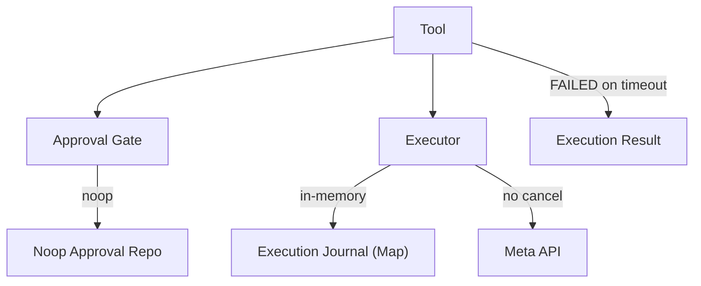

### 6. Architecture After

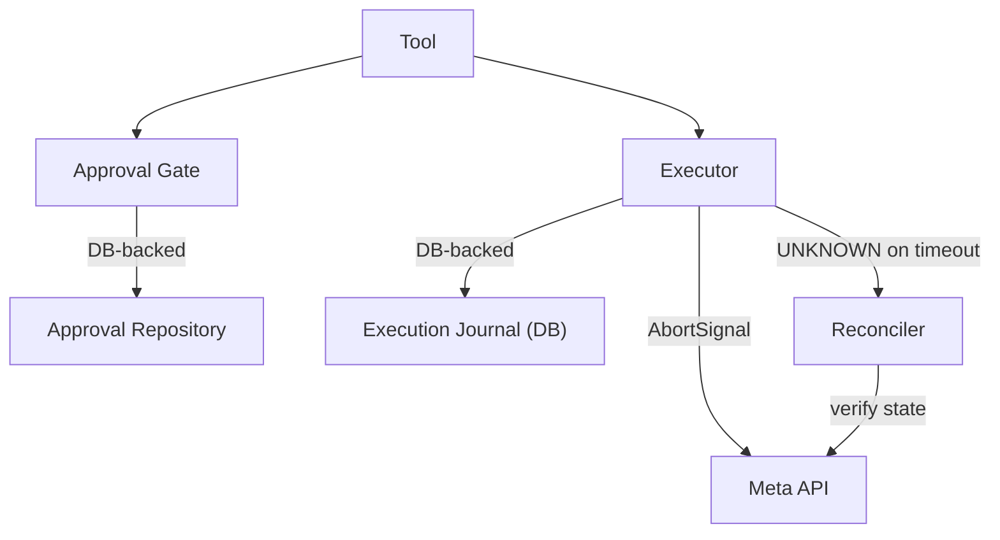

### 7. What JARVIS Can Do Now

JARVIS has a clear roadmap of exactly what needs to be fixed to be production-safe.

### 8. Before vs After Example

**BEFORE:**

User: "Execute this recommendation"
JARVIS: Executes the action, but:
- The approval is never consumed (can be reused无限次)
- If the server restarts, the execution state is lost
- If Meta's response is lost, the action is marked FAILED (may have actually succeeded)
- Two concurrent requests can execute the same action twice

**AFTER:**

User: "Execute this recommendation"
JARVIS: [After fixes in 10.2-10.7]:
- Approval consumed atomically on first use
- Execution state persisted in database
- Ambiguous outcomes marked UNKNOWN, reconciled against Meta
- Concurrency prevented by database leases

*(Example data — synthetic)*

### 9. User Impact

This audit phase had no direct user impact but established the foundation for all subsequent safety improvements.

### 10. Safety Impact

The audit revealed that the existing safety controls were structurally present but operationally broken. The fix plan prioritized write-path integrity.

### 11. Tests and Verification

This was an audit-only phase. No tests were run. Findings were validated through code inspection.

### 12. Production Status

| Dimension | Status |
|-----------|--------|
| Implemented | Audit complete |
| Verified | Findings validated by code inspection |
| User-accessible | N/A (audit only) |

### 13. Known Limitations

The audit itself had limitations:
- Could not verify runtime behavior without a live environment.
- Some MEDIUM findings may require architectural changes to resolve.

### 14. Phase Verdict

**NOT PRODUCTION-READY** — 6 CRITICAL findings identified, fix plan established.

---

## Phase 10.2 — Concurrency & Crash Recovery

### 1. Problem Before This Phase

The execution journal was in-memory (JavaScript Map). It was lost on server restart. Two concurrent requests could both check the journal, both see "not executing," and both proceed — violating single-winner semantics.

### 2. Objective

Replace in-memory idempotency with database-backed execution journal. Implement lease-based concurrency control and crash recovery.

### 3. What Changed

- **DB-backed execution journal:** `ToolExecution` model with UNIQUE constraint on `(userId, toolId, idempotencyKey)`.
- **Lease-based claims:** `claimForExecution()` uses database atomic operations to ensure exactly one winner.
- **Heartbeat system:** Active executions must periodically renew their lease. Stale leases indicate crashes.
- **Crash recovery:** Stale EXECUTING executions are detected via expired leases and mapped to UNKNOWN (never FAILED).

### 4. Technical Changes

**New files:**
- `packages/tools/src/execution-journal.ts` — DB-backed journal implementation
- `packages/tools/src/startup-recovery.ts` — Stale execution recovery on startup

**New migrations:**
- `20260820_phase101_execution_journal` — ToolExecution table with lease fields
- `20260820_phase102_concurrency` — UNIQUE constraint, heartbeat fields

**New tests:**
- `packages/tools/test/phase102-concurrency-tools.test.ts`
- `packages/db/test/phase102-concurrency-pg.integration.test.ts`
- `packages/db/test/phase102-lease-recovery.test.ts`

### 5. Architecture Before

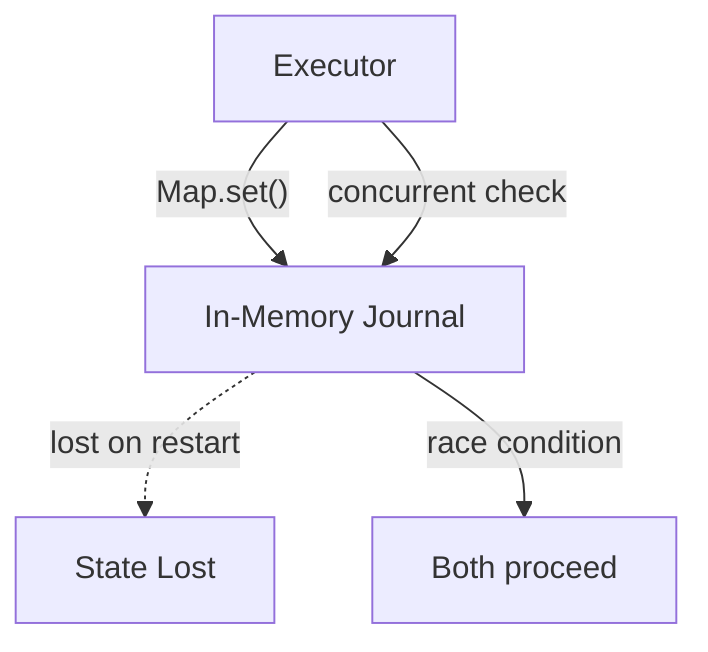

### 6. Architecture After

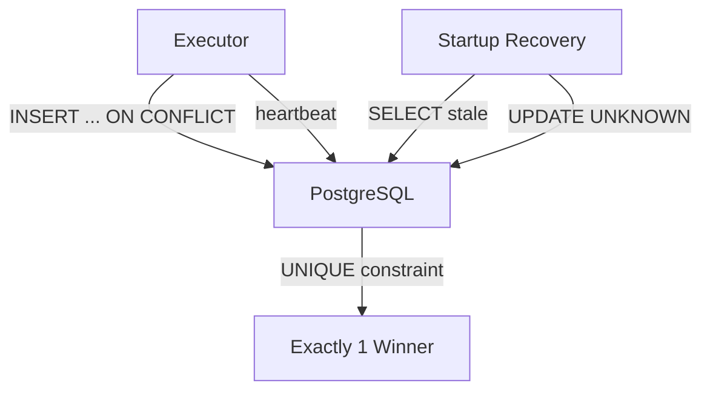

### 7. What JARVIS Can Do Now

JARVIS can safely execute concurrent actions against Meta without risk of duplicate execution. If the server crashes mid-execution, the system recovers gracefully.

### 8. Before vs After Example

**BEFORE:**

Two users approve the same campaign pause simultaneously.
Result: Both executions proceed. Campaign is paused twice (idempotent by accident).
Server crashes during execution.
Result: Execution state lost. System has no record of the attempt.

**AFTER:**

Two users approve the same campaign pause simultaneously.
Result: Database UNIQUE constraint ensures exactly one wins. Second gets `DUPLICATE_EXECUTION`.
Server crashes during execution.
Result: Stale lease detected on restart. Execution marked UNKNOWN. Reconciliation verifies actual state.

*(Example data — synthetic)*

### 9. User Impact

Users can now safely approve actions without worrying about duplicates or crash-related data loss. The system is reliable across restarts.

### 10. Safety Impact

- Duplicate execution prevention via database constraints.
- Crash recovery without data loss.
- Concurrent access safely handled.
- UNKNOWN state properly propagated (never silently converted to FAILED).

### 11. Tests and Verification

- **New tests:** ~40 across 3 test files
- **All passing against PostgreSQL.**
- **Verified:** Single-winner claims, begin convergence, crash recovery, idempotent recovery.

### 12. Production Status

| Dimension | Status |
|-----------|--------|
| Implemented | YES |
| Verified | YES (PostgreSQL integration tests) |
| User-accessible | YES |

### 13. Known Limitations

- Requires PostgreSQL to be running.
- Heartbeat interval must be tuned for the expected execution duration.

### 14. Phase Verdict

**PASS**

---

## Phase 10.3 — Approval Persistence & Consumption

### 1. Problem Before This Phase

The approval system used a noop repository. Approvals were never persisted, never consumed, and could be reused无限次. The human-in-the-loop safety mechanism was structurally present but operationally dead.

### 2. Objective

Wire the approval system to PostgreSQL. Implement atomic approval consumption (one-time use). Ensure approvals cannot be reused.

### 3. What Changed

- **DB-backed approvals:** `Approval` model with status lifecycle (PENDING → APPROVED → CONSUMED / REJECTED / EXPIRED).
- **Atomic consumption:** `consumeApproval()` uses database atomic operations. Only one execution can consume an approval.
- **paramsHash enforcement:** Approval is bound to exact parameters. Re-verification before execution.

### 4. Technical Changes

**New migration:**
- `20260820_phase103_approval_pg` — Approval table with consumption tracking

**New tests:**
- `packages/db/test/phase103-approval-pg.integration.test.ts`
- `packages/db/test/phase103-approval-consumption.test.ts`
- `packages/security/test/tool-approval.test.ts` (updated)
- `packages/security/test/tool-approval-params-hash.test.ts` (updated)

### 5. Architecture Before

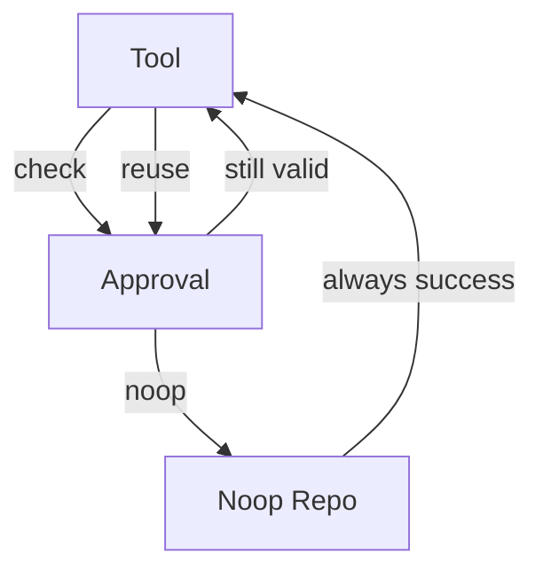

### 6. Architecture After

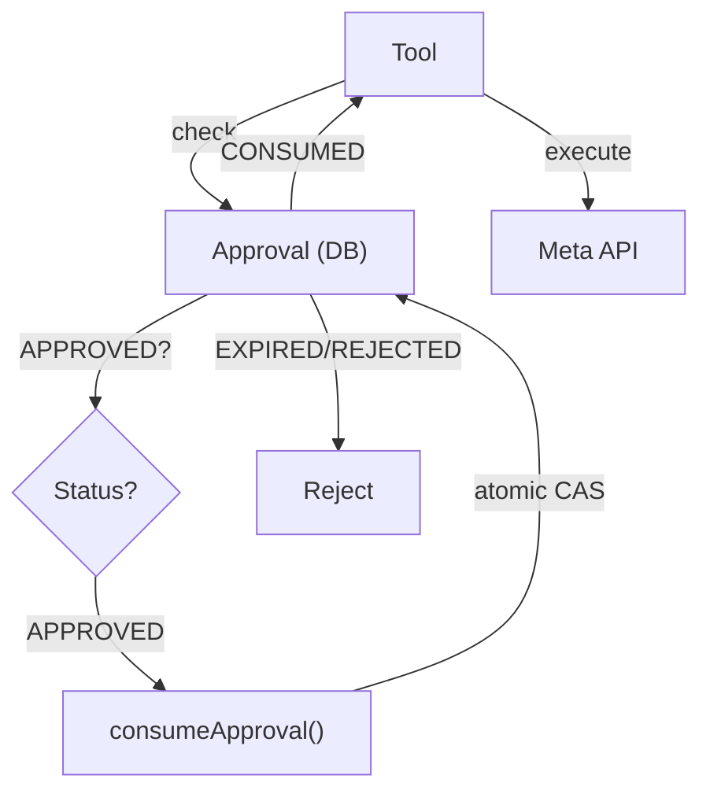

### 7. What JARVIS Can Do Now

Approvals are now real, durable, and one-time-use. An approval for "Pause campaign X" cannot be reused to authorize "Pause campaign Y" or even "Pause campaign X" a second time.

### 8. Before vs After Example

**BEFORE:**

User approves "Pause campaign X."
System executes.
User (or attacker) reuses the same approval.
System executes again (unintended duplicate).

**AFTER:**

User approves "Pause campaign X."
System consumes the approval atomically.
Same approval reused → rejected: `APPROVAL_ALREADY_CONSUMED`.
Different parameters → rejected: `PARAMS_HASH_MISMATCH`.

*(Example data — synthetic)*

### 9. User Impact

Users can trust that their approvals are binding and cannot be reused. Each approval corresponds to exactly one execution.

### 10. Safety Impact

- One-time-use approvals prevent replay attacks.
- paramsHash prevents parameter substitution.
- Atomic consumption prevents race conditions on approval.

### 11. Tests and Verification

- **New tests:** ~30 across 4 test files
- **All passing against PostgreSQL.**
- **Verified:** Consumption lifecycle, paramsHash binding, expiry, concurrency.

### 12. Production Status

| Dimension | Status |
|-----------|--------|
| Implemented | YES |
| Verified | YES |
| User-accessible | YES |

### 13. Known Limitations

- Approvals require PostgreSQL.
- Approval expiry TTL must be configured appropriately.

### 14. Phase Verdict

**PASS**

---

## Phase 10.4 — Timeout Classification

### 1. Problem Before This Phase

When a Meta API call timed out, the system recorded the execution as FAILED. But the request may have actually reached Meta and been processed. Marking it FAILED could lead to retrying an action that already happened.

### 2. Objective

Properly classify timeout outcomes. Propagate AbortSignal for cancellation. Distinguish "definitely failed" from "uncertain outcome."

### 3. What Changed

- **AbortSignal propagation:** Timeout is implemented via AbortController. The signal propagates to the HTTP client, cancelling the actual request.
- **UNKNOWN classification:** Timeouts after potential transmission are classified as UNKNOWN (not FAILED).
- **Reconciliation path:** UNKNOWN outcomes enter the reconciliation flow to verify actual state.

### 4. Technical Changes

**New migration:**
- `20260820_phase104_timeout_classification` — UNKNOWN status support

**New tests:**
- `packages/db/test/phase104-timeout-classification-pg.integration.test.ts`

### 5. Architecture Before

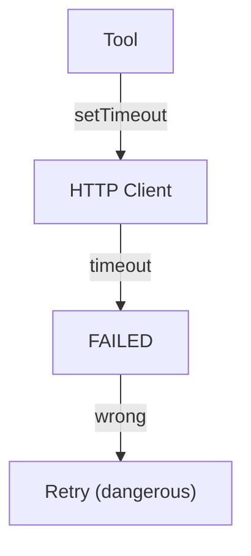

### 6. Architecture After

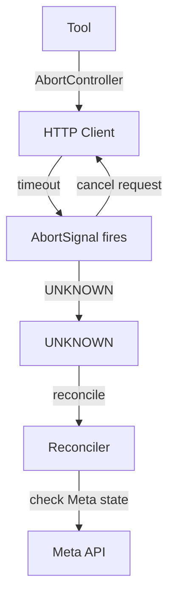

### 7. What JARVIS Can Do Now

JARVIS correctly handles timeouts by marking them as UNKNOWN rather than FAILED. The system will not blindly retry an action that may have already been processed.

### 8. Before vs After Example

**BEFORE:**

JARVIS sends "Pause campaign X" to Meta.
Response times out after 30 seconds.
JARVIS marks execution as FAILED.
User retries. Campaign is paused twice (if first request actually succeeded).

**AFTER:**

JARVIS sends "Pause campaign X" to Meta.
Response times out after 30 seconds.
JARVIS cancels the HTTP request via AbortSignal.
JARVIS marks execution as UNKNOWN.
Reconciliation checks Meta: campaign is PAUSED.
Outcome: First execution succeeded. No retry needed.

*(Example data — synthetic)*

### 9. User Impact

Users no longer need to worry about whether a timeout means the action was performed. JARVIS will verify and handle it correctly.

### 10. Safety Impact

- Prevents duplicate execution after ambiguous timeouts.
- AbortSignal cancels hung HTTP connections.
- UNKNOWN state triggers proper reconciliation.

### 11. Tests and Verification

- **New tests:** ~15 integration tests
- **All passing against PostgreSQL.**
- **Verified:** Timeout classification, signal propagation, UNKNOWN handling.

### 12. Production Status

| Dimension | Status |
|-----------|--------|
| Implemented | YES |
| Verified | YES |
| User-accessible | YES |

### 13. Known Limitations

- Timeout duration must be tuned (too short = premature cancellation, too long = slow failure detection).

### 14. Phase Verdict

**PASS**

---

## Phase 10.5 — Reconciliation Service

### 1. Problem Before This Phase

UNKNOWN outcomes (from timeouts or ambiguous failures) had no path to resolution. They remained permanently uncertain.

### 2. Objective

Implement a reconciliation service that verifies UNKNOWN outcomes against the actual Meta platform state. Classify reconciled outcomes as SAFE_TO_RETRY or finalize as SUCCEEDED/FAILED.

### 3. What Changed

- **Reconciliation service:** Queries Meta Graph API (read-only) to verify whether an action actually took effect.
- **Reconciliation outcomes:** FOUND (action visible on Meta), NOT_FOUND (action not visible), UNCERTAIN (Meta returned ambiguous response), PROVIDER_ERROR (Meta API error).
- **Atomic reconciliation:** Only one process can reconcile a given execution at a time.

### 4. Technical Changes

**New migration:**
- `20260820_phase105_reconciliation` — Reconciliation fields on ToolExecution

**New files:**
- `packages/tools/src/reconciliation.ts` — Reconciliation service
- `packages/meta-graph/src/reconciler.ts` — Meta-specific reconciliation

**New tests:**
- `packages/db/test/phase105-reconciliation-pg.integration.test.ts`
- `packages/tools/test/reconciliation-service.test.ts`

### 5. Architecture Before

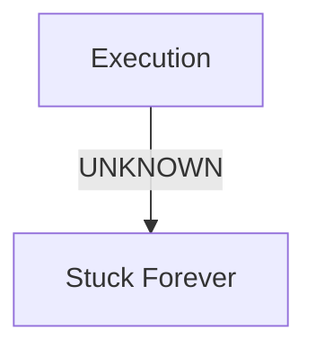

### 6. Architecture After

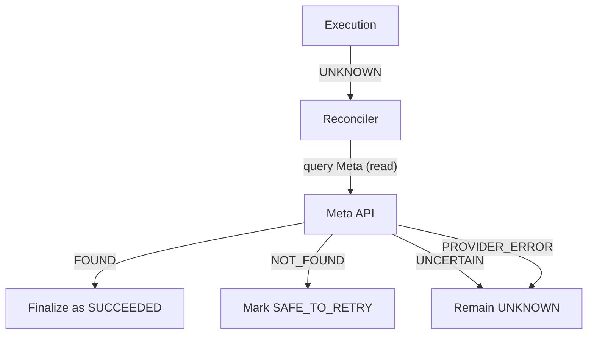

### 7. What JARVIS Can Do Now

JARVIS can resolve uncertain execution outcomes by checking the actual state on Meta. No execution remains permanently stuck.

### 8. Before vs After Example

**BEFORE:**

User: "Did the pause actually work?"
JARVIS: "Execution timed out. Status: UNKNOWN. I cannot determine the outcome."

**AFTER:**

User: "Did the pause actually work?"
JARVIS: "Reconciliation check:
  - Execution timed out.
  - Meta state: Campaign 'Spring Sale' status = PAUSED.
  - Verdict: Action SUCCEEDED despite timeout.
  - Outcome: Campaign is now paused."

*(Example data — synthetic)*

### 9. User Impact

Users get definitive answers about ambiguous execution outcomes. No more permanent uncertainty.

### 10. Safety Impact

- UNKNOWN outcomes are resolved, not ignored.
- Reconciliation is read-only (no side effects on Meta).
- Atomic claims prevent concurrent reconciliation races.
- UNCERTAIN reconciliation results are preserved (not falsely resolved).

### 11. Tests and Verification

- **New tests:** ~30 across 2 test files
- **All passing against PostgreSQL.**
- **Verified:** All reconciliation outcomes (FOUND, NOT_FOUND, UNCERTAIN, PROVIDER_ERROR), concurrency, crash recovery.

### 12. Production Status

| Dimension | Status |
|-----------|--------|
| Implemented | YES |
| Verified | YES |
| User-accessible | YES |

### 13. Known Limitations

- Reconciliation depends on Meta API availability.
- UNCERTAIN outcomes may require manual investigation.
- Reconciliation correlation window must be appropriately sized.

### 14. Phase Verdict

**PASS**

---

## Phase 10.6 — Shutdown Lifecycle

### 1. Problem Before This Phase

When the server shut down, in-flight executions were interrupted without proper state management. No graceful draining. No admission control.

### 2. Objective

Implement a graceful shutdown lifecycle that drains in-flight executions, prevents new executions during shutdown, and preserves journal state.

### 3. What Changed

- **Forward-only state machine:** RUNNING → DRAINING → STOP_ACCEPTING → STOPPED.
- **Admission gate:** DRAINING allows READ_ONLY tools only. STOP_ACCEPTING allows nothing.
- **In-flight preservation:** Running executions are not interrupted. Their leases are preserved for recovery.
- **Idempotent shutdown:** Multiple shutdown signals are safely handled.

### 4. Technical Changes

**New files:**
- `packages/tools/src/lifecycle.ts` — Shutdown lifecycle manager

**New tests:**
- `packages/tools/test/phase106-shutdown-lifecycle.test.ts`

### 5. Architecture Before

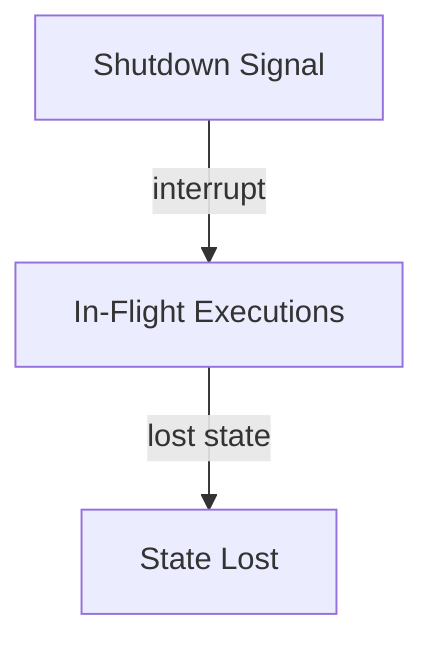

### 6. Architecture After

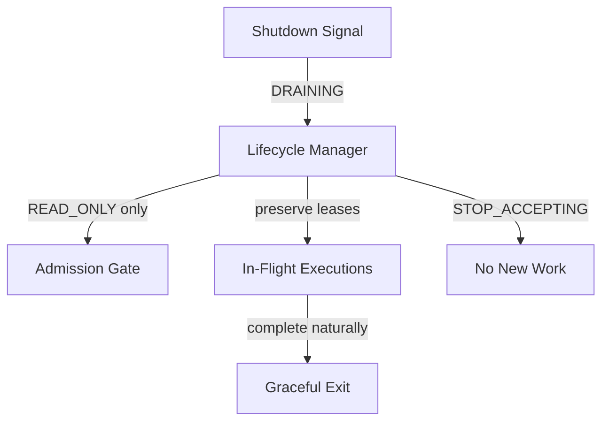

### 7. What JARVIS Can Do Now

JARVIS shuts down gracefully. In-flight executions complete naturally. New write operations are rejected during shutdown. No data is lost.

### 8. Before vs After Example

**BEFORE:**

Server receives SIGTERM.
In-flight Meta API call is interrupted mid-request.
Execution state: unknown.
On restart: stale execution with no recovery path.

**AFTER:**

Server receives SIGTERM.
Lifecycle enters DRAINING. No new writes accepted.
In-flight Meta API call completes normally.
Execution state: preserved in DB.
On restart: startup recovery detects and handles any stale executions.

*(Example data — synthetic)*

### 9. User Impact

Deployments and restarts no longer risk losing in-progress work or corrupting execution state.

### 10. Safety Impact

- In-flight executions are never interrupted.
- No new writes during shutdown prevent new risks.
- Journal leases preserved for crash recovery.

### 11. Tests and Verification

- **New tests:** ~20 test cases
- **All passing.**
- **Verified:** State machine transitions, admission rules, idempotent shutdown, in-flight preservation.

### 12. Production Status

| Dimension | Status |
|-----------|--------|
| Implemented | YES |
| Verified | YES |
| User-accessible | YES (transparent to user) |

### 13. Known Limitations

- Grace timeout must be configured (too short = interrupted executions, too long = slow shutdown).

### 14. Phase Verdict

**PASS**

---

## Phase 10.7 — Approval API Integration

### 1. Problem Before This Phase

The approval system was DB-backed but not wired to the API layer. Users could not approve or reject actions through the REST API.

### 2. Objective

Wire the approval system to the API layer. Expose approval listing, approval, and rejection endpoints. Verify end-to-end approval flow.

### 3. What Changed

- **API routes:** `/api/v1/approvals` (GET), `/api/v1/approvals/:id/approve` (POST), `/api/v1/approvals/:id/reject` (POST).
- **Approval summary service:** Aggregates pending approvals for display.
- **IDOR protection:** Users can only approve their own account's approvals.
- **Approval TTL constant:** Standardized expiry window.

### 4. Technical Changes

**New files:**
- `apps/api/src/routes/approvals.ts` — Approval API routes
- `apps/api/src/services/approval-summary.ts` — Summary aggregation

**New tests:**
- `packages/db/test/phase107-approval-api-pg.integration.test.ts`

### 5. Architecture Before

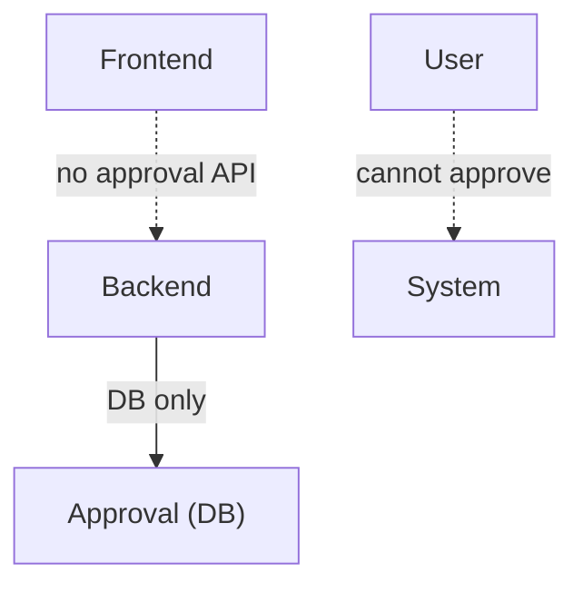

### 6. Architecture After

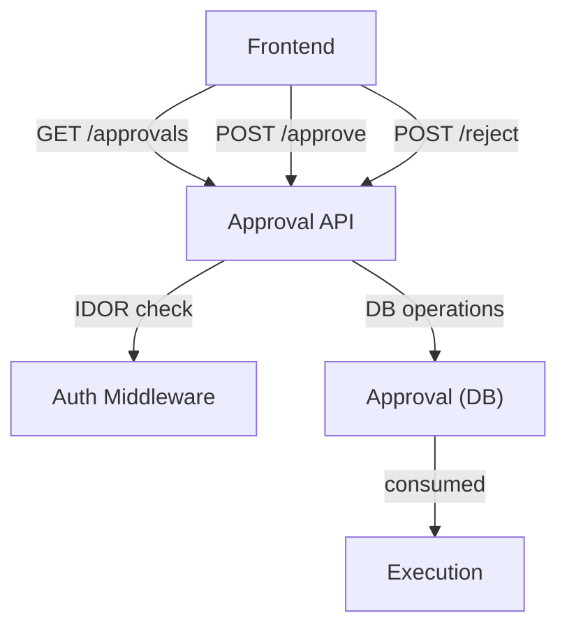

### 7. What JARVIS Can Do Now

Users can view pending approvals, approve actions, and reject actions through the web interface. The full approval loop is operational.

### 8. Before vs After Example

**BEFORE:**

JARVIS recommends pausing a campaign.
System creates an approval in the database.
User has no way to approve it through the interface.
Action is stuck forever.

**AFTER:**

JARVIS recommends pausing a campaign.
System creates an approval in the database.
User sees approval in the Approvals panel.
User clicks "Approve."
System consumes the approval and executes the action.

*(Example data — synthetic)*

### 9. User Impact

The approval system is now fully operational from recommendation through approval to execution.

### 10. Safety Impact

- IDOR protection ensures users can only approve their own account's actions.
- Approval API is authenticated and authorized.
- Full audit trail of approval decisions.

### 11. Tests and Verification

- **New tests:** ~20 integration tests
- **All passing against PostgreSQL.**
- **Verified:** End-to-end approval flow, IDOR protection, authentication.

### 12. Production Status

| Dimension | Status |
|-----------|--------|
| Implemented | YES |
| Verified | YES |
| User-accessible | YES |

### 13. Known Limitations

- Approval UI is basic (functional but not polished).
- No real-time notifications for pending approvals (planned).

### 14. Phase Verdict

**PASS**

---

## Phase 10 Summary

| Sub-phase | Focus | Verdict |
|-----------|-------|---------|
| 10 (audit) | Production readiness inspection | NOT PRODUCTION-READY |
| 10.2 | Concurrency + crash recovery | PASS |
| 10.3 | Approval persistence + consumption | PASS |
| 10.4 | Timeout classification | PASS |
| 10.5 | Reconciliation service | PASS |
| 10.6 | Shutdown lifecycle | PASS |
| 10.7 | Approval API integration | PASS |

### Test Trajectory

| Milestone | Total Tests |
|-----------|-------------|
| Post Phase 9.3-R | 611 |
| Post Phase 10.7 | ~900 (estimated from individual sub-phases) |

### Production Readiness

After Phase 10, all 6 CRITICAL findings from the audit were resolved:
- ✅ Approval system DB-backed and consumed
- ✅ Idempotency journal DB-backed with UNIQUE constraint
- ✅ Timeout cancellation via AbortSignal
- ✅ Ambiguous failures classified as UNKNOWN
- ✅ Approvals consumed atomically
- ✅ Concurrency prevented by database leases

---

*Document version: 1.0*
*Last updated: 2026-08-25*
