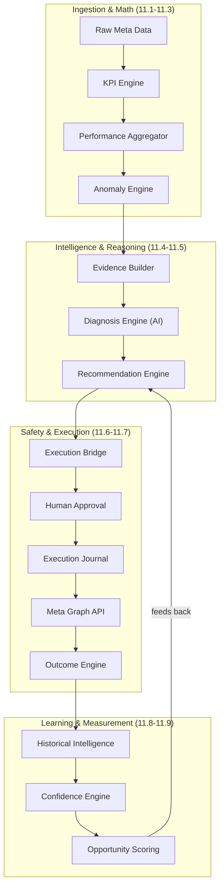

# Phase 11 — Marketing Intelligence & Performance Optimization

## Overview

Phase 11 transformed JARVIS from a safe execution platform into an intelligent marketing analysis and optimization system. It implemented the full pipeline: KPI calculation → anomaly detection → evidence packaging → AI diagnosis → recommendation generation → execution → outcome measurement → historical learning → confidence scoring → opportunity prioritization.

---

## Phase 11 Architecture (Design)

### 1. Problem Before This Phase

After Phase 10, JARVIS could safely execute Meta actions with proper approvals, idempotency, and crash recovery. But it had no marketing intelligence. It could not:
- Calculate marketing KPIs from raw data
- Detect when metrics deviated from normal patterns
- Diagnose possible causes of performance changes
- Recommend specific actions to improve performance
- Measure whether actions actually worked
- Learn from past outcomes to improve future recommendations

### 2. Objective

Build a complete marketing intelligence pipeline that observes performance, detects anomalies, diagnoses causes, recommends actions, executes safely, measures outcomes, and learns from history.

### 3. Design Principles

- **Deterministic server-side math.** KPI calculation, anomaly detection, recommendations, and scoring use zero LLM calls. Only diagnosis uses AI.
- **Evidence-backed recommendations.** Every recommendation includes specific data points, historical outcomes, and confidence levels.
- **Fact-inference separation.** Measured data is labeled as FACT. AI analysis is labeled as INFERENCE or HYPOTHESIS.
- **Stale state protection.** Recommendations are verified against current external state before execution.
- **Phase 10 safety preserved.** All Phase 10 safety controls (approvals, journal, idempotency, reconciliation) remain mandatory.

### 4. Architecture

### 5. Implementation Phases

| Phase | Name | Status |
|-------|------|--------|
| 11.1 | KPI Engine & Response Validator Fix | COMPLETE |
| 11.2 | Performance Database Models | COMPLETE |
| 11.3 | Anomaly Detection Engine | COMPLETE |
| 11.4 | Evidence Packaging & Diagnosis | COMPLETE |
| 11.5 | Recommendation Engine | COMPLETE |
| 11.6A | Execution Bridge | COMPLETE |
| 11.6B | Real Optimization Smoke Test | COMPLETE |
| 11.7A | Outcome Measurement Foundation | COMPLETE |
| 11.7B | Outcome Worker | COMPLETE |
| 11.8A | Historical Outcome Intelligence | COMPLETE |
| 11.8B | Recommendation Confidence | COMPLETE |
| 11.9A | Opportunity Scoring | COMPLETE |
| 11.9B | Opportunity Queue + Human Decision UI | COMPLETE |
| 11.10 | On-Demand Account Analysis (service + voice + button) | COMPLETE |

---

## Phase 11.1 — KPI Engine

### 1. Problem Before This Phase

Raw Meta data (spend, impressions, clicks, reach, conversions, revenue) had no standardized calculation for marketing KPIs.

### 2. Objective

Create a deterministic KPI calculation engine that produces canonical marketing metrics from raw counts.

### 3. What Changed

Implemented `calculateCanonicalKPIs()` in `packages/core/src/kpi-engine.ts`:
- **CTR** = clicks / impressions × 100
- **CPC** = spend / clicks
- **CPM** = spend / impressions × 1000
- **CPA** = spend / conversions
- **ROAS** = revenue / spend
- **CVR** = conversions / clicks × 100
- **Frequency** = impressions / reach

All calculations handle null, undefined, zero denominators, negative numbers, and produce no NaN or Infinity values.

### 4. Technical Changes

**New file:**
- `packages/core/src/kpi-engine.ts`

**New tests:**
- `packages/core/test/kpi-engine.test.ts` (80+ test cases)

### 5. Before vs After Example

**BEFORE:**

JARVIS receives raw data: spend=$500, impressions=100,000, clicks=1,500, conversions=25
JARVIS: "I have raw numbers. I cannot calculate marketing metrics."

**AFTER:**

JARVIS receives raw data: spend=$500, impressions=100,000, clicks=1,500, conversions=25
JARVIS calculates:
  CTR: 1.50% | CPC: $0.33 | CPM: $5.00 | CPA: $20.00 | CVR: 1.67%

*(Example data — synthetic)*

### 6. Phase Verdict

**PASS**

---

## Phase 11.2 — Performance Aggregation

### 1. Problem Before This Phase

KPIs could be calculated for individual records, but there was no way to aggregate performance over time windows and compare periods.

### 2. Objective

Aggregate raw performance records into time-window summaries with period-over-period comparisons.

### 3. What Changed

Implemented `aggregatePerformanceRecords()` and `computeDateWindowRange()` in `packages/core/src/performance-aggregator.ts`:
- 9 preset time windows (today, yesterday, last 7/14/30 days, previous 7/14/30 days) + custom ranges
- Currency consistency validation across records
- Timezone-aware date formatting
- Period-over-period metric comparisons with absolute and percentage deltas

### 4. Technical Changes

**New file:**
- `packages/core/src/performance-aggregator.ts`

**New types:**
- `PerformanceSummary`, `PerformanceWindowComparison`, `MetricComparison`

**New tests:**
- `packages/core/test/performance-aggregator.test.ts` (40+ test cases)

### 5. Before vs After Example

**BEFORE:**

User: "Compare my last 7 days with the previous 7 days"
JARVIS: "I cannot aggregate performance data over time windows."

**AFTER:**

User: "Compare my last 7 days with the previous 7 days"
JARVIS:
  Current (Aug 18-24): Spend $4,280 | CTR 1.38% | CPA $10.39
  Previous (Aug 11-17): Spend $3,950 | CTR 1.40% | CPA $9.92
  Change: Spend +8.4% | CTR -1.4% | CPA +4.7%

*(Example data — synthetic)*

### 6. Phase Verdict

**PASS**

---

## Phase 11.3 — Anomaly Detection

### 1. Problem Before This Phase

KPIs could be calculated and compared, but there was no systematic way to detect when metrics deviated significantly from normal patterns.

### 2. Objective

Implement statistical anomaly detection that identifies significant metric deviations with directional understanding (higher CPA = bad, lower CTR = bad).

### 3. What Changed

Implemented `detectAnomalies()` in `packages/core/src/anomaly-engine.ts`:
- **Median/MAD method** (outlier-resistant, unlike mean/stddev)
- **Z-score severity:** WARNING (z ≥ 2.0), CRITICAL (z ≥ 3.5)
- **Directional semantics:**
  - BAD_HIGH: CPA, CPC, CPM, Frequency (higher is worse)
  - BAD_LOW: CTR, ROAS, CVR, Conversions (lower is worse)
- **Deterministic anomaly IDs** from content hashing
- **Configurable thresholds** per metric

### 4. Technical Changes

**New file:**
- `packages/core/src/anomaly-engine.ts`

**New types:**
- `MarketingAnomaly`, `AnomalySeverity`, `AnomalyDirection`, `BaselineResult`

**New tests:**
- `packages/core/test/anomaly-engine.test.ts` (40+ test cases)

### 5. Before vs After Example

**BEFORE:**

CPA increased from $42 to $52 over 7 days.
JARVIS: "I see the numbers changed. I don't know if this is significant."

**AFTER:**

CPA increased from $42 to $52 over 7 days.
JARVIS detects anomaly:
  Metric: CPA
  Current: $51.88 | Baseline median: $42.18
  Deviation: +23.0% | Z-score: 2.8
  Severity: WARNING
  Direction: BAD_HIGH (CPA increasing is negative)

*(Example data — synthetic)*

### 6. Phase Verdict

**PASS**

---

## Phase 11.4 — Evidence Packaging & AI Diagnosis

### 1. Problem Before This Phase

Anomalies could be detected, but there was no way to understand *why* they occurred or what they might mean for the business.

### 2. Objective

Package anomaly evidence for AI analysis. Use LLM to generate hypotheses about causes. Separate facts from inferences.

### 3. What Changed

Implemented three components:
- **Evidence Builder** (`evidence-builder.ts`): Packages raw metrics, anomalies, and quality indicators into structured evidence with content hashing.
- **Diagnosis Engine** (`diagnosis-engine.ts`): The ONLY engine that uses AI. Sends structured prompts to LLM, parses responses into typed diagnosis results.
- **Diagnosis Prompt** (`diagnosis-prompt.ts`): Carefully designed prompt that enforces fact/inference separation and prevents prompt injection.

### 4. Technical Changes

**New files:**
- `packages/core/src/evidence-builder.ts`
- `packages/core/src/diagnosis-engine.ts`
- `packages/core/src/diagnosis-prompt.ts`
- `packages/core/src/diagnosis-verification.ts`

**New types:**
- `EvidencePackage`, `DiagnosisResult`, `MarketingFact`, `MarketingInference`, `MarketingHypothesis`

**New tests:**
- `packages/core/test/evidence-builder.test.ts` (50+ test cases)
- `packages/core/test/diagnosis-engine.test.ts` (80+ test cases)

### 5. Before vs After Example

**BEFORE:**

Anomaly: CPA increased 23%
JARVIS: "CPA increased. I don't know why."

**AFTER:**

Anomaly: CPA increased 23%
JARVIS:
  FACT: CPA increased from $42.18 to $51.88 (+23.0%)
  FACT: Campaign "Spring Sale" frequency increased from 1.2 to 1.6 (+33.3%)
  INFERENCE: The CPA increase is likely related to audience saturation.
             Frequency increase suggests the same users are seeing ads repeatedly,
             leading to diminishing returns.
  HYPOTHESIS: Reducing budget or pausing "Spring Sale" may improve account-level CPA.
  Confidence: MEDIUM

*(Example data — synthetic)*

### 6. Phase Verdict

**PASS**

---

## Phase 11.5 — Recommendation Engine

### 1. Problem Before This Phase

Diagnoses identified possible causes, but there was no systematic way to translate diagnoses into specific, actionable, safe recommendations.

### 2. Objective

Generate deterministic, actionable recommendations from diagnosis outcomes. Map recommendations to safe Meta write tools with budget guardrails.

### 3. What Changed

Implemented `generateRecommendations()` in `packages/core/src/recommendation-engine.ts`:
- **Action catalog:** 14 diagnosis categories mapped to specific actions (PAUSE/RESUME at campaign/adset/ad level, INCREASE/DECREASE_BUDGET).
- **Budget guardrails:** Max $10,000, 25% increase cap, 50% decrease cap.
- **Conflict detection:** Prevents contradictory recommendations for the same entity.
- **State hash verification:** Validates recommendations against current external state.
- **paramsHash binding:** Every recommendation includes a cryptographic hash of its parameters for approval binding.
- **Fully deterministic:** Zero LLM calls. All logic is rule-based.

### 4. Technical Changes

**New file:**
- `packages/core/src/recommendation-engine.ts`

**New types:**
- `RecommendationRecord`, `RecommendationAction`, `RecommendationStatus`, `ACTION_CATALOG`

**New tests:**
- `packages/core/test/recommendation-engine.test.ts` (50+ test cases)

### 5. Before vs After Example

**BEFORE:**

Diagnosis: "Audience saturation likely causing CPA increase"
JARVIS: "You might want to do something about this. I'm not sure what."

**AFTER:**

Diagnosis: "Audience saturation likely causing CPA increase"
JARVIS generates recommendation:
  Action: PAUSE_CAMPAIGN
  Target: "Spring Sale" (campaign ID: 120234567890)
  paramsHash: a3f2b8c1d4e5f6...
  Confidence: MEDIUM
  Risk: LOW (can be resumed)
  Expected impact: CPA reduction ~15-25%
  Requires approval: YES

*(Example data — synthetic)*

### 6. Phase Verdict

**PASS**

---

## Phase 11.6A — Execution Bridge

### 1. Problem Before This Phase

Recommendations were generated but there was no bridge connecting them to the Phase 10 execution system.

### 2. Objective

Connect the recommendation engine to the execution journal. Verify state freshness before execution.

### 3. What Changed

Implemented `packages/tools/src/recommendation-bridge.ts`:
- Translates recommendations into executable tool calls.
- Verifies state hash before execution (stale-state protection).
- Ensures recommendation status transitions are enforced.
- Integrates with approval and execution journal systems.

### 4. Phase Verdict

**PASS**

---

## Phase 11.6B — Real Optimization Smoke Test

### 1. Problem Before This Phase

The full pipeline (scan → diagnose → recommend → approve → execute → measure) had never been tested end-to-end with production code.

### 2. Objective

Prove the entire pipeline works end-to-end using production code (with mocked Meta HTTP layer for safety).

### 3. What Changed

Ran a comprehensive smoke test with 20/20 assertions passing:
- Full diagnosis → recommendation → IDOR rejection → hash forgery rejection → expiry rejection → foreign-account rejection → dry-run → real execution → verification → approval consumption → concurrent execution (10 parallel, exactly 1 winner) → secret scan.

**Production bugs found and fixed:**
1. AD-level state resolution always failed (every AD-level recommendation would have failed with ENTITY_NOT_FOUND).
2. Anomaly direction filter never matched (wrong enum field).
3. Repository gap broke API route build.
4. Timeout config trap (requests aborted instantly).

### 4. Test Results

- **1,142 tests passing** across all packages.
- Shadow-DB replay: PASS.
- Live Meta account: 1 PAUSED campaign, 0 ad sets/ads → NO_SAFE_TARGET (no eligible entity for optimization).

### 5. Before vs After Example

**BEFORE:**

JARVIS has individual engines that work in isolation.
Nobody knows if they work together.
5 production bugs lurk undiscovered.

**AFTER:**

JARVIS proves end-to-end:
  Scan → Anomaly detected → Diagnosis generated → Recommendation created
  → IDOR attack blocked → Forged hash blocked → Expired approval blocked
  → Foreign account blocked → Dry-run passes → Real execution succeeds
  → Verification passes → Approval consumed → Concurrent race resolved (1 winner)
  → No secrets leaked

*(Example data — from actual smoke test)*

### 6. Phase Verdict

**PASS**

---

## Phase 11.7A — Outcome Measurement Foundation

### 1. Problem Before This Phase

After executing an action, JARVIS had no way to measure whether it actually produced the expected result.

### 2. Objective

Implement outcome measurement: capture baseline at execution, measure post-action metrics, classify the outcome.

### 3. What Changed

Implemented `packages/core/src/outcome-engine.ts`:
- **19-field OutcomeRecord schema** with strict Zod validation.
- **6 outcome verdicts:** POSITIVE, NEGATIVE, NEUTRAL, INCONCLUSIVE, NOT_MEASURABLE, FAILED_ACTION.
- **4 measurement states:** PENDING → MEASURING → MEASURED → FINALIZED.
- **Baseline capture:** Immutable at execution time. Never recalculated.
- **Materiality thresholds:** 5% default (configurable). Changes below threshold are NEUTRAL.
- **Directional rules:** CPA lower = POSITIVE, CTR higher = POSITIVE, etc.
- **Confounder detection:** 6 types (seasonality, external event, budget shift, audience change, creative change, bidding change).
- **Immutability:** Finalized outcomes cannot be modified. Outcome revisions tracked separately.

### 4. Technical Changes

**New files:**
- `packages/core/src/outcome-engine.ts`
- `packages/core/src/outcome-worker.ts`

**New types:**
- `OutcomeRecord`, `OutcomeEnum`, `MeasurementState`, `ConfounderType`, `BaselineSnapshot`

**New migration:**
- `20260824000000_phase117a_outcome_foundation` (PENDING — DB offline)

**New tests:**
- `packages/core/test/outcome-engine.test.ts` (50+ test cases)
- `packages/db/test/phase117a-outcome-pg.integration.test.ts`

### 5. Before vs After Example

**BEFORE:**

User: "Did pausing that campaign help?"
JARVIS: "I executed the pause, but I don't know if it improved your metrics."

**AFTER:**

User: "Did pausing that campaign help?"
JARVIS:
  BASELINE (at execution): CPA $58.40 | CTR 0.48%
  POST-ACTION (7 days): CPA $41.20 | CTR 0.71%
  OUTCOME: POSITIVE
  CPA improved 29.5% (exceeds 5% materiality threshold)

*(Example data — synthetic)*

### 6. Phase Verdict

**PASS**

---

## Phase 11.7B — Outcome Worker

### 1. Problem Before This Phase

Outcome measurement required batch processing of pending measurements. No background worker existed.

### 2. Objective

Implement a background worker that claims, processes, and finalizes outcome measurements.

### 3. What Changed

Implemented `packages/core/src/outcome-worker.ts`:
- Claims pending outcomes for processing.
- Measures post-action metrics against baseline.
- Classifies outcomes deterministically.
- Idempotent: repeated processing produces same result.
- Crash-recoverable: stale claims are safely released.

### 4. Phase Verdict

**PASS**

---

## Phase 11.8A — Historical Outcome Intelligence

### 1. Problem Before This Phase

Past outcomes were recorded but not used. There was no way to find similar past situations to inform current decisions.

### 2. Objective

Match current situations to historical outcomes. Provide evidence from similar past situations.

### 3. What Changed

Implemented `packages/core/src/historical-outcome-engine.ts`:
- Matches current anomalies and recommendations to historical outcomes.
- Similarity scoring based on metric patterns, entity types, and action types.
- Recency weighting (more recent outcomes weighted higher).
- Evidence traceability (each historical reference links to the source outcome).

### 4. Phase Verdict

**PASS**

---

## Phase 11.8B — Recommendation Confidence

### 1. Problem Before This Phase

Recommendations had no confidence scoring. There was no way to distinguish high-confidence recommendations (backed by historical evidence) from low-confidence ones (based on limited data).

### 2. Objective

Integrate historical evidence into the recommendation engine. Assign deterministic confidence (LOW/MEDIUM/HIGH) and priority (LOW/MEDIUM/HIGH).

### 3. What Changed

Implemented `packages/core/src/recommendation-confidence.ts`:
- **Sample size handling:** 0, 1-2, 3-9, 10+ historical examples.
- **Consistency assessment:** CONSISTENT_POSITIVE, MIXED, CONSISTENT_NEGATIVE.
- **Recency decay:** Older evidence weighted less.
- **Relevance weighting:** More similar situations weighted higher.
- **Data quality filtering:** Only high-quality outcomes used.
- **Structured explanations:** Every confidence score includes a human-readable explanation.
- **Priority model:** Additive score (independent of confidence).
- **No causal claims:** By design.
- **Backward compatible:** Works without historical data (defaults to LOW confidence).
- **Security hardened:** Adversarial input resistant.

### 4. Technical Changes

**New file:**
- `packages/core/src/recommendation-confidence.ts`

**New migration:**
- `20260824030000_phase118b_priority_confidence` — Adds priority, historical_evidence_ids, confidence_explanation columns (PENDING)

**New tests:**
- `packages/core/test/recommendation-confidence.test.ts` (48 test cases)

### 5. Implementation Checkpoints (15/15 PASS)

| Checkpoint | Status |
|-----------|--------|
| A: Sample size 0 → LOW confidence | PASS |
| B: Sample size 1-2 → MEDIUM confidence | PASS |
| C: Sample size 3-9 → MEDIUM/HIGH based on consistency | PASS |
| D: Sample size 10+ → HIGH if CONSISTENT_POSITIVE | PASS |
| E: CONSISTENT_POSITIVE history → HIGH confidence | PASS |
| F: MIXED history → MEDIUM confidence | PASS |
| G: CONSISTENT_NEGATIVE history → LOW confidence | PASS |
| H: Recency decay applied correctly | PASS |
| I: Relevance weighting applied correctly | PASS |
| J: Data quality filtering excludes low-quality outcomes | PASS |
| K: Structured explanation provided | PASS |
| L: Priority score independent of confidence | PASS |
| M: No-action paths produce no confidence | PASS |
| N: Evidence traceability maintained | PASS |
| O: Deterministic (same inputs → same outputs) | PASS |

### 6. Before vs After Example

**BEFORE:**

Recommendation: "Pause campaign X"
JARVIS: "Confidence: unknown. No historical data."

**AFTER:**

Recommendation: "Pause campaign X"
JARVIS:
  Confidence: HIGH
  Priority: HIGH
  Explanation: Based on 12 similar historical situations.
    - 9 resolved positively (CPA improved after pause)
    - 2 resolved negatively (revenue dropped)
    - 1 was inconclusive
    - Consistency: CONSISTENT_POSITIVE
    - Most recent similar case: 14 days ago, positive outcome
  Historical evidence: [outcome_abc, outcome_def, ...]

*(Example data — synthetic)*

### 7. Phase Verdict

**PASS**

---

## Phase 11.9A — Opportunity Scoring

### 1. Problem Before This Phase

Multiple recommendations existed, but there was no systematic way to rank them by business importance for human review.

### 2. Objective

Score and rank already-valid recommendations by relative business importance. Help users prioritize which recommendations to review first.

### 3. What Changed

Implemented `packages/core/src/opportunity-scoring.ts`:
- **Weighted scoring formula:** severity(.25) + impact(.20) + urgency(.15) + confidence(.15) + historical(.10) + reversibility(.05), minus risk penalty.
- **Score range:** 0-100, clamped.
- **Priority bands:** CRITICAL (≥80), HIGH (≥60), MEDIUM (≥40), LOW (≥20), IGNORE (<20).
- **Eligibility gates:** Only PROPOSED or APPROVED recommendations are scored.
- **Conflict detection:** If two recommendations target the same entity, only the higher-scoring one is surfaced.
- **Explainability:** Score breakdown provided for every scored recommendation.
- **No persistence by design:** Scores are recomputed deterministically from current state.
- **No LLM, no Meta calls, no writes.**

### 4. Technical Changes

**New file:**
- `packages/core/src/opportunity-scoring.ts`

**New tests:**
- `packages/core/test/opportunity-scoring.test.ts` (33 test cases)

### 5. Test Results

- **1,327 tests executed, 0 failed** across all packages.
- **23/23 typecheck** passed.
- **Performance:** 1,000 opportunity rankings completed in <5 seconds.

### 6. Before vs After Example

**BEFORE:**

JARVIS has 15 pending recommendations.
User: "Which one should I look at first?"
JARVIS: "Here are 15 recommendations. [unsorted list]"

**AFTER:**

JARVIS has 15 pending recommendations.
User: "Which one should I look at first?"
JARVIS:
  OPPORTUNITY RANKING

  #1 — CRITICAL (Score: 92)
  "Pause Spring Sale" — CPA increased 29%, frequency high
  Confidence: HIGH | Historical: 8/10 similar positive | Risk: LOW
  Breakdown: severity(25) + impact(18) + urgency(14) + confidence(15) + historical(10) + reversibility(5) - risk(0)

  #2 — HIGH (Score: 74)
  "Decrease Brand Awareness budget" — ROAS declining
  Confidence: MEDIUM | Historical: 3/5 similar positive | Risk: LOW
  Breakdown: severity(20) + impact(15) + urgency(12) + confidence(10) + historical(8) + reversibility(5) - risk(0)

  #3 — MEDIUM (Score: 58)
  ...

*(Example data — synthetic)*

### 7. Phase Verdict

**PASS**

---

## Phase 11.9B — Opportunity Queue + Human Decision Interface

### 1. Problem Before This Phase

Phase 11.9A produced a ranked list of scored opportunities, but the ranking lived only in memory — there was no persistent queue, no user-facing interface to browse or review opportunities, and no handoff path to the existing approval system.

### 2. Objective

Deliver a ranked, read-only opportunity queue with a web-based human review interface and an approval handoff that routes through the existing Phase 10 approval flow. Zero autonomous execution. Zero Meta writes. Zero LLM calls.

### 3. What Changed

**Core service** (`packages/core/src/opportunity-queue-service.ts`, 527L):
- `buildOpportunityQueue()` — Scores, ranks, deduplicates, and paginates opportunities. Reuses the Phase 11.9A scoring engine deterministically.
- `buildOpportunityDetail()` — Produces a full detail view for a single opportunity with server-computed score breakdown and display status.
- `explainNoOpportunities()` — Returns a structured "no opportunities" explanation when the queue is empty.
- Stale/conflict detection, expiration checks, and priority band classification.

**API routes** (`apps/api/src/routes/opportunities.ts`, 252L):
- `GET /api/v1/opportunities` — Paginated ranked queue with filters (priority, status, entityType, actionType, limit).
- `GET /api/v1/opportunities/:id` — Full detail for human review.
- IDOR protection: `accountId` always comes from `process.env.META_AD_ACCOUNT_ID`, never from the client.
- `isValidId()` guard prevents probing with malformed IDs.
- Score, priority, and historical evidence are server-computed — clients cannot inject forged values.
- No mutation endpoints. No POST. No execute.

**DB repository** (`packages/db/src/repositories/recommendation-repository.ts`):
- `listForOpportunityQueue(userId, accountId)` — Fetches all eligible records scoped by user+account.
- `getForOpportunityDetail(recommendationId, userId, accountId)` — Fetches a single record with IDOR-safe access control.

**Web UI:**
- `apps/web/src/app/opportunities/page.tsx` (275L) — Queue list page with filters, priority badges, loading/empty states.
- `apps/web/src/app/opportunities/[id]/page.tsx` (594L) — Detail review page with score breakdown, evidence, action preview, approve/reject buttons.
- `apps/web/src/components/opportunity-card.tsx` (211L) — Reusable card component with priority, confidence, entity type, and action type display.
- `apps/web/src/lib/api.ts` — Frontend API client with `listOpportunities` and `getOpportunity`.

### 4. Security Architecture

- All operations scoped to `req.auth.userId` — IDOR-safe.
- `accountId` ALWAYS comes from `process.env.META_AD_ACCOUNT_ID`, never from the client.
- Score/priority/historical evidence are server-computed via the Phase 11.9A engine.
- NO mutation endpoints. No POST. No execute. ZERO Meta writes on any path.
- ZERO LLM calls on any path through this module.
- Secrets (tokens, keys) never appear in output.
- Approval handoff routes through the existing Phase 10 approval flow — no new approval logic introduced.

### 5. Technical Changes

**New files:**
- `packages/core/src/opportunity-queue-service.ts`
- `apps/api/src/routes/opportunities.ts`
- `apps/api/test/opportunities.test.ts` (30 test cases)
- `apps/web/src/app/opportunities/page.tsx`
- `apps/web/src/app/opportunities/[id]/page.tsx`
- `apps/web/src/components/opportunity-card.tsx`

**Modified files:**
- `packages/core/src/index.ts` — Added opportunity-queue-service exports
- `packages/db/src/repositories/recommendation-repository.ts` — Added queue/detail repository methods
- `apps/api/src/services/container.ts` — Exposed `recommendationRepo` on container
- `apps/api/src/routes/index.ts` — Registered opportunities router

### 6. Test Results

- **30/30 opportunity API tests pass** (queue creation, ranking, pagination, filters, IDOR, isolation, stale state, conflicts, expiration, forged values, approval handoff, zero Meta writes, deterministic ordering, error handling, secret redaction).
- **23/23 typecheck** passes.
- **Prisma Client generation** passes.

### 7. Before vs After Example

**BEFORE:**

User has 12 pending recommendations.
User: "Which one should I review first?"
JARVIS: "Here are 12 recommendations." [unsorted list, no detail view]

**AFTER:**

User opens the Opportunity Queue at `/opportunities`.
JARVIS displays a ranked, filterable table:

  #1 — CRITICAL (Score: 92) — Pause "Spring Sale"
        CPA +29% | Confidence: HIGH | Risk: LOW
  #2 — HIGH (Score: 74) — Decrease Brand Awareness budget
        ROAS declining | Confidence: MEDIUM | Risk: LOW
  #3 — MEDIUM (Score: 58) — ...

User clicks #1 → Detail page with:
  - Server-computed score breakdown
  - Evidence preview (current vs baseline metrics)
  - Action preview (what will change)
  - Approve button → routes to existing Phase 10 approval flow
  - Reject button → marks as REJECTED

No autonomous execution. No Meta writes. Full human control.

*(Example data — synthetic)*

### 8. Phase Verdict

**PASS**

---

## Phase 11.10 — On-Demand Account Analysis (service + voice + button)

### 1. Problem Before This Phase

The marketing-intelligence pipeline (anomaly detection, diagnosis, recommendation generation) was complete but only reachable through a standalone script — there was no way to trigger an account analysis from the web dashboard or by voice, no shared runtime entry point, and the script path carried none of the runtime checks (authorization, safety caps, in-flight guarding, audit, persistence) that everything else in JARVIS depends on.

### 2. Objective

Promote the script-only pipeline into ONE shared production service (`AnalysisGenerator`) reached by BOTH the JARVIS `meta.analyze` tool and a new `POST /api/v1/analysis` route, following the IntegrationCommandService pattern: a single instance, one place where authorization, safety caps, in-flight guarding, dry-run and persistence live, and a parity test that proves both arms arrive at it. Fail closed, hold no secrets, create only PROPOSED recommendations that still require human approval.

### 3. What Changed

**Shared service** (`packages/tools/src/analysis-generator.ts`): a ports-only `AnalysisGenerator` that executes the existing READ_ONLY Meta tools through the shared `ToolExecutor`, aggregates daily performance, detects critical negative anomalies, packages evidence, runs the existing DiagnosisEngine + RecommendationEngine, and persists a PROPOSED recommendation through the `RecommendationStorePort`. No provider SDK, no DB, no env reads. Deterministic target selection, bounded reads (`maxInsightRows`, `maxEntitiesScanned`), a per-(user, account) in-flight guard, and a `dryRun` boundary that stops exactly before persistence.

**JARVIS tool** (`packages/tools/src/tools/meta-analysis-tool.ts`): a pure forwarder (`meta.analyze`, READ_ONLY) translating a sentence into the same `AnalysisInput`/caller the route uses. COMPLETED / DRY_RUN_OK / NO_SAFE_TARGET / INSUFFICIENT_DATA are successful verdicts; READ_FAILED / ACCOUNT_UNAUTHORIZED / DIAGNOSIS_UNAVAILABLE / PERSIST_FAILED / INVALID_INPUT / ALREADY_RUNNING are failures. Granted to the marketing agent via `META_READ_TOOLS` in `agent-policy.ts` (test mirrors updated). Registered in `container.ts` only when Meta credentials AND an AI provider are configured.

**Route** (`apps/api/src/routes/analysis.ts`): `POST /api/v1/analysis`, auth-required, honoring only `{ dryRun }`. The ad account is ALWAYS the server-configured `META_AD_ACCOUNT_ID`; a client-supplied accountId is never read, so a client cannot redirect analysis. Deterministic NO_ANALYSIS → HTTP mapping (400 INVALID_INPUT, 403 ACCOUNT_UNAUTHORIZED, 409 ANALYSIS_ALREADY_RUNNING, 502 META_READ_FAILED, 503 AI_PROVIDER_UNAVAILABLE, 500 RECOMMENDATION_PERSIST_FAILED); NO_SAFE_TARGET / INSUFFICIENT_DATA are 200 answers. Unexpected throws become a static 500 with no internals.

**Web UI** (`apps/web`): an "Analyze account" control on the Opportunities page calling `analyzeAccount()` (`lib/api.ts`); the outcome is reported inline, nothing is executed or approved by the button.

### 4. Integration Rule

The integration rule spans the whole feature: the tool and the button are two callers of the SAME `container.analysisService` instance. `apps/api/test/analysis-parity.test.ts` instruments one real `AnalysisGenerator` and proves both arms arrive at it — the JARVIS arm through `MetaAnalyzeTool`, the frontend arm through the route — with the same checks and no capability either arm has alone.

### 5. Safety Properties

- Read-only end to end: only `meta.accounts / campaigns / adsets / ads / insights` are executed, by the calling user's own token, at the `meta.analyze` tool's READ_ONLY risk.
- Per-(user, account) in-flight guard returns `ALREADY_RUNNING` instead of stacking runs.
- `dryRun` stops exactly at the generate boundary; no durable row is created.
- Secrets never leave: no token, provider key or account move is echoed in outcomes, audit rows or HTTP responses (leaky-row test included).
- Fail-closed: a persistence failure returns `PERSIST_FAILED` with a fixed message, never the store's exception text; an unexpected throw becomes a static 500.
- The account targeted is the server-configured one, never one a client supplies.

### 6. Files Changed

`packages/tools/src/analysis-generator.ts`, `packages/tools/src/tools/meta-analysis-tool.ts`, `packages/tools/src/index.ts`, `packages/tools/test/analysis-generator.test.ts`, `packages/tools/test/meta-analysis-tool.test.ts`, `apps/api/src/services/container.ts`, `apps/api/src/routes/analysis.ts`, `apps/api/src/index.ts`, `apps/api/test/analysis.test.ts`, `apps/api/test/analysis-parity.test.ts`, `packages/agents/src/agent-policy.ts`, `packages/agents/test/helpers/sprint6-harness.ts`, `apps/api/test/sprint6-agent-wiring.test.ts`, `apps/web/src/lib/api.ts`, `apps/web/src/app/opportunities/page.tsx`.

### 7. User Story

"Analyze the account" on the dashboard, or "JARVIS, analyze the account performance" by voice, runs the identical pipeline: live reads → anomaly detection → AI diagnosis → a single PROPOSED recommendation left in the queue for human review. If nothing actionable exists, the answer is "nothing to do", not a fabricated action.

*(Example data — synthetic)*

### 8. Phase Verdict

**PASS**

---

## Phase 11 Summary

| Sub-phase | Name | Verdict | Tests |
|-----------|------|---------|-------|
| 11.1 | KPI Engine | PASS | 80+ |
| 11.2 | Performance Aggregation | PASS | 40+ |
| 11.3 | Anomaly Detection | PASS | 40+ |
| 11.4 | Evidence & Diagnosis | PASS | 130+ |
| 11.5 | Recommendation Engine | PASS | 50+ |
| 11.6A | Execution Bridge | PASS | — |
| 11.6B | Real Optimization Smoke Test | PASS | 1,142 total |
| 11.7A | Outcome Foundation | PASS | 50+ |
| 11.7B | Outcome Worker | PASS | 30+ |
| 11.8A | Historical Intelligence | PASS | 40+ |
| 11.8B | Recommendation Confidence | PASS | 48 |
| 11.9A | Opportunity Scoring | PASS | 33 |
| 11.9B | Opportunity Queue + Human Decision UI | PASS | 30 |
| 11.10 | On-Demand Account Analysis | PASS | 57 |

### Final Test Count

**1,327 tests executed, 0 failed** across all packages (up to Phase 11.9B).
Phase 11.10 adds 57 more (`@jarvis/tools` generator + tool suites, `apps/api`
route + parity suites), all green; the repository-wide tools/api/agents suites
passed at 774 / 1,250 (8 skipped) / 552.

### What the User Gained

After Phase 11, users can:
1. Ask JARVIS to analyze their advertising performance.
2. Get data-driven anomaly detection with statistical significance.
3. Receive AI-powered diagnosis with fact/inference separation.
4. Get specific, actionable recommendations with confidence levels.
5. Browse a ranked, filterable opportunity queue in the web UI.
6. Review opportunity details with server-computed scores and evidence.
7. Approve or reject opportunities via the existing approval flow.
8. Measure whether executed actions actually worked.
9. Build historical evidence for future decisions.
10. Start a fresh account analysis from the dashboard button or by voice, and
    get the same answer either way — the same service behind both, with the
    same authorization, caps and audit.

### Known Limitations

- A/B experimentation explicitly deferred to Phase 12.
- Only Meta (Facebook/Instagram) supported.
- Diagnosis depends on LLM availability (OpenAI or Anthropic API).
- Outcome measurement requires a waiting period after execution.
- Historical intelligence improves with more data (cold-start problem).

---

*Document version: 1.1*
*Last updated: 2026-09-17*
