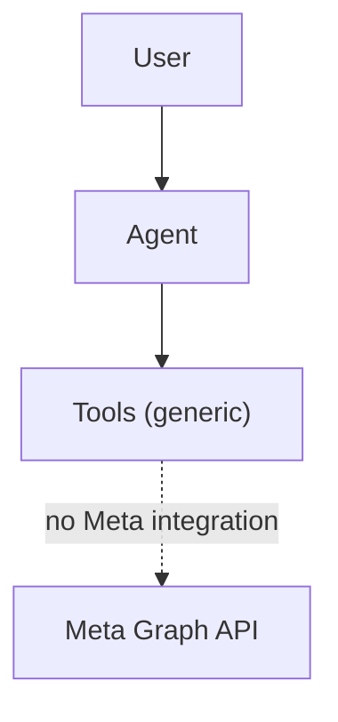
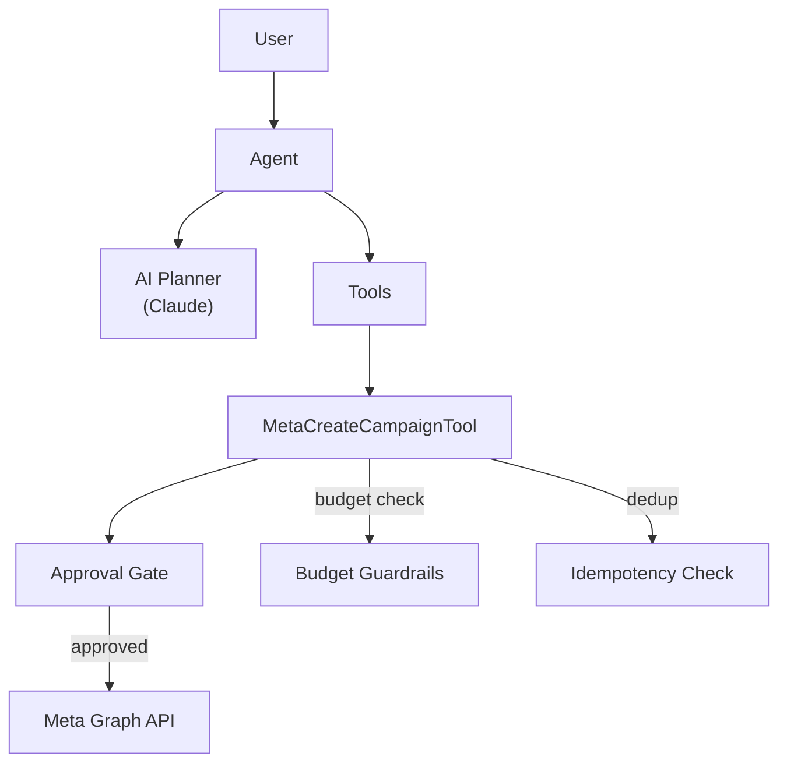
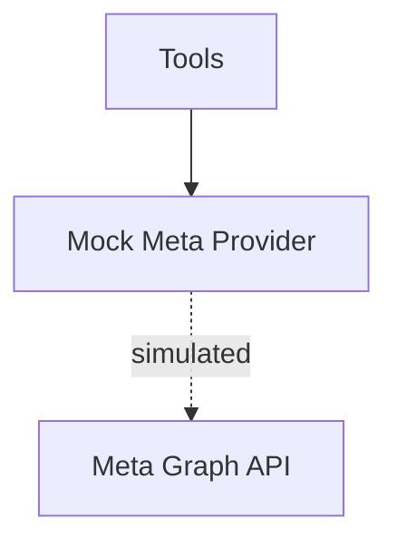
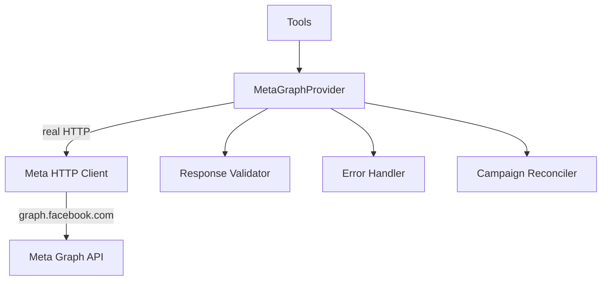

# Phase 9 — Meta Campaign Creation & Real Provider

## Overview

Phase 9 established the foundation for JARVIS's Meta advertising integration. It progressed from AI-assisted campaign proposal (9.3) to a real Meta Graph API provider (9.3-R), enabling JARVIS to read from and write to actual Meta advertising accounts.

---

## Phase 9.3 — AI-Assisted Meta Campaign Creation

### 1. Problem Before This Phase

JARVIS had no integration with the Meta advertising platform. There was no way to read campaign data, no way to propose campaign changes, and no way to execute actions against Meta accounts. The tool system existed but had no marketing-specific tools.

### 2. Objective

Create a Meta campaign creation tool with AI-assisted planning, safety guardrails, and human approval gates. Prove that JARVIS can propose, approve, and execute Meta advertising actions.

### 3. What Changed

A new AI provider adapter (Claude/Anthropic) was added for planning. A campaign proposal contract was defined. The `MetaCreateCampaignTool` was implemented with full approval gates, budget validation, idempotency protection, and audit metadata.

### 4. Technical Changes

**New package:**
- `packages/ai-anthropic/` — Claude adapter (planner-only, 7 files)

**New tool:**
- `packages/tools/src/meta-ads-write-tools.ts` — `MetaCreateCampaignTool` with:
  - Approval gate (requires human approval before execution)
  - Budget guardrails (max amount, transition limits)
  - Idempotency (prevents duplicate campaign creation)
  - Stale protection (validates state before execution)
  - Audit metadata (trace ID, timestamp, user ID)

**New contracts:**
- `CampaignProposal` type in `packages/core/src/types/meta-ads.ts`

**Modified:**
- `packages/core/src/types/meta-ads.ts` — Added proposal types, budget validation

**Tests:** 70 new campaign-specific tests. Total suite: 567 tests all passing.

### 5. Architecture Before

### 6. Architecture After

### 7. What JARVIS Can Do Now

JARVIS can receive a natural language campaign request, use AI to plan a campaign proposal, validate it against budget guardrails, present it for human approval, and execute it on Meta — all with idempotency and audit tracking.

### 8. Before vs After Example

**BEFORE:**

User: "Create a campaign for my summer sale"
JARVIS: "I cannot create Meta campaigns. I don't have access to the Meta platform."

**AFTER:**

User: "Create a campaign for my summer sale"
JARVIS: "I've prepared a campaign proposal:
  - Name: Summer Sale 2026
  - Objective: CONVERSIONS
  - Budget: $50/day
  - Duration: Aug 1–31
  This requires your approval before execution.
  [Approve] [Reject]"

*(Example data — synthetic)*

### 9. User Impact

Users gained the ability to request campaign creation through natural language. The system handles planning, validation, approval routing, and execution — reducing the manual effort of campaign setup.

### 10. Safety Impact

- Every campaign creation requires explicit human approval.
- Budget guardrails prevent excessive spending.
- Idempotency prevents duplicate campaigns.
- All actions are audit-logged with trace IDs.

### 11. Tests and Verification

- **Test count:** 567 (tools: 451, core: 32, security: 18, agents: 66)
- **All passing.**

### 12. Production Status

| Dimension | Status |
|-----------|--------|
| Implemented | YES |
| Verified | YES |
| User-accessible | YES (with Meta credentials configured) |

### 13. Known Limitations

- Campaign creation was mock-only at this phase (real Meta HTTP calls not yet implemented).
- No read access to existing campaigns.
- No ad set or ad-level management.

### 14. Phase Verdict

**PASS**

---

## Phase 9.3-R — Real Meta Graph API Provider

### 1. Problem Before This Phase

The Meta integration used mock providers. No real HTTP calls were made to `graph.facebook.com`. The system could not read actual campaign data or verify authorization against a real Meta account.

### 2. Objective

Implement a real Meta Graph API provider that makes actual HTTP calls to Meta's servers. Verify authorization and read-only access against a live account.

### 3. What Changed

A complete `MetaGraphProvider` was implemented in `packages/meta-graph/`, implementing all 5 provider interfaces (read, write, budget, create, authorizer) with real HTTP calls. It was wired into the API container for end-to-end operation.

### 4. Technical Changes

**New package:**
- `packages/meta-graph/` (7 files):
  - `client.ts` — HTTP client with 30s AbortController timeout
  - `config.ts` — Zod-validated configuration
  - `provider.ts` — `MetaGraphProvider` implementing all 5 interfaces
  - `reconciler.ts` — Campaign state reconciliation
  - `response-validator.ts` — Zod-validated response parsing
  - `error-handler.ts` — Error classification with secret redaction

**Modified:**
- `apps/api/src/services/container.ts` — Wired MetaGraphProvider

**Tests:** 44 new meta-graph tests. Total suite: 611 tests all passing.

### 5. Architecture Before

### 6. Architecture After

### 7. What JARVIS Can Do Now

JARVIS can connect to real Meta advertising accounts, verify authorization, and read campaign data (insights, campaigns, ad sets, ads) through actual HTTP calls to Meta's Graph API.

### 8. Before vs After Example

**BEFORE:**

User: "Show me my campaigns"
JARVIS: [Returns mock data that doesn't reflect actual account state]

**AFTER:**

User: "Show me my campaigns"
JARVIS: [Returns real campaign data from your Meta account]
  - Campaign: "Spring Sale" (ACTIVE) — $320/day
  - Campaign: "Brand Awareness" (ACTIVE) — $150/day
  - Campaign: "Retargeting" (PAUSED) — $80/day

*(Example data — synthetic)*

### 9. User Impact

Users can now connect JARVIS to their real Meta advertising accounts and see actual campaign data. The system transitions from a demo/development tool to a functional marketing intelligence platform.

### 10. Safety Impact

- Real Meta access tokens are validated at configuration time.
- Tokens are redacted in all diagnostic output.
- Single-host validation prevents token leakage to unintended domains.
- 30-second timeouts prevent hung connections.
- All HTTP responses are Zod-validated before processing.

### 11. Tests and Verification

- **Test count:** 611 (tools: 451, core: 32, security: 18, agents: 66, meta-graph: 44)
- **All passing.**
- **Smoke test:** Authorization and read-only access verified against live account (steps 1-5 require live credentials; steps 6-7 pass).

### 12. Production Status

| Dimension | Status |
|-----------|--------|
| Implemented | YES |
| Verified | YES |
| User-accessible | YES (requires META_ACCESS_TOKEN configuration) |

### 13. Known Limitations

- Smoke test steps 1-5 require live Meta credentials (not run in CI).
- Campaign creation remains mock-verified only.
- Write operations not yet exercised against real Meta API.
- Account must have active campaigns for meaningful read results.

### 14. Phase Verdict

**PASS**

---

*Document version: 1.0*
*Last updated: 2026-08-25*
